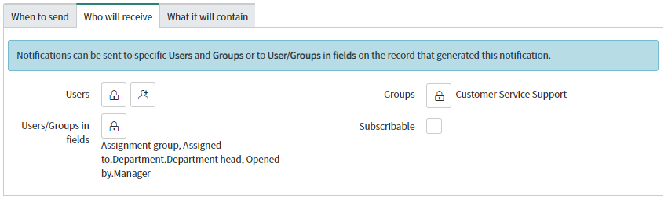
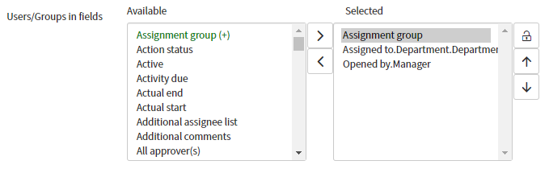
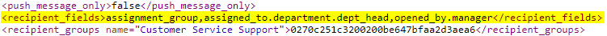

In ServiceNow there are special fields called **Field List** fields which allow you to select fields from a table. These fields also allow you to dot-walk down into fields on related tables. 

For example, a **Field List** aimed at the **incident** table can select:
`Assigned to -> Department -> Department head`
which would have the value of:
`assigned_to.department.dept_head`

In essence, it lets you dot-walking without having to hard-code the fields to dot-walk through.

I've used these **Field List** fields in other projects, such as a custom approval engine which allowed users to send approval requests to users within related fields on a request.

You'll most likely come across these on configurable rules such as Notifications where you can select fields that contain users or groups to send the notification out to.



Here's what that same field looks like when it's opened or unlocked.



Behind the scenes, the value of these fields looks like the below: a comma-separated list of period-separated fields. The latter part, the period-separated list of fields, works similar to dot-walking in queries and filters.



## The problem
The problem is that ServiceNow doesn't provide a straight-forward and developer-accessible way of fetching data from a GlideRecord using this value. If I have a **GlideRecord** of an incident record, how to I get `assigned_to.department.dept_head`?

`grIncident.getValue("assigned_to.department.dept_head");` comes back with `null`.

`grIncident["assigned_to.department.dept_head"];` comes back with `undefined`.

## The solution
I put together a function to solve this problem that is surprisingly straight-forward. It steps through the dot-walkable fields on the GlideRecord for as many steps are in the path string. The result that it has at the end of the path will be the desired value. This works well because stepping through a field that isn't dot-walkable just returns `undefined` which can be handled safely, instead of throwing an exception and stopping the process. This also  that the benefit of working safely for dot-walking into fields that don't exist, and dot-walking through a reference field that is empty without causing issues.

```js
function getDotWalkValueFromGr(valuePath, gr) {
	var r = null;
	
	valuePath = ""+valuePath; // Force it into a string
	valuePathSplit = valuePath.split(".");
	for (var iPath=0; iPath < valuePathSplit.length; iPath++) {
		var pathSegment = valuePathSplit[iPath].trim();
		
		//gs.print("Segment: "+pathSegment);
		
		if (pathSegment == "") continue; // Skip empty segments
		
		if (r == null) r = gr[pathSegment];
		else r = r[pathSegment];
		
		//gs.print("r: "+r);
	}

	return r;
}
```

Here is a test which demonstrates the process in action. You can see that it successfully dot-walks through the elements of a GlideRecord and returns the value at the end of it.

```js
// === DEBUG ===
// Get a test incident
var gr = new GlideRecord("incident");
gr.get("552c48888c033300964f4932b03eb092");
gs.print(gr.getDisplayValue());

// Get the value at the end of the path
var testPath = "assigned_to.department.dept_head";
gs.print("Result: "+getDotWalkValueFromGr(testPath, gr));

// Output for an incident assigned to Beth Anglin
// INC0010112
// Path: assigned_to.department.dept_head
// Segment: assigned_to
// r: 46d44a23a9fe19810012d100cca80666
// Segment: department
// r: 221db0edc611228401760aec06c9d929
// Segment: dept_head
// r: 06826bf03710200044e0bfc8bcbe5d6f
// Result: 06826bf03710200044e0bfc8bcbe5d6f
```