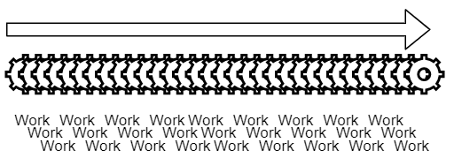
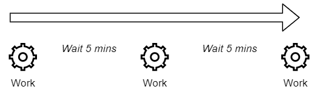
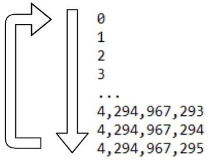

So you've got an Arduino that flashes some lights, moves some motors, and reads some sensors. Chances are that you don't want it to do whatever it's doing as many times as it can as quickly as it can. You don't care what the temperature is every 0.001 seconds. 



So you add delays to things e.g. read the sensor every 5 minutes.



The easy way is to use `delay()` which puts things to sleep, but this is usually a bad idea because you can't do anything else while it's `delay()`-ing.

The next thing you try is to check if the desired amount of time has passed before doing the activity again.
```cpp
void readTemp() {
	If (millis() > tempLastRead) {
		// read the temperature
	}
}
```

`millis()` returns the number of milliseconds that the controller has been active for. If you plugged in your USB cable and then called `millis()` an exact second after, you'd get 1,000 which is 1,000 milliseconds or 1 second.

## The problem
The problem is that `millis()` is an unsigned long which goes from 0 up to 4,294,967,295 milliseconds, or about 49 days. When the maximum number is reached (`0xFFFFFFFF`) and more time passes, it will roll-over back to 0 (`0x00000000`) and start again. It won't cause the Arduino to crash, lock-up, or anything like that, it'll just happen. 



Remember what happened with the Warlord Ghandi bug in the game Civilizations? The leader Ghandi was already pretty peaceful. When extra bonuses and policies were applied, he would get more and more peaceful until it went below 0. However, the "peaceful" number was using an unsigned integer and couldn't go negative, so it rolled-over up to the other end of the scale and Gandhi became incredibly aggressive and warlike because of it.


With time comparisons in Arduino, this becomes a problem if the comparison logic uses the last time it was read. This results in the task never being performed once `millis()` has rolled over, or once the controller has been on for more than 49 days. 

```
Interval = 100
Millis = 5000
NextRead = 4500
Millis - NextRead = 500 which is greater than the interval, run the task
```
This example shows the logic working correctly.

```
Interval = 100
Millis = 5
NextRead = 4000000000
Millis - NextRead = -3999999999 which is a negative number less than the interval, do not run the task
```

This example shows where the `LastRead` is still up around the end of the number scale, but `millis()` has rolled back around to the bottom end. This results in the task never being run once `millis()` has rolled over.

## The solution
The solution to this problem is to instead compare the **duration**, not the **timestamps**. Take the current time, subtract the last time the task was performed, and then check if that number is greater than the interval. Because of the way that the math is performed, the 2 timestamps roll-over together in the same way so they're not out of sync.

The code for this is:
```cpp
unsigned long lastThink = 0;
unsigned long interval = 250; // in milliseconds
unsigned long now = millis();
if ( ( now - lastThink) >= interval) { 
	lastThink = now;
	doTheThing();
}
```

I like to use this logic at the start of the task functions themselves. Instead of wrapping the entire function in an `if` block, I reverse the logic and `return` out of the function if not enough time has passed.

```cpp
void doTheThing() {
	if ( millis() - lastThink < interval ) return; // Not enough time has passed, return
	
	// Do the thing
}
```
