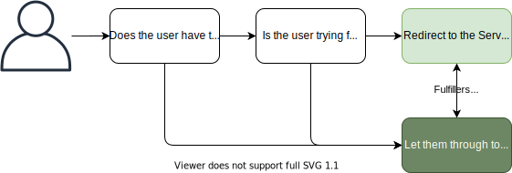

The self-service Service Portal is a powerful feature of ServiceNow. It provides end users and non-fulfiller users with a clean, user friendly, and straight-forward experience to see and find what they need to, without overwhelming them to the myriad of navigation options available in the Platform UI (a.k.a. the backend, the ITIL view, the normal view).


Here's a screenshot of how the service portal looks as it comes out-of-the-box.


An issue that I experience regularly is when fulfiller-users want to enter and exit the service portal and aren't sure how, or other users that frequently jump between the 2. There's no buttons or no links (except for admins) so this isn't intuitive enough that people can figure it out for themselves, and that's a problem.

Out of the box, the user has to manually update the URL in the address bar to enter and exit the Service Portal, which also requires that the user knows the URL of the Service Portal they want to enter.


How can this be made easier to improve the user experience? Here's what I often recommend.

## Design
The design is simple:
* The user will be automatically redirected to the Service Portal if they don't have one of the roles we specify.
* The user can enter the Service Portal from the Application Navigator: **Self-service > Service Portal**.
* The user can exit the Service Portal using a button in the header that only appears if they have one of the roles we specify.



It's at this point that you'll want to decide the user roles that will decide if the user gets redirected to the service portal or not. As it comes out-of-the-box, the **SPEntryPage** script will not redirect any user that has any role of any kind. For simple scenarios this works well, but I find that this is too broad a brush when custom non-fulfiller roles start being used, such as roles to control access to homepages.

# Automatically redirecting to the Service Portal
ServiceNow has already made this part easy. Use the script include "SPEntryPage", and modify it slightly so that users with the desired role(s) do not get redirected.

This script is used when the user navigates to the base URL of the instance (if they're not trying to go anywhere). If they have a link to somewhere specific like a record, they won't be redirected and will successfully land where they were trying to get to.

I think this is a good thing. Redirecting to the Service Portal typically loses where the user was trying to get to, so by redirecting the user that's trying to follow a link to somewhere specific, they'll likely become frustrated that they were taken away from where they wanted to go.

E.g. 
* instance.service-now.com/ = **redirected**
* instance.service-now.com/incident.do? = **not redirected**
* instance.service-now.com/navto.do?url=incident.do = **not redirected**

> The company "Awesome Inc" only wants IT staff to be able to see the Platform UI. All other staff members should be redirected to the Service Portal.
> HR and Facilities staff should also be redirected.
> 
> If the user has the "itil" role, they will continue to use the Platform UI. Otherwise, they'll be redirected to the Service Portal.

To accommodate this scenario, lets change this line in the **SPEntryPage** script from this:

```js
if (user.hasRoles() && !redirectURL && !isServicePortalURL)
```

to this:

```js
if (user.hasRole("itil") && !redirectURL && !isServicePortalURL)
```

That should be about it. Redirecting users using the **SPEntryPage** script has been covered extensively before, here are some links if you'd like to look into the topic further.
*  https://hi.service-now.com/kb_view.do?sysparm_article=KB0746730
* https://docs.servicenow.com/bundle/istanbul-servicenow-platform/page/build/service-portal/concept/c_SPSSOLoginAndRedirects.html
* (that community redirection article)
	
## Entering the Service Portal from the Platform UI
With the out-of-the-box ServiceNow service portal configuration, the only ways to enter the service portal are:
* To be redirected there when you login.
* To manually navigate to the service portal by changing the browser address by adding `/sp`.


This is a user-experience problem for users that wouldn't normally be redirected. Examples include:
* IT Support staff who want to access the portal to assist an end-user.
* ServiceNow administrators who have to regularly switch in and out of the service portal.
* Knowledge managers who want to check how their knowledge articles appear in the user-facing service portal.

There is a very easy solution for this user-experience problem. Create a new module called **Service portal ➚** in the application navigator under **Self-service**. I like the little "➚" symbol that ServiceNow has been using because it denotes that clicking on it will open in a new tab. Shouldn't need to add any role against it because it'll be visible to everyone, just set:
* **Type** to **URL (from Arguments:)**.
* **Arguments** to `/sp`.
* **Window name** to `_blank` so it opens in a new tab.


## Exiting the portal
So you've followed a link into the service portal, but you're an ITIL user and want to get out. How do you do it?

In the out of the box service portal, there's no button or link that you can use to leave, and you're forced to manually change the address in your browser address bar, chopping off the `/sp?` and everything after it.

A change I recommend is to create an "Exit" menu item on the service portal's header menu. This will appear as a button at the top of the service portal to users with the same roles that don't get redirected, and clicking on it will redirect the user to the platform UI.

To do so, open the Service Portal Menu which is the header menu for your service portal and create a new menu item with these details:
* **Name** to `Exit portal`.
* **Order** to `100` or so, to position it on the far-left.
* **Glyph** to the up arrow. I like this because it denotes that you're going to leave the service portal.
* **Type** to `URL`.
* **URL** to just `/`.
* and **Condition** to `gs.hasRole("itil")`. Note that this is the same condition used in the SPEntryPage redirection for consistency.


I can't recommend this change enough. It can be frustrating for users that get into the portal and have to force their way out of it. This button cuts down a handful of clicks and key presses down to a single click. This is an easy but worthwhile boost to user experience. 