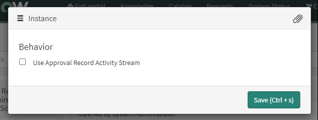

ServiceNow is great for approval processes. It's powerful, flexible, and easy to track who approved what.

A key feature which enables users to quickly action approvals is the ServiceNow service portal, which gives approvers an easy to use interface, a hard to miss count of approvals awaiting their action, and summarising approvals for an at-a-glance review right there on the home page.

However, there are some rough-edges for approvals in ServiceNow. I suspect that most of these rough edges are inherited from the original approval process that came with the initial version of ServiceNow, and have hung around since launch. However, because of the ServiceNow platform's highly-flexible nature, many of these rough edges can be smoothed out relatively easily.

## The problem

The activity stream at the bottom of the "approval" page in the service portal shows the activity of the approval request record, not the activity of the task that the approval is for.

In short, this often confuses approver users by creating another separate hole where notes and attachments can get lost in.

This is the cause of a collection of different issues, including:
- Comments and attachments from the task being missed or ignored by approvers.
- Comments from approvers being missed by fulfillers watching the task.
- Comments from approvers not being visible to other approvers.

Below is an example of an approval for a change request. You can see that the notes on the change request are not visible on the approval page.

*The change request, with note added.*

*The approval, with note added.*

*The approval in the service portal, no notes from the change request.*

## The solution

The solution is surprisingly simple. I suspect that ServiceNow have received this complaint a number of times, and have added an option to make this happen.

Open the widget instance options for the "**Approval Record**" widget on the service portal page "**approval**", untick the "**Use Approval Record Activity Stream**" tickbox, and then click on save. It's as easy as that!

After enabling this option, the activity stream on the approval page will show notes and attachments from the task that is being approved.

