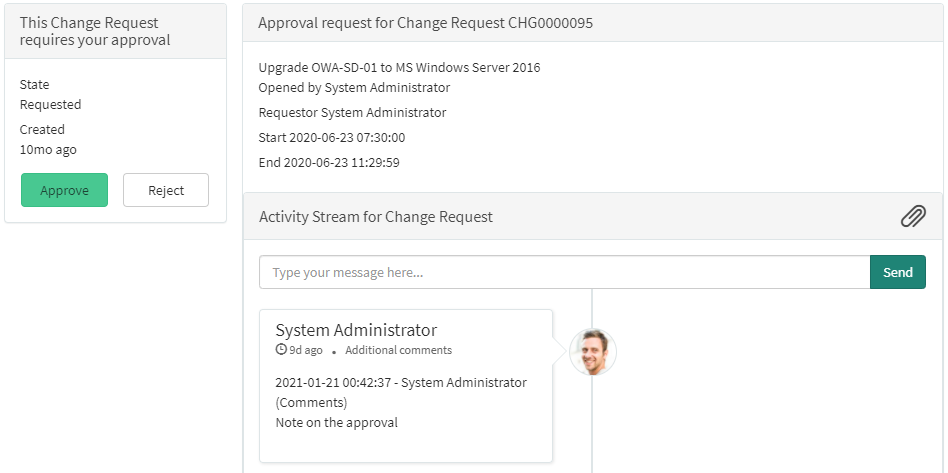
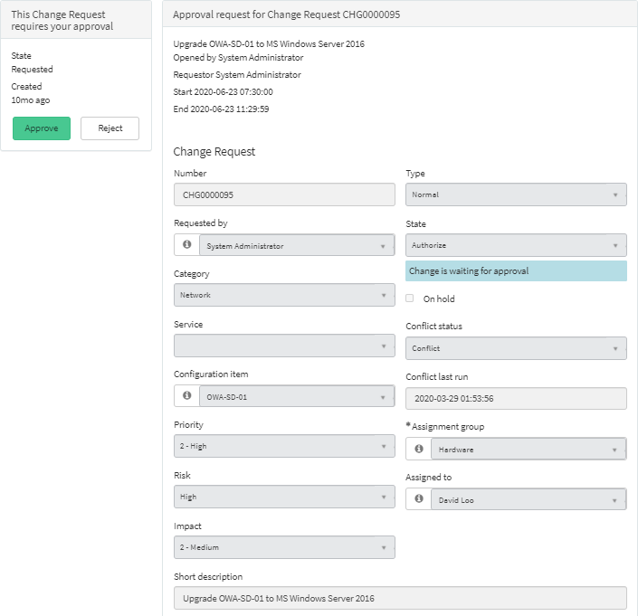
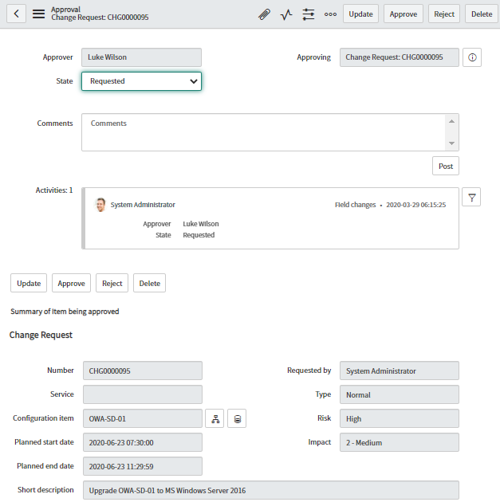

ServiceNow is great for approval processes. It's powerful, flexible, and easy to track who approved what. Enabling users to quickly action approvals extends into the ServiceNow service portal, including a highly visible count of approvals awaiting the user, and summarising approvals for an at-a-glance review.

However, there are some areas for improvement for ServiceNow approvals. In this case, I feel this pain-point stems from the service portal originally focusing on the Service Catalog and Request items, which didn't include other tasks such as incidents, changes, HR cases, and work orders.

## The problem
The "**approval**" service portal page wants to summarise the record that is being approved. For catalog items, it tries to show only the relevant variables. However for regular records like change requests, the page tries its best to approximate a summary, mostly based on the order of the fields on the form. This approximated summary doesn't show every field.

[](approval-sp-without-form.png)

See that little summary at the top? The one that only has the change request's Opened by, Requestor, Start, and End? That is all that the approver is able to see on this page, nothing else except the activity stream.

The problem this causes is that important information that the approver needs to make a decision is often missing on this page. For example, can a Change Manager properly approve a change request without reviewing its "Risk and impact analysis" or "Implementation plan"? This creates a bad user experice by forcing the approver to hunt for the related record to review the information, and then return back to this "**approval**" page to action the approval.

## The solution
The straight-forward solution to this problem would be to show the form of the record being approved. Luckily, this is a simple change to make which leverages existing functionality that is used to show forms in the service portal.

[](approval-sp-without-form.png)

This will look somewhat similar to how approvals appear in the platform UI, with the form of what's being apprved embedded in the page.

[](approval-form.png)

1. Open the Service Portal Widget Editor.
1. Open the widget "**Approval record**".
1. Make a copy of this widget, call it "Approval record w/ form". **Don't change the original!** Select the new widget you just made, because the widget editor doesn't automatically change to the new widget. 
1. Update the "**Server Script**" of the widget as below around where it gathers the variables. Change the ```while``` to an ```if```, and then add in the new code below that.
    
    ```js
    var itemsGR = new GlideRecord("sc_req_item");
    itemsGR.addQuery("request", task.sys_id);
    itemsGR.query();
    while (itemsGR.next()) { // === Was a "while", change to an "if" ===
        // SN code to get variables
    }
    // === New code starts here
    else
    {
        // Get fields of a non-RITM record.
        // The "task" variable should already be a
        // GlideRecord of what is being approved.
        data.table = task.getTableName();
        data.f = $sp.getForm( task.getTableName(), task.sys_id);
        
        for (var prop in data.f._fields) {
            data.f._fields[prop]["sys_readonly"] = true;
        }
    }
    ```

1. Update the "**HTML Template**" of the widget as below, near the end and just before the tickerConversation element.

    **Note:** The "**disabled**" in ```<fieldset disabled>``` ensures that the form is strictly read-only to the approver, which is good.
    
    **Note:** The fieldset is wrapped in a "**panel-body**" div to give it some padding and visual appeal.

    ```html
    <div class="panel-body">
        <fieldset disabled>
            <sp-model form-model="data.f" mandatory="mandatory"></sp-model>
        </fieldset>
    </div>
    <sp-widget widget="data.ticketConversation" /><!-- This already existed -->
    ```

6. Save the widget.
7. Open the "approval" page in the service portal page designer. Delete the "**Approval record**" widget instance from the page and replace it with the new "**Approval record w/ form**" widget created earlier.

That's it, you've now got an approval service portal page that should show almost all of the information ServiceNow can offer an approver to make their decision.

This solution could be improved by adding some optional bells-and-whistles, such as the below. I may review this one later on to add these in.

* Including a option to control the form behaviour: *always*, *only for non-RITMs*, *never*.
* Support for related lists at the bottom of the form, similar to the form page.