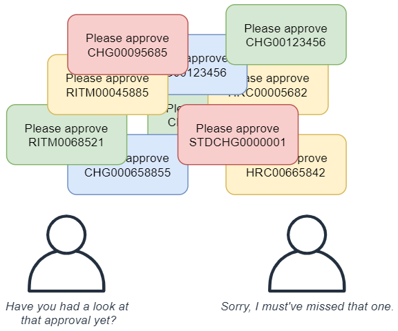
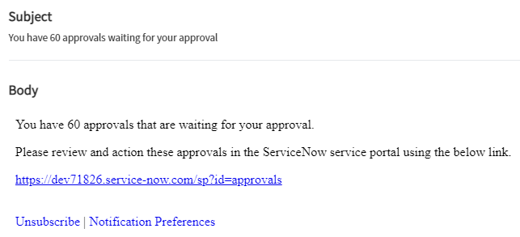
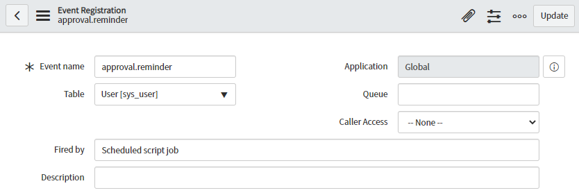
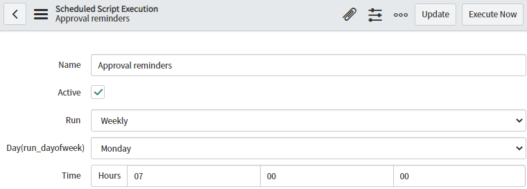
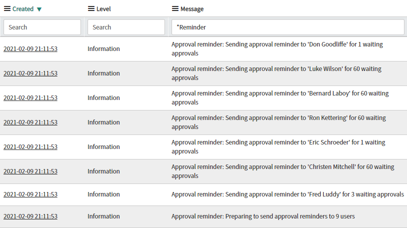

ServiceNow is great for approval processes. It's powerful, flexible, and easy to track who approved what. Enabling users to quickly action approvals extends into the ServiceNow service portal, including a highly visible count of approvals awaiting the user, and summarising approvals for an at-a-glance review.

However, if approvers are a part of multiple or large processes, they can quickly become overwhelmed with approval requests. This sometimes leads to approvals being missed and falling through the cracks, sometimes forgotten completely.

## The problem
When an approval is assigned to an approver to action, ServiceNow usually sends an email out to the user to let them know about it.

However, most approvers are approvers for a lot of different things, and their mailboxes are usually swamped with emails about approvals. When an approval doesn't get actioned, processes in baseline ServiceNow process just stop and wait.

Consider a change manager at an enterprise-sized company. They get dozens of emails a week about being asked to approve something.

[](diagram-swamped-emails.png)

If an approval is completely forgotten about, they build up and stay there until someone notices that Barry from accounting has 3,000 approvals that he hasn't looked at in years.

## The solution
An easy solution that I'd recommend is a reminder email sent out regularly (e.g. weekly) that looks something like this:

[](sample-reminder-email.png)

This lets the user know:
* That they have approval requests waiting for them to action.
* How many approvals are waiting for them.
* Directions to the approvals page in the service portal, where they can review and action their approvals.

The aim is for the reminder email slim &amp; lightweight, dircting the user to the service portal instead of including the approval details in the email. 

I like this approach because:

* It passively encourages approvers to use and become familiar with ServiceNow and the service portal.
* It doesn't include information about the approvals, which often becomes stale over time.
* It avoids security concerns with shared mailboxes, where sensitive approval details may accidently be viewed by someone who has access to the approver's mailbox.
 Especially with HR-related approvals.

#### 1. Creating the event
Create a new event to use in the reminders. 
**Name:** "approval.reminder"
**Table:** User \[sys_user\]
**(Optional) Fired by:** Scheduled script job

[](event-registration.png)

#### 2. Creating the scheduled trigger
Create a new scheduled script execution job with the following code. Adjust the frequency as needed, I'm going to set this to the 7am Monday every week so that it's near the top of the user's mailboxes as they start the week. Feel free to adjust the variables at the top of the script.

[](scheduled-job.png)

**Name:** Approval reminders
**Run:** Weekly
**Day:** Monday
**Time:** 7:00:00
**Run this script:**
```js
sendApprovalReminders();

function sendApprovalReminders() {
	// Get a count of waiting approvals, grouped by requester
	var gaA = new GlideAggregate("sysapproval_approver");
	gaA.addQuery("state", "requested"); // Only care about waiting approvals
	gaA.addAggregate("COUNT", "approver"); // Get a count, per approver
	gaA.query();
	gs.info("Approval reminder: Preparing to send approval reminders to "+gaA.getRowCount()+" users");
	
	while (gaA.next()) {
		var userID = ""+gaA.approver;
		var grU = new GlideRecord("sys_user");
		if (!grU.get(userID)) {
			gs.warn("Approval reminder: Could not send approval reminder to unknown user: "+userID);
		} else {
			var approvalCount = gaA.getAggregate("COUNT", "approver");
			gs.info("Approval reminder: Sending approval reminder to '"+grU.getDisplayValue()+"' for "+approvalCount+" waiting approvals");
			gs.eventQueue("approval.reminder", grU, userID, approvalCount, "");
		}
	}
}
```

In short, the script:
* queries for a count of approvals with the stating of "Requested", grouping them by the "Approver".
* triggers the reminder event for each user.

It also adds messages to the system log so that administrators can see what the reminder job has done.

[](reminder-logging.png)

#### 3. Creating the email notification
This email is triggered by our earlier event. It will get the recipients from event param 1, and get the number of awaiting approvals provided from event param 2.

**Name:** Approval Reminder
**Table:**  User \[sys_user\]
**Send when:** Event is fired
**Event name:** approval.reminder (the one we created earlier)
**Event parm 1 contains recipient:** checked
**Subject:** You have ${event.parm2} approvals waiting for your approval
**Message HTML:**

```
You have ${event.parm2} approvals that are waiting for your approval.

Please review and action these approvals in the ServiceNow service portal using the below link.

${mail_script:sp_approvals_link}
```

For the link to the approvals page on the service portal, I've used an email script to build the link so I don't have to hard-code the instance's URL.

```js
(function runMailScript(/* GlideRecord */ current, /* TemplatePrinter */ template,
          /* Optional EmailOutbound */ email, /* Optional GlideRecord */ email_action,
          /* Optional GlideRecord */ event) {

          // Add your code here
	
	var link = "https://"+gs.getProperty("instance_name")+".service-now.com/sp?id=approvals";
	template.print("<a href='"+link+"'>"+link+"</a>");

})(current, template, email, email_action, event);
```

#### The result
At 7am every Monday, any user that has an approval that is awaiting their action will get a reminder email telling them to go to the approvals page in the service portal and action their approvals. No more missed approvals gathering dust!

[](sample-reminder-email.png)

If approvers ***still*** don't action their approvals even with the reminder, then that's a people-problem.

[](action-your-approvals-meme.jpg)

## Improvements
This functionality can be built-upon with additional features, depending on requirements, including:

* Guilting the approver by including the age of the oldest approval.
 E.g. *"...and your oldest approval is 1 month 4 days old."*
* CC-ing the reminder to the approver's manager if the count or oldest approval is over a threshold.
 E.g. if they have over 20 approvals, or the oldest is from 2 months ago.
