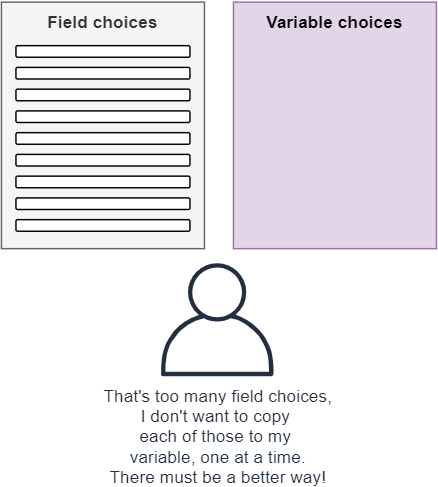
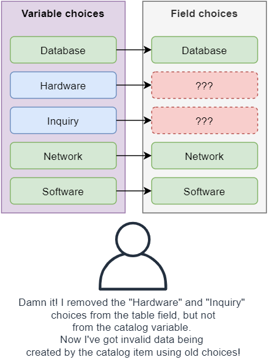
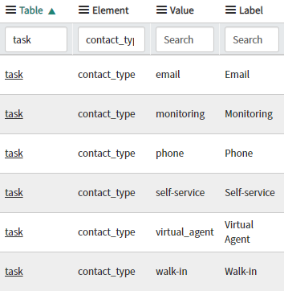
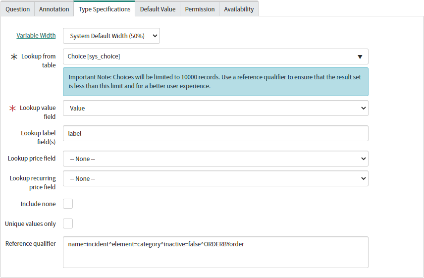
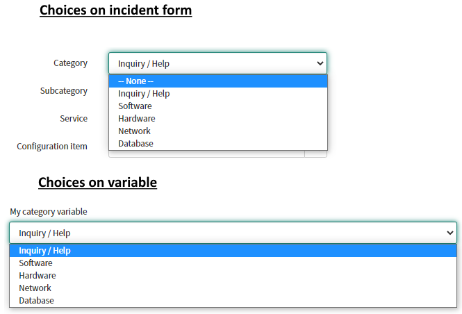

## The problem
So you've got a select box or multiple choice variable on a catalog item or record producer, and you want to use the same set of choices from a choice field (e.g. choices from the Incident Category field).

A common approach is to manually duplicate the choices from the table field to the select box variable. This is painful for larger sets of choices, such as the incident category field.

This approach also creates a problem where changes on the field's choices (adding or removing choices) aren’t automatically reflected on the variable's choices, which need to be kept up-to-date manually by the ServiceNow administrators.

## The solution
I stumbled on this solution while trying to think a little sideways, and it works surprisingly well.

The gist of this solution is to use a Lookup variable to grab choices in the sys_choice table for the choice field that you want to reflect. Below are the sys_choice's for the Contact type field on the Task table.

Set the variable up to use these sys_choice entries like so:
**Type:** Lookup select box
**Lookup from table:** Choice (sys_choice)
**Lookup label field(s):** label
**Lookup value field:** value
**Reference qualifier:** `name=TABLENAME^element=FIELDNAME^inactive=false^ORDERBYsequence`

The magic is in the **Reference qualifier**.

Replace "**TABLENAME**" and "**FIELDNAME**" with the name of the table & field that you want to use the choices from.
E.g. the Category field on the Incident table: `name=incident^element=category^inactive=false^ORDERBYsequence`

The "**inactive=false**" is important, so that choices that have been set as inactive do not appear as choices in your variable.

The "**ORDERBYsequence**" part of the qualifier means that the variable choices will follow the same ordering used elsewhere, instead of just alphabetically.

### The result
The end result is a drop-down select box that uses the same choice values as the desired table field, without all of the manual mess of copying the options.

