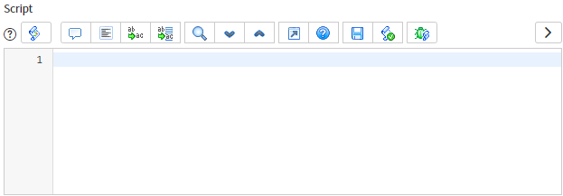

## What is GlideScopedEvaluator?
If you come from a JavaScript background, you likely know that you can run a string of text as code using `eval()` or by creating a new `Function()` using a string. 
`eval("document.title = 'My awesome title';");`
`Function("document.title = 'My awesome title';");`

You could also pull this script from somewhere else. Let's pretend that there's a text area on a web page called "myScriptField".
`eval(document.getElementById("myScriptField").value)`

ServiceNow doesn't want you to use `eval()` either client-side or server-side, and with good reason. It's a notable security problem to allow any arbitrary code to be executed, and it can be an entry point for malicious users to do bad things. 

If you try to use `eval()` or `Function()`, you might get an error message that looks something like this:

```
java.lang.SecurityException: eval() not allowed in a custom application, use GlideScopedEvaluator instead
java.lang.SecurityException: function constructor not allowed in a custom application, use GlideScopedEvaluator instead
```

However, there are times that you will want to call arbitrary script on the server side without creating a new business rule or script include, so ServiceNow has provided the **[GlideScopedEvaluator](https://developer.servicenow.com/dev.do#!/reference/api/orlando/server_legacy/GlideEvaluatorAPI)** class to allow you to run script from script fields. It's pretty straight-forward to use, and it can make your cool project very powerful and flexible.

It works by taking a script from a field on an existing record, and executes it as server-side JavaScript. The field should be the type of "Script" or "Script (plain text)", but it'll accept any string field.

Ever wondered how scripts in one of these below fields went from text to code that runs?

* The "Script" field on "Business Rules".
* The "Advanced condition" on "Notifications".
* The "Script" field on "Transform Maps".
* The "Source script" field on "Field Maps".


*Or something very similar.*

## Why should I use it?
> ***But David, I can just write script in a business rule or a script include, why would I want to pull code from anywhere else?***

That's because you're a **talented system administrator**, and anything you create in a script include will need to be maintained either by you or someone else just as talented. This is known as **technical debt**. 

](./technical-debt.png)

Once you've created something large enough and ***awesome*** enough, **low-code** and **no-code** administrators should should be able configure it without modifying scripts and business rules. By using small & simple script fields and **GlideScopedEvaluator**, you're allowing less-savvy administrators to achieve more with fewer changes and less complexity.

## Usage
Using **GlideScopedEvaluator** is fairly simple. The most important part is the `evaluateScript()` function which is used like this:
```js
.evaluateScript(
    grObj, /* GlideRecord that contains the script */
    field, /* String name of the field that contains the script*/
    variables /* Name-value pairs of variables */
);
```

You can pass in variables for the script to use in 2 different ways: using `.putVariable()` or using the `variables` parameter in `.evaluateScript()`. They both work the same way. 

```js
// Variables using .putVariable()
var ge = new GlideScopedEvaluator();
ge.putVariable("current", current);
ge.putVariable("answer", "");
ge.evaluateScript(gr, "script");

// Variables using map object in .evaluateScript()
var ge = new GlideScopedEvaluator();
var vars = {
    current: current,
    answer: ""
}
ge.evaluateScript(gr, "script", vars);

// You can even use both methods
var ge = new GlideScopedEvaluator();
ge.putVariable("var1", "var1"); // var1
ge.putVariable("var2", "var2"); // var2
var vars = {var3: "var3", var4: "var4"}; // var3 and var4
ge.evaluateScript(gr, "script", vars); // var1, var2, var3, and var4 all work
```

## Example
Let's assume that we've created a new field on the "User group" table called "Assignment condition", and this scripted field will control whether or not an incident can be assigned to this group.

](./group-assignment-condition-field.png)

> **Note**: this example is messy but works as an example. Don't actually do this.

To run and check these rules, we'll use a business rule that uses **GlideScopedEvaluator** to check the rule.

**Name:** Evaluate assignment rules
**Table:** Incident [incident]
**Advanced:** checked
**Insert:** checked
**Update:** checked
**Filter conditions:** Assignment group CHANGES AND Assignment group IS NOT EMPTY
**Script:**
```js
(function executeRule(current, previous /*null when async*/) {

	var grAG = current.assignment_group.getRefRecord(); // Get the GlideRecord of the assignment group
	if (grAG.isValidRecord()) {
		var ge = new GlideScopedEvaluator();
		ge.putVariable("current", current); // Pass through the "current" variable as "current"
		ge.putVariable("group", grAG); // Pass through the "grAG" variable as "group"
		ge.putVariable("answer", true); // default "answer" to TRUE
		ge.evaluateScript(grAG, "u_assignment_condition"); // Run the script
		// Abort the transaction if the "answer" variable was set to FALSE explicitly (undefined doesn't count)
		if (ge.getVariable("answer") === false) { 
			gs.addErrorMessage("Assignment rule did not pass");
			current.setAbortAction(true);
		}
	}
})(current, previous);
```

What does this script do?
1. Gets the **GlideRecord** of the assignment group
1. Starts a new **GlideScopedEvaluator**
1. Puts the "current", "group", and "answer" variables into the script that's going to be run
1. Run the script in the group's "u_assignment_condition" field
1. If the script set the "answer" variable is FALSE, abort the action and show up an error message about it

](./assignment-rule-fail.png)

Now we can start using some scripted conditions!

This example script in the "Assignment condition" field will always prevent assignment.

```js
answer = (function(current,group) {
	return false; // Always block
})(current,group);
```

This example script in the "Assignment condition" field will only allow assignment if "Category" is "Hardware".

```js
answer = (function(current,group) {
	return current.category == "hardware";
})(current,group);
```

## Returning values
In some scenarios, you'll want to use the script to pass back a result of some kind, to drive something else. This usually comes in 2 different flavours: **simple results**, or **variable results**.

### Simple results
The **simple results** method works like the "Reference qualifier" field on a dictionary entry, or the "Condition" field on a business rule, where the result is whatever the last statement turned out to be.

Here's the "Condition" field on the business rule "Sync Sysem Preference". This script works just like a condition inside an `if` condition, that compares stuff together and then either returns **true** or **false**.

](./simple-condition-field.png)

If you had to write a script that would run this script as a condition, it would look something like this.

```js
var ge = new GlideScopedEvaluator();
ge.putVariable("current", current);
ge.putVariable("previous", previous);
var result = ge.evaluateScript(grBusinessRule, "condition"); // Grab whatever comes out of the .evaluateScript()

// Run the business rule if the last statement evaluates to TRUE
var shouldIRunThisBusinessRule = (result == true); 
```

When the script contains semi-colons or multiple statements, the final statement is what gets returned.

Script: `"asdasd"; 1234; 56.78`
The result is "56.78".

Script: `var gr = new GlideRecord("incident"); gr.get("68abf2a72fba20107087b2e72799b620"); gr.getDisplayValue()`
The result is "INC12345689".

### Variable results
**Variable results** is when you pass in a variable (or multiple variables) that you want the user to set in their script. A common example would be the **"answer"** variable used in many ServiceNow scripted condition fields.

Here's the "Script" field on an ACL record, where the "answer" variable is being set to either `true` or `false` by the script.

![[ACL script field returning the answer variable(./acl-script-field.png)]](./acl-script-field.png)

If you had to write something that would run script in that field and retrieve what the user set "answer" to, it would look something like this.

```js
var ge = new GlideScopedEvaluator();
ge.putVariable("current", current);
ge.putVariable("answer", false); // Default the "answer" to FALSE
ge.evaluateScript(grACL, "script");
var answer = ge.getVariable("answer");

// This ACL will grant access if "answer" evaluates as TRUE
var aclGrantsAccess = (answer == true); 
```

You can pass in multiple variables that the user set if you'd like. However, **Dave's tip** would be to send through an object that can collect multiple results.

```js
answer = (function(myAnswerObj) {
    myAnswerObj.var1 = "abc";
    myAnswerObj.var2 = "123";
    myAnswerOBj.var3 = "foo";
})();
```

## Cool tips

### Self-documenting script fields
A common mistake I see is that cruel and malicious developers create their script fields blank by default, and look like this:

](./blank-script-field.png)

What variables are available?
What should this script do?
How should it return a result?

I ***highly*** recommend creating a default value for the script field as a function template, similar to the look-and-feel of Business Rule and Transform Map script fields. This reduces confusion, and leads to a smoother experience for the user, which means users aren't asking you how to use it over and over again.

](./field-map-script-field.png)

In this picture, you can clearly see that the "source" variable is available, and it's a self-running function that's setting the "answer" variable to the result of the function. No confusion there.

### Running scripts without needing a record
Normally, **GlideScopedEvaluator** wants to force you to use a field on a GlideRecord as the source of your script.

However, you can trick **GlideScopedEvaluator** to run any sort of code you like without needing to save that script back into the database.

Consider the following code:
```js
var gr = new GlideRecord("incident");
gr.setLimit(1); gr.query(); gr.next(); // Get any incident, any at all
gr.setValue("description", "gs.info('Hello there')");
// Note that we haven't saved this record, it's just hanging about in memory

var ge = new GlideScopedEvaluator();
ge.evaluateScript(gr, "description");
// There should now be a message in the system log saying "Hello there"
```

You can see that it:
1. creates a GlideRecord object, then fetches any of those records, but doesn't save it
1. puts some code into the "description" field
1. runs `evaluateScript` using the temporary GlideRecord object to run the script

ServiceNow has plugged the hole that allowed you to create a new **GlideRecord** without saving, and running code from it. That approach doesn't work anymore.

However, this is cheating, insecure, and is considered very naughty by ServiceNow. I wouldn't recommend using this approach at all except for testing purposes. If you do this in production, you will be judged.

