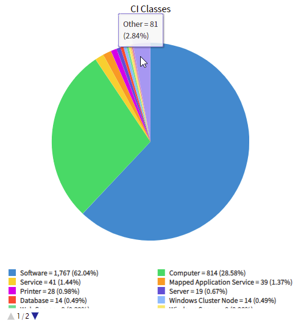

Here's a quick little script to help you search a table and counting unique values or searching for duplicates.

I've found this useful in situations, like:

* Searching for users with duplicate email addresses, usually from an import gone wrong.
* Checking for duplicate numbers on tasks or KB articles (yes, it happens).
* Finding duplicate serial numbers or asset tags in the CMDB, without re-triggering a health scan.

```js
function findDupes(tableName, fieldName) {
    var r = []; // Ready the result list
    
    var ga = new GlideAggregate(tableName); // GlideAggregate, not GlideRecord
    // add any ga.addQuery(...) filters here
    ga.addNotNullQuery(fieldName); // Ignore when it's blank
    ga.addAggregate("COUNT", fieldName); // Count how many unique values there are
	ga.query();
    while (ga.next()) { // Move through each unique value
        var c = ga.getAggregate("COUNT", fieldName); // Count how many times that unique value has been seen
        if (c > 1) { // Only care if it shows up more than once
            r.push({value: ga.getValue(fieldName), count: c}); // Add a result to the result list
		}
	}

    return r; // Return the list we put together
}
```

Use it like this.

```js
var r = findDupes("sys_user", "email"); // Find duplicate email addresses
gs.print("Unique duplicates: "+r.length);
for (var i=0; i < r.length; i++) {
	gs.print(""+r[i].value+" : "+r[i].count);
}

// === Output ===
// Unique duplicates: 6
//
// mmorris@example.com : 3
// mnewton@example.com : 2
// mnunn@example.com : 2
// jmackay@example.com : 2
// dmac@example.com : 8
// astewart@example.com : 20
```

## Using a report to count the unique values
If there aren't that many possible unique values, you can use a pie or bar report to find out all of the unique values and count how many times they appear.

However, this only really works for the top results, as the less-used values get hidden behind the "Other" slice of the pie / bar there.

[](pie-graph-count.png)

## Using "Group by" in a list to count unique values
If your list is small (e.g. incidents created today), it's most certainly going to be easier to 

1. right-click on a list
2. click on "Group by"
3. just count the numbers

However, if the list has either a lot of unique values or the list is rather large, this is a bad idea. You'll notice that it can take a rather long time to open. This is because instead of reading data from the table in little chunks, it loads the data of every record in the list (or every record in the entire table if there's no filter on the list), and then sends a lot of that data to your web browser. This can put of strain on both ServiceNow, your internet connection, and your web browser if there's a lot of results.

For example, if you go to the `sys_metadata` table and "Group by" on the "Class" (sys_class_name) column, it's going to take a while to open up because it has to load and fetch all of the columns from almost every configuration record on the instance. Business rules, script includes, form layouts, the lot.

That's when I'd use the above script. We don't care about all of the other data about those records, we just care about counting stuff.

[](./sys-metadata-group-by.png)

## GlideAggregate.addHaving(...)
Some snippets of **GlideAggregate** use a function called `addHaving(...)`, which lets you specify a minimum aggregate limit.

E.g. https://community.servicenow.com/community?id=community_blog&sys_id=656b373ddb96ff401cd8a345ca961958
```js
duplicateCheck.addHaving('COUNT', '>', 1);
```

You might be asking *"So why didn't you use `.addHaving(...)` in your code, instead ignoring results in an `if` which is less efficient?"*.

Sadly, the `.addHaving(...)` function doesn't work in scope apps. For consistency, I'd recommend coding in a way that works in both global **and** scoped scripts. Otherwise, you'll get upset and frustrated.