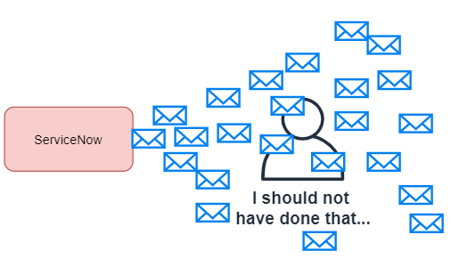

## The problem

Let me set the scene.

You're working in a development instance that was cloned from production about 6 months ago. You need to test something by actually sending out the email, so you go into Email Properties, tick the "Enable email sending", and then click on "Save".

[](email-properties.png)

***Oh no...***

Those 50,000 emails that were sitting in the sys_email table and waiting to be sent have now been sent out as actual emails to actual mailboxes.

[](servicenow-sending-emails.png)

Did you set the "Send all email to this test email address", so that all emails get redirected to a single email address?

If you did set it, that one mailbox just received about 6 months worth of emails in a few minutes.

If you didn't set it, then 6 months of emails have just been sent out as real emails to real people, and your afternoon is ruined as you spend the day apologizing to people.

## The script

Before I enable email sending in any instance, I like to run this script. In a nutshell, it goes through every "send-ready" email and sets it to "send-ignore" so it won't be sent out.

It's simple, but it's saved my skin many times.

```js
var grEmail = new GlideRecord("sys_email");
grEmail.addQuery("type", "send-ready");
grEmail.queryNoDomain(); // Same as .query(), but for domain-separated instances

gs.print("Count: "+grEmail.getRowCount());
while (grEmail.next()) {
	grEmail.type = "send-ignored";
	grEmail.update();
}
```

It sets the emails from this:

[](emails-send-ready.png)

To this:

[](emails-send-ignored.png)