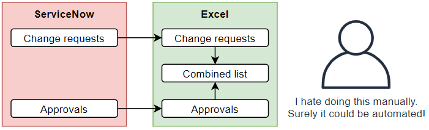

## The problem
A problem typically encountered by ServiceNow reporters is that it's not entirely simple to report on both task data (e.g. incident, changes, requests, etc) **and** report on reporters at the same time in the same report.

For example, a finance process owner who wants to see what procurement requests are in-flight and who they're waiting for approval on, and they want to see it in a single list instead of across multiple lists.

A common yet cumbersome answer to this that I see is that someone will be tasked with exporting a list of both tasks and approvals for that task, and use Excel to combine them into a single list. This solution isn't great, because it's not fully automatic.

[](excel-export-process.png)

Surely there has to be a better way, right?

## The solution
To solve this one, there's a quick and light-weight solution that can be used. It involves creating 2 new fields on the task table, one to show everyone who's ever been sought for approval and one to show who the task is currently waiting for approval, and a business rule to keep the fields up to date.

[](approver-fields.png)

### Fields
Create 2 fields on the **task** table. Feel free to change the names if you want, but you may need to change the business rule script to match.

**Label:** All approver(s)
**Name:** u_all_approvers
**Type:** List
**Reference:** User
**Read only:** ticked

**Label:** Current approver(s)
**Name:** u_current_approvers
**Type:** List
**Reference:** User
**Read only:** ticked

Because these fields are **List** type reference fields, reference filters can be used in the report.

[](list-search.png)

### Business rule
The business rule will be responsible for keeping the fields up to date, in response to changes to Approval (sysapproval_approver) records.

I've aimed to make the script fast and effective, touching the database as few times as possible by using a single GlideAggregate query to get the list of approvers.

Create a business rule with these details:
**Name:** Update task approver fields
**Table:** Approval [sysapproval_approver]
**Insert:** ticked
**Update:** ticked
**Delete:** ticked
**When:** after
**Conditions:** Approval for IS NOT EMPTY AND Approver IS NOT EMPTY
**Script:**

```js
(function executeRule(current, previous /*null when async*/) {

    // Helper function to only add to the array if it's not already in there.
    function addIfMissing(arr, val) {
        if (arr.indexOf(val) == -1) arr.push(val);
    }

    var taskSysId = ""+current.document_id;
	var allApprovers = [];
	var currentApprovers = [];
	
	// Get a list of approvers, grouped by the approval's state
	var ga = new GlideAggregate("sysapproval_approver");
	ga.addQuery("document_id", taskSysId);
	ga.addNotNullQuery("approver");
	ga.groupBy("state");
	ga.groupBy("approver");
	ga.query();
	while (ga.next()) {
        addIfMissing(allApprovers, ""+ga.approver); // Always add to the allApprovers list

        // Add to the currentApprovers list if the approval needs actioning
        if (ga.state == "requested") 
            addIfMissing(currentApprovers, ""+ga.approver); 
	}
	
	// Update target task with approver details
	var grT = new GlideRecord("task");
	if (grT.get(taskSysId)) {
		if (grT.isValidField("u_current_approvers")) {
			grT.u_current_approvers = currentApprovers.join(",");
		}
		
		if (grT.isValidField("u_all_approvers")) {
			grT.u_all_approvers = allApprovers.join(",");
		}
		
		grT.update();
	}

})(current, previous);
```

### Fix script
The business rule will update the approver fields for any future approver changes, but what about the existing tasks and approvals? Running a fix script run once can take care of that.

Create and run a Fix Script with the following details. Running it will go through all of the tasks that have approvals against them, and fill in the new approval fields.

**Name:** Populate task approver fields
**Script:**
```js
// Helper function to only add to the array if it's not already in there.
function addIfMissing(arr, val) {
    if (arr.indexOf(val) == -1) arr.push(val);
}

// Get a list of all tasks that have approvals against them
var ga = new GlideAggregate("sysapproval_approver");
ga.addNotNullQuery("sysapproval"); // Must have a task approval against it
ga.groupBy("sysapproval");
ga.query();
while (ga.next()) {
    gs.log("Updating approval fields: "+ga.sysapproval.getDisplayValue()+" ("+ga.sysapproval+")");
    updateApprovalFields(ga.sysapproval);
}

function updateApprovalFields(taskSysId) {

	var allApprovers = [];
	var currentApprovers = [];
	
	// Get a list of approvers, grouped by the approval's state
	var ga = new GlideAggregate("sysapproval_approver");
	ga.addQuery("document_id", taskSysId);
	ga.addNotNullQuery("approver");
	ga.groupBy("state");
	ga.groupBy("approver");
	ga.query();
	while (ga.next()) {
        addIfMissing(allApprovers, ""+ga.approver); // Always add to the allApprovers list

        // Add to the currentApprovers list if the approval needs actioning
        if (ga.state == "requested") 
            addIfMissing(currentApprovers, ""+ga.approver); 
	}
	
	// Update target
	var grT = new GlideRecord("task");
	if (grT.get(taskSysId)) {
		if (grT.isValidField("u_current_approvers")) {
			grT.u_current_approvers = currentApprovers.join(",");
		}
		
		if (grT.isValidField("u_all_approvers")) {
			grT.u_all_approvers = allApprovers.join(",");
		}
		
		// Update the task silently
		grT.setWorkflow(false);
		grT.update();
	}
}
```

### Security
I'd recommend considering security ACL's for these new fields to match your business requirements. For example, I'm assuming that you don't want self-service non-fulfiller users to be able to see the user's name that their Request or HR Case is waiting on. 
