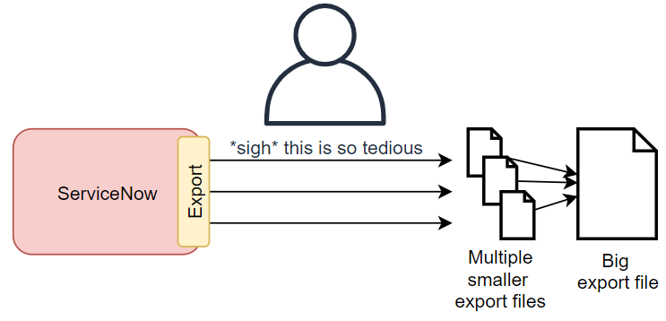
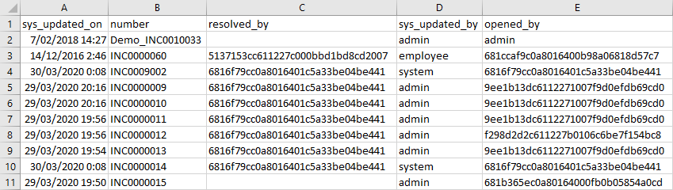
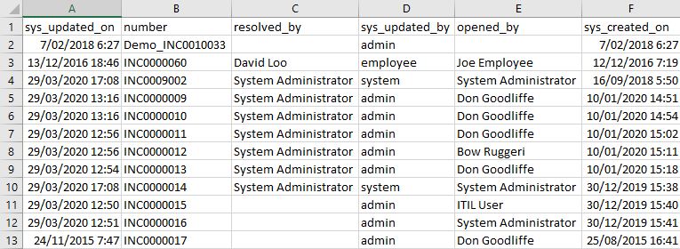

## The problem
I was working on a task that involved exporting all of the records from multiple ServiceNow tables for archiving in a data warehouse. Some of the tables had around **160,000 records** in there, they weren't small tables.

The issue was that the ServiceNow data exporting functionality had row limits, typically around 10,000 rows. If there is a lot of data and you're exporting using XLSX, then the limit may be even smaller, as ServiceNow limits the maximum file size for XLSX documents. For the tables with 160,000 records in it, that's 16 x 10,000 row CSV exports that I had to manually export by hand, and then combine everything into 1 file afterwards. The whole thing took me a few hours to do, and it felt like such a waste of time.

The old-fashioned and manual way was to:
1. Sort the table by sys_id.
1. Export the data, including the sys_id column.
    E.g. /incident.do?CSV&sysparm_query=ORDERBYsys_id
1. Wait for the export to finish downloading. Stand up, stretch your back, walk around the office, maybe grab a coffee.
1. Open the export and grab the sys_id from the last row.
1. Add a condition where "sys_id GREATER THAN (the last sys_id in the report)".
    E.g. /incident.do?CSV&sysparm_query=sys_id>bff3f8421b0de0908098caa9274bcb7dORDERBYsys_id
1. Export again.
1. Repeat until you've exported everything.
1. Manually combine all of the export files into a single file.

ServiceNow recommends this approach in ServiceNow Docs:
https://docs.servicenow.com/bundle/paris-platform-administration/page/administer/exporting-data/task/t_BreakUpALargeExport.html

[](manual-export-process.png)

There has to be an easier way, surely!

## The solution
As an alternative, ServiceNow recommended using the **Table API** to export large amounts of data.
https://support.servicenow.com/kb?id=kb_article_view&sysparm_article=KB0727636

In a nutshell, it's doing the same as above, but a script or program is doing the hard work of paginating through all of the results.

I've seen this approach used before in paid-for solutions, typically in migration tools or data warehousing connectors. These solutions costed money, which I didn't want to pay for just doing a once-off data export.

## Dave's ServiceNow Bulk Export Tool
I went home that night after work, put my thinking cap on, and banged out my own data export tool in a couple of hours: **DavesSNBulkDataExportTool**

https://github.com/towerofpower256/DavesSNBulkDataExportTool

Now if I need to do a large data export from ServiceNow, I've already done the hard work!

It does as ServiceNow recommends, and pulls data from ServiceNow in chunks of rows using the **Table API**, and outputs them all into a single output file. It's basically a wrapper that sits on top of the SN Table API.

It's a CLI tool written in Python so it's possible to use on **Windows**, **Linux**, and **Mac**. I decided not to go with a pretty GUI for further compatibility and fewer requirements to run the tool.

[](tool-export-process.png)

What took me hours to do be hand, took this tool **less than 10 mins**.

Here's the console output from a test run, exporting the incident table with 10 records per page, saving to a file called "output.csv".

```
> python .\davesSNBulkDataExportTool.py -n dev12345 -t incident -p 10 -a basic --basic-username admin --basic-password xxxxxx -o output.csv
INFO:SNDataExport:Running
INFO:SNDataExport:Instance URL: dev71826.service-now.com
INFO:SNDataExport:Exporting from table: incident
INFO:SNDataExport:Query: ORDERBYsys_id
INFO:SNDataExport:Output file: output.csv
INFO:SNDataExport:Page 1 offset 0 - 10
INFO:SNDataExport:Results: 10
INFO:SNDataExport:Getting page 2, offset 10 - 20
INFO:SNDataExport:Results: 10
INFO:SNDataExport:Getting page 3, offset 20 - 30
INFO:SNDataExport:Results: 10
INFO:SNDataExport:Getting page 4, offset 30 - 40
INFO:SNDataExport:Results: 10
INFO:SNDataExport:Getting page 5, offset 40 - 50
INFO:SNDataExport:Results: 10
INFO:SNDataExport:Getting page 6, offset 50 - 60
INFO:SNDataExport:Results: 10
INFO:SNDataExport:Getting page 7, offset 60 - 70
INFO:SNDataExport:Results: 10
INFO:SNDataExport:Getting page 8, offset 70 - 80
INFO:SNDataExport:Results: 4
INFO:SNDataExport:No more pages
INFO:SNDataExport:Finished!
INFO:SNDataExport:Execution time: 14.03s
```

The output file looks just like a CSV export.

[](sample-raw.png)

You can either keep the data as the raw values, or use display values instead to make it human readable.

[](sample-display.png)

Here's the current **help** message, as of 02/07/2021.

```
> python .\davesSNBulkDataExportTool.py --help 
usage: davesSNBulkDataExportTool.py [-h] [-v] [-p PAGESIZE] -t TABLE [-n INSTANCENAME] [-N INSTANCEURL] [-d] -o OUTPUTNAME
                                    [-a {none,basic}] [-q QUERY] [-l ROW_LIMIT] [-f FIELDS] [--basic-username BASIC_AUTH_USERNAME]       
                                    [--basic-password BASIC_AUTH_PASSWORD]

David McDonald's ServiceNow Bulk Data Export tool 2021. For exporting bulk amounts of data out of ServiceNow.

optional arguments:
  -h, --help            show this help message and exit
  -v, --verbose         Enable verbose logging.
  -p PAGESIZE, --pagesize PAGESIZE
                        Rows per page / request. Default: 500
  -t TABLE, --table TABLE
                        The ServiceNow table name to export from. E.g. 'incident'
  -n INSTANCENAME, --instance-name INSTANCENAME
                        The name of the ServiceNow instance. E.g. 'dev71826'
  -N INSTANCEURL, --instance-url INSTANCEURL
                        The hostname URL of the ServiceNow instance, if the instance has a custom URL. E.g. 'dev71826.custom-url.co.uk   
  -d, --display-value   Fetch displayvalues, instead of system values
  -o OUTPUTNAME, --output OUTPUTNAME
                        Name of the file to save the data to.
  -a {none,basic}, --auth-mode {none,basic}
                        Type of authentication. Default: none
  -q QUERY, --query QUERY
                        Query to use on the table when fetching data.
  -l ROW_LIMIT, --row-limit ROW_LIMIT
                        Limit how many rows to export
  -f FIELDS, --fields FIELDS
                        A comma-separated list of fields to include. Can dot-walk through reference fields (e.g. caller_id.email).       
                        Leave blank for all fields.
  --basic-username BASIC_AUTH_USERNAME
                        Basic authentication username.
  --basic-password BASIC_AUTH_PASSWORD
                        Basic authentication password.
```


### Improvements
* At the moment, it only works with data offered by the Table API. It'd be useful to be able to export attachments along with the rows.
* The code isn't my finest and could use some cleaning up and refining.
* At the moment it only supports either no authentication or basic (username and password). I may look into supporting OAuth later on.
* To get both the raw and the display value, you currently need to specify the fields you want. I'd like to allow it to naturally capture both the value and display value for a field.
