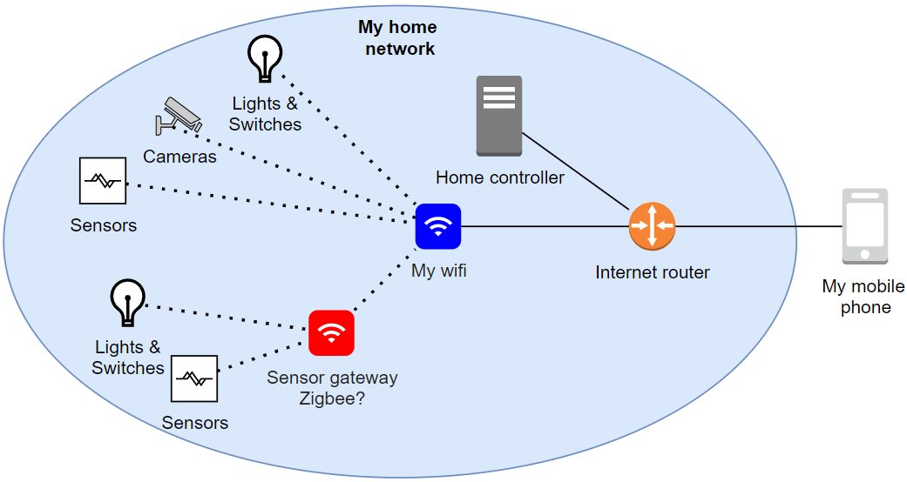
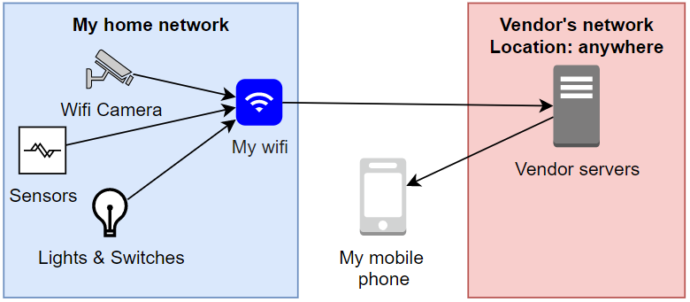
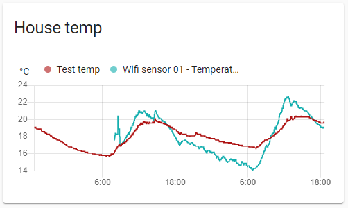

Over the last couple of years, I've been getting interested in hobby electronics. My main goal when I started was to be able to make a smart weather station where I could see all sorts of cool stats and trends about the weather, including temperature, pressure, rainfall, and humidity.

I've created a few electronics hobbies so far, such as:
* Flashing a smart power switch with a custom firmware.
* Building a Wifi thermometer.
* Building an NMEA reader for boat electronics.
* Joining the **Arduino** discord chat, and helping others with their electronics questions.

However, I feel like my ambitions need to start focusing in on something specific, instead of whimsically switching from project to project.

Over time, my interested has focused in on **smart home electronics**.

## The smart home dream
I'm going to try to implement a few of these smart home features where I can, and learn more about what works well and what doesn't. I'm currently living in an apartment and I won't be able to do everything, like replace power switches or install power sensors in the power box, but I want to do as much as I can.

I'll aim to do some blog articles about the journey, covering what I did and how I did it.

I like the idea of being able to:
* See what's going on around the house, even when you're out-and-about away from home.
* Collect historical data and create visual trends on that data, to see what I've missed, see how things are going, and see possible problems before they occur.

### The no-cloud challenge
The challenge I'm faced with is that any solution **must not use a vendor cloud**. There are 2 main reasons for this.

The first reason is that I want to own the data about my house and own the control of my house. I'm not comfortable with smart home devices sending information to servers in dark corners of the internet, owned by who-knows. There's a lot of devices out there that still "dial home" even if you set them to work offline.

The second reason is that there is likely to be multiple services for different devices.

* One for cameras.
* One for sensors.
* One for power switches.
* etc...

By using my own smart home controller, I don't have to have multiple phone apps and web pages to have to jump between to control things around the house.

The third reason is that I want the whole solution to work if the internet problems. In the future I'd like to own a property out of town with my own hobby garden and workshop. This means that the internet isn't always going to be reliable, and I don't want poor internet connectivity to bring the whole thing down.

This means:
* No cameras or sensors that send information back to a vendor.
* No reliance on vendor web services or mobile phone apps.
* All sensors and actuators must communicate to a central controller within the local network.
* Must be able to access the smart home controller from the internet, securely. VPN?

## The goals
### Sensors
I'd like to gather sensor data from around the house. This includes:
* Temperature sensors for the air, both inside and outside the house.
* Temperature sensors for the fridge / freezer.
* Power usage, to see how much power is being generated (solar, batteries), and how much power is being used for each circuit (lights, power points, air conditioners, etc).
* Temperature and power usage for the hot water system.
* Brewing gear (fermenter temperature, ambient air, airlock bubble rate, etc).
* When I live on a property, rain water tank level and outgoing flow rate.

I've already started to collect this sort of data and I find it very interesting, but I'd like to do more. Below is a comparison of the air temperature, inside (red) vs outside (blue).

### Security camera
I'd like to have a video camera setup with the aim of:
* Being able to view what's going on outside the house, or what the skies look like to see if it's raining at home.
* When I've got pets, it'd be good to see what they're up to and how they're going.
* Motion detection and security alerts (either IR motion or video motion) which can trigger events & actions, including taking a recording and sending an alert to me.
* Being able to capture videos when security events happen, to aid in police reports or post videos on the community Facebook group.
* Check if I've forgotten something at home. I'm guilty of forgetting to shut the garage door sometimes.

While **video** is the mail goal, it'd be good to capture **audio** as well.

Having a fully-featured intercom system with video and 2-way audio would be ideal, like a smart home doorbell intercom, but I consider it an optional luxury extra.

### Actuators
Actuators are real-world things that are controlled by the smart home, such as switches, motors, and lights.

I'll admit I'm apprehensive about having a computer being able to interact with my house and make real-world changes. I've worked and lived around computers long enough to know that they can fail, and they can be broken into. If that computer controller real-world things then that could cause some very real-world problems.

That said, I'd be interested in being able to control:
* Some lights around the house.
* Controlling the air conditioning, either via an IR blaster to pretend to be a remote control, or using a web API.
* Opening / closing the garage door. More closing than opening, because I forget to close the door sometimes.
* Controlling automated irrigation and plant watering.

### Not going to do
There are some smart home features that I'm not all that interested in implementing. This is mostly for security concerns, but sometimes for safety concerns.
* Smart door locks, this is a terrible idea.
* Smart oven control, risk of fire.
* Smart speakers.
* Voice control (Google Nest, Amazon Alexa, Apple Siri), it's a security risk and relies on internet connectivity.

## Configuring vs custom firmware vs building
Ideally, I'd like to find cost-friendly off-the-shelf products that are fit for the job. This would be idea in most circumstances, but sadly it's looking like this will be the exception rather than the norm.

Failing that, I've been having fun flashing custom firmware onto some devices. This has the benefit of well manufactured and certified hardware, and configurable and feature-rich software. I've been doing a little bit of this so far.

If there's nothing on the market that's fit for the job, I'll look at building my own. This should be avoided if possible, because my work isn't as good as a professionally designed product and take me time to create. That said, there are times that what I'm looking for is more unique that it's easier to just build it myself.

## The next steps
I've got some parts being delivered now, a security camera that I can flash, and a Zigbee gateway and thermometer. If those bits work well, then I'll write up a little bit about them, and continue the adventure to cooler and fancier things.

Stay tuned!