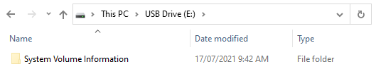
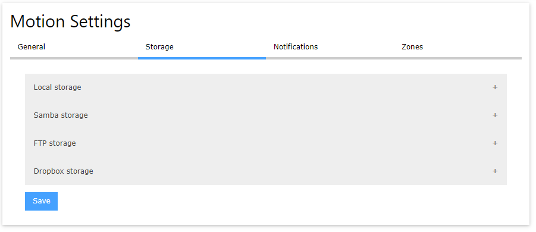
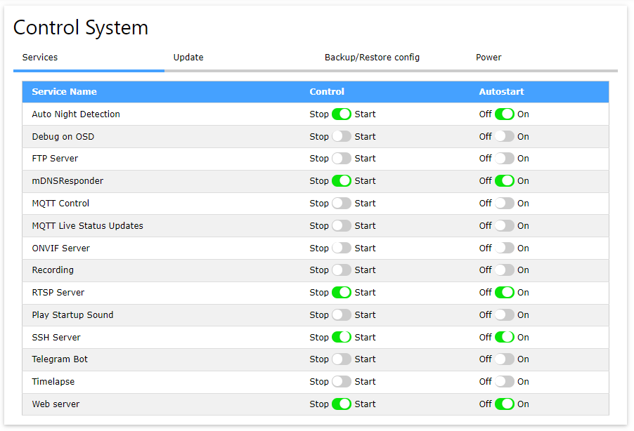

This is a part of my adventures with smart home tech. You can read about some of the goals I'm aiming here in this post.

[My Smart Home: The Dream](/posts/2021-07-04-smart-home-dream/)

# The Wyze Cam v2
[](wyze-cam-v2.jpg)

https://wyze.com/wyze-cam-v2.html

I picked up a Wyze Cam v2 from eBay for AUD$54.99. This camera came recommended by a the [Home Assistant reddit](https://www.reddit.com/r/homeassistant/), [Home Assistant Discord](https://discord.com/invite/home-assistant), and some other tech blogs around the internet. The camera's specs look like a very capable WiFi security camera, claiming:
* 1080p camera, 110 degree vision
* microphone
* WiFi connectivity
* motion detection (via video analysis)
* night vision up to 9 meters, with an IR-CUT filter, and four 850nm infrared LEDs
* magnetic base with swivel mount
* micro USB power input
* microSD card storage

# Custom firmware Xiaomi-Dafang-Hacks
Out of the box, this camera will want to use the **Wyze CAM** online cloud to deliver services. This won't meet my challenge of keeping all of my smart home tech within my own network and independant from the internet.

[](layout-vendor.png)

However, the main reason that I chose the Wyze Cam v2 is that it's easy to replace the firmware.

The custom firmware I'm going to go with is **Xiaomi-Dafang-Hacks**, a firmware made by security camera enthusiasts as a replacement for a number of WiFi cameras that use a T10/T20 embedded computer, including the Wyze Cam v2.

https://github.com/EliasKotlyar/Xiaomi-Dafang-Hacks

The firmware comes in 2 steps:
1. The bootloader is replaced with a modified bootloader which allows the entire firmware to be read from an SD card.
1. An SD card with the custom firmware stays inserted into the camera.

This approach of loading the firmware onto an SD card has the advantage of being able to revert back to the out-of-the-box firmware simply be removing the SD card and restarting the camera, which will detect that there's no SD card and load it's factory firmware. Cool, right?

## Installing the custom firmware on the Wyze Cam v2
I had some issues following the instructions on the project's GitHub. I'll list the steps that I followed to successfully get the custom firmware on the camera.

There's also a great video on the topic here, this video helped a lot.

https://www.youtube.com/watch?v=DD7mLfk_l9I

**Do not install the latest official firmware onto the camera!** The newer official firmware from Wyze patches out the method that you'll be using to replace the firmware.

### Ready the SD card
This process involves a microSD card. I had an old 2GB microSD card lying around from an old smart phone.

1. Download the official SD Card formatter tool, and wipe the SD card. **This part is important** and I couldn't get it working without doing this first.
 https://www.sdcard.org/downloads/formatter/
 **Do not do a "Quick format"**. Select "Overwrite format". Yes, it takes longer, but the microSD card needs to be squeaky clean to be recognised by the camera's firmware updater.
 [](SD-Card-Formatter.png)
1. Format the SD card as **FAT32**. Not NTFS, not exFAT, but FAT32.

### Install the CFW bootloader
First, install the CFW bootloader.
1. 
1. Download the CFW-Binary file for the Wyze Cam v2 from Github. This is the replacement bootloader that will let the camera run your own firmware from the SD card.
1. Open the SD card and make sure that it is absolutely empty. **Don't use a Windows computer for this**, see the notes below.
1. Copy the CFW-Binary file onto the SD card, and rename it to **"demo.bin"**. This name is important and must match exactly.
1. Safely remove the SD card from the computer.
1. Remove the power cable from the Wyze Cam v2, and insert the SD card into the camera. Make sure that it clicks in.
1. Hold down the "Setup" button on the camera, and keep holding this button down while, and...
1. Plug the power cable back into the camera to turn it on.
1. Keep holding the "Setup" button for about another 10 seconds.
1. The light on the back will go solid blue for about 15-30 seconds, and then turn yellow. Once the light turns yellow, the flashing process is complete.
 *The instructions on GitHub say to wait for about 3 minutes, but mine didn't take anywhere near that long.*
1. Remove the power cable from the camera, and remove the SD card.

#### Cleaning up after a failed attempt
It's important that the "demo.bin" file is the only file on the SD card.

Unfortunately, the factory firmware will automatically create some new files when it starts, including folders called "**record**" and "**time_lapse**". While the presence of these files doesn't mean that it failed, you will need to delete these files and folders between each attempt.

[](extra-files.png)

### Install the new firmware
Now it's time to load the new firmware onto the SD card.
1. Clone the repository from github. If you are on Windows download the repository as zip file. Make sure nothing gets windows line endings.
1. Copy everything from "firmware_mod" folder into the root of the microSD.
 **This step is very important!** Don't copy the "firmware_mod" folder onto the SD card, copy everything **in** the "firmware_mod" folder to the root of the SD card.
 If in doubt, there should be a file called "run.sh" at the very top of the SD card.
1. To setup the wifi, copy the file `/config/wpa_supplicant.conf.dist` to `/config/wpa_supplicant.conf` (without the `.dist`). Open the new file that you created, and update it to match your wifi network (should just need to change the SID / network name and the password).
 **Make sure that this does not use Windows-style line endings!**
1. Insert the SD card into the camera, and then connect the power cable.
1. You can now login at https://dafang or your cameras IP adress with the default credentials root/ismart12

If all went well, you should be able to see a web control panel for the camera, and a live feed from the camera on the main page.

[](homepage.png)

### Don't use Windows to add the CFW bootloader
The key to the bootloader being replaced is that the replacement bootloader needs to be the **only** thing on the SD Card.

Windows has a nasty habit of making itself at home, and creating extra files on storage devices, including SD cards and USB sticks. Most of this lives in the system hidden "**System Volume Information**" folder.

[](system-volume-information.png)

When it comes to copying the CFW bootloader onto the SD card, you should:
* Use a Mac or a Linux computer. If you only have Windows, download a Linux live CD or USB, and boot your computer into that temporary Linux OS.
 I like Lubuntu myself, a lightweight version of Ubuntu.
 Lubuntu: https://lubuntu.net/downloads/
 How to make a bootable Lubuntu USB stick: https://www.lifewire.com/try-lubuntu-16-04-windows-10-4037886
* Always delete every other file on the SD card. If Windows has created that "System Volume Information" folder on the SD card, delete it.

### Self-signed certificate
Although the firmware's web server uses secure connections over HTTPS, its security certificate is self-signed. This means that your web browser is going to complain about it almost every time you connect to it. This is OK, and is safe to ignore.

[](privacy-error.png)

## Connecting to the camera's serial debug interface
A lot of embedded devices these days are basically small computers that are running Linux, and these devices have little serial interfaces on them for debugging and reprogramming. 

I had some issues trying to install the firmware, and I wanted to see if I was doing the right thing. When I read about there being a serial interface, I wanted to try for myself. This actually helped a lot, and it told me that I was doing something wrong, which put me on the right track.

First, I opened up the camera, removing the 2 screws from the bottom, and *carefully* removed the base by wiggling it away from the camera. The base is held in by 2 clips on the side.

I did find this disassembly video helpful in opening it without breaking it.
https://www.youtube.com/watch?v=yYrLeWjRiqU

Once the bottom was removed, I spotted 3 little pins on the side of one of the boards. **Bingo.**

Although they weren't marked, I suspected that they were GND, TX, and RX. I didn't have an FTDI USB to serial adapter available, but I have plenty of spare Arduino's lying around which I know that I can use instead of an FTDI USB to serial adapter. 
* I grabbed an Arduino Nano and put it on a breadboard,
* preventing the Arduino itself from actually running by connecting RST to GND on the Arduino,
* and then connected the Arduino to the camera's serial pins.

I didn't know which PIN was which, so I guessed, and I guessed right on the first go. From the closest to the case, to the closest to the middle: **GND, RX, TX**

The baud rate was **115200**.

[](camera-serial-1.png)

[](camera-serial-2.png)

In the Arduino IDE serial monitor, I could see the messages from the camera as it booted up. This debugging was instrumental in resolving my issue, and told me exactly where I'd stuffed up.

[](arduino-serial-monitor.png)

Here's the serial output of the bootloader being updated with the CFW bootloader.

```
FWGRADEUP=FACTORY!!!!!!!!!!!!!
SD card is insert!!!
enable to use mmc 0:1 for fatls
Interface:  MMC
  Device 0: Vendor: Man 000003 Snr 7a3aff00 Rev: 0.0 Prod: SU02G⸮
            Type: Removable Hard Disk
            Capacity: 1938.5 MB = 1.8 GB (3970048 x 512)
Filesystem: FAT16 "NO NAME    "
file_fat_detectfs OK!!
reading factory_ZMC6tiIDQN
read factory_ZMC6tiIDQN sz -1 hdr 64
factory_ZMC6tiIDQN not found!!!
jiabo_do_auto_update!!!!!!!!!!!!!!!!!!!!!!!!
gpio_request lable = sdupgrade gpio = 46
setup_button set long!!!!!!!!!!!!!!!!!!!
Interface:  MMC
  Device 0: Vendor: Man 000003 Snr 7a3aff00 Rev: 0.0 Prod: SU02G⸮
            Type: Removable Hard Disk
            Capacity: 1938.5 MB = 1.8 GB (3970048 x 512)
Filesystem: FAT16 "NO NAME    "
the manufacturer 5e
SF: Detected ZB25VQ128

reading demo.bin <-- This is the important part
reading demo.bin
jiabo_au_check_cksum_valid!!!!!!!!!!!!!!!!!!!!!!!!
jiabo_idx=4
```

## The result
The end result shocked me with just how many settings were available. At a glance, it was going to fulfil my requirements, and more!

Is provided an RTSP stream that I could connect to from other devices, including VLC for testing.

Stream URL: rtsp://dafang:8554/unicast

I'm able to control the camera's settings.

[](camera-settings.png)

I'm able to control the motion detection, the sensitivity, what it does when motion is detected, and the zones that it'll watch for motion.

[](motion-basic-settings.png)

[](motion-storage-settings.png)

[](motion-notification-settings.png)

[](motion-zone-settings.png)

I could even control the services running on the camera. I felt like I could control almost everything about this camera now!

[](services-settings.png)

# Up next...
I'm going to try to integrate it into my smart home network and make it do some cool stuff. Stay tuned!