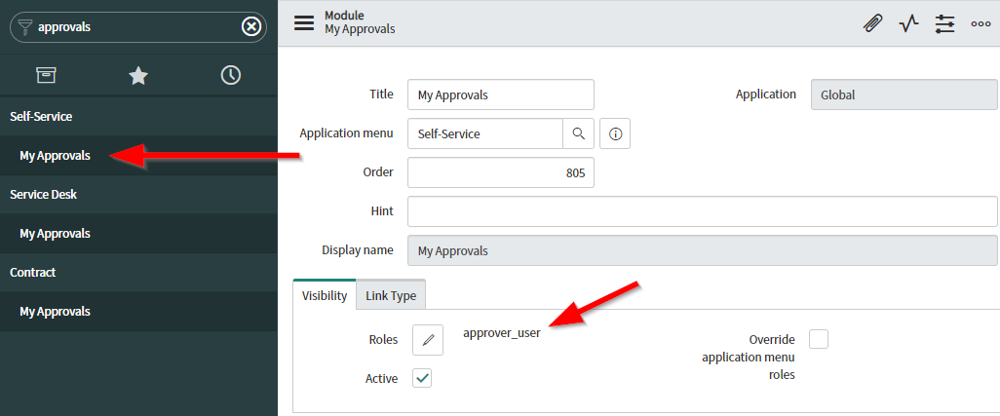
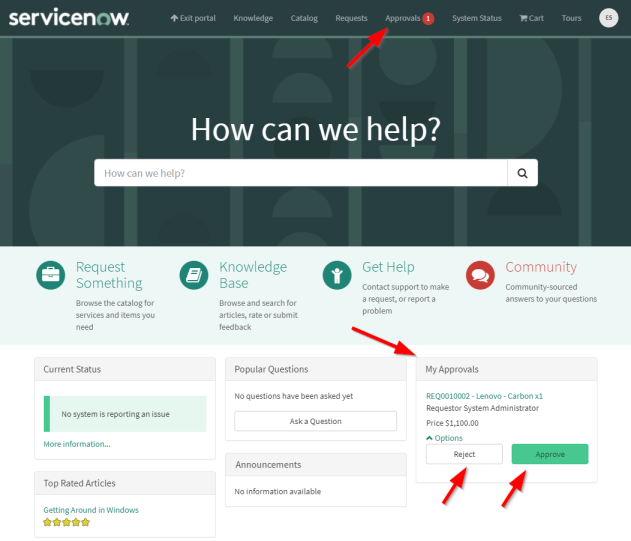
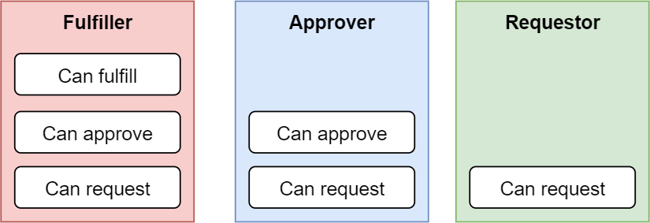
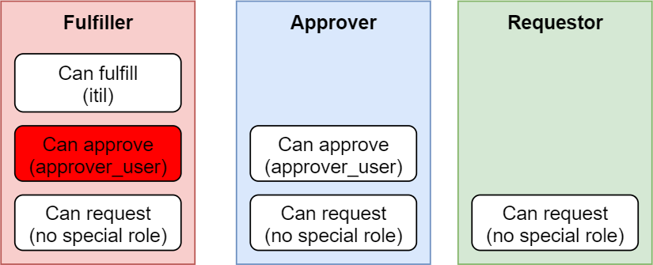
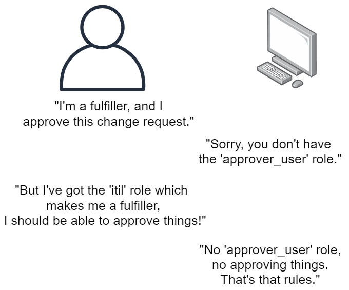
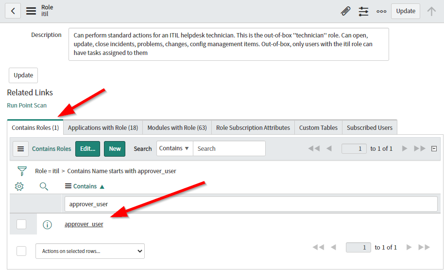

> **Disclaimer**
> This article touches on the topic of ServiceNow licensing, and should be taken as information from a technical standpoint only. ServiceNow licensing models can differ between subscriptions.
> 
> Always contact your ServiceNow account representitive for information about your licensing agreement.

# The problem
An issue I've recently run into is that there's a lot of approval functionality explicitly requires the user to have the '**approver_user**' role.

This includes approval menu items in the application navigator,

and service portal widget visibility & actions. The "Approvals" header menu and the "My Approvals" widget requires the user to have the "**approver_user**" role, and you cannot click the "Approve" or "Reject" buttons if you don't have the role.

For users that are marked as approvers and have the '**approver_user**' role, this isn't a problem. However, this is a problem for users licensed as **fulfillers** or other positions higher in the licensing food-chain, which should also be granted the ability to **approve** in the typical ServiceNow licensing model.

"Licensing" a user in ServiceNow is typically done by giving the ServiceNow user a role.
E.g. license a user as an approver by giving them the "approver_user" role.
E.g. license a user as an "ITSM Fulfiller" by giving them the "itil" role.
E.g. license a user as an "ITBM Worker" via "Release Management" by giving them the "rm_release_user" role.

Back in the day (last I checked in 2020), these roles for licenses which including the ability to approve included the role "**approver_user**", which meant that any user with a higher role would automatically be able to approve things within the ServiceNow platform.
E.g. giving a user the "itil" role would make the approval functionality appear in the service portal.

**However, this is no longer the case**. Users licensed as fulfillers and workers are no longer automatically receiving the "**approver_user**" role, and therefore have issues when they try to approve things. Sometimes, ServiceNow flat-out says "sorry, you're not an approver" when they actually are from a licensing standpoint.

I was very surprised when I found that "**approval_admin**" didn't include the "**approver_user**" role and couldn't easily approve things, that took me a moment to wrap my head around.

# The solution
The solution for this issue is fairly simple: add the "**approver_user**" role as an included role under any of the higher-licensed roles. E.g. the "itil" role.

This will ensure that higher-level licenses which include the ability to approve stuff are actually able to approve stuff within the ServiceNow platform.

I've confirmed with a ServiceNow customer representitive before doing this with a customer, and they confirmed that it wouldn't create any licensing problems or implications for the customer's ServiceNow subscription.

Roles that I'I've encountered so far that I'd recommend adding "**approver_user**":
* itil
* approval_admin
* change_manager

You'll likely find more in your own instance, depending on what applications and plugins you have installed.

> **Disclaimer**
>
> Always contact your ServiceNow account representitive for information about your licensing agreement before making changes that may impact licensing.
> 
> If you make this change, and you accidently over-subscribe on your licenses because your subscription doesn't allow this change, then that's on you.

# Why is this so?
I couldn't say for sure why roles don't include the "**approver_user**" role. 

My theory is that it's because there are now some very unique subscription agreements out there where fulfillers and workers **do not automatically get the ability to approve**, which would mean that the default stances of "give them the role automatically" wouldn't work in 100% of cases anymore, which would mean that automatically granting "**approver_user**" under fulfiller and worker roles would automatically over-subscribe the customer, so ServiceNow had to take it away by default.

I suspect that it also has something to do with the introduction of the **Business Stakeholder** level of license, which is similar to an **Approver** but a little different.