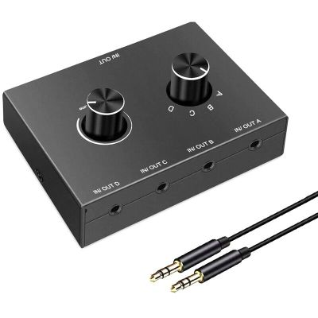

## The problem
At my home computer, I like to use speakers for sound, but I need to use headphones for when I'm using the microphone for either voice chat in games or video calls.

When I want to switch from speakers to headphones, I need to reach behind my computer, unplug something, and plug something back in.

This is a problem when an application is already running (e.g. a computer game), and plugging &amp; unplugging speakers kills all sound until the application is stopped and restarted, which takes time and is annoying.

## The solution
The idea I had was a relay or switch of sorts to be able to switch between audio outputs.

I could buy one from eBay for AUD$28.59, like one of these:

But I wanted to see if I could make my own!

I found some guides on the internet to build one.
* https://www.instructables.com/How-to-Construct-a-35mm-Switch-diy/
* https://www.instructables.com/DIY-Audio-Switch/
* https://www.instructables.com/Curiously-Small-Audio-Switch/

The idea is simple:
1. get 3x 3.5mm stereo chassis-mount audio jacks (1x for input, 2x for output)
1. and connect them to a 3PDT (3 pole, dual throw) switch.
1. Whack that in a hobby-box plastic case.

**Total cost from Jaycar: $15**

The final result works great! No static as far as I can tell, the sound quality sounds pretty good.

Only took me 2hrs to build, soldering and heat shrinking, I'm pretty proud of that.

