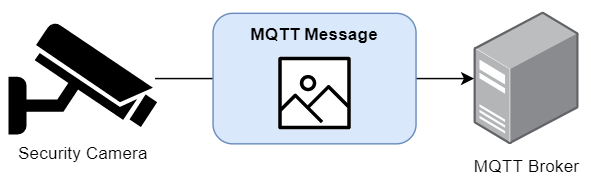

## What is MQTT?
MQTT is a protocol to send extremely lightweight publish / subscribe messages, typically used by IoT devices with a small footprint. Often, the messages won't contain much data at all, just a sensor value.

[](mqtt-diagram.jpg)

An example of a sensor publishing a message:

*"Hi broker. I am WifiSensor_01 and the current temperature is 26.4 degrees"*
```
myhome/wifisensor_01/sensor/temperature: 26.4
```

The messages are all sent to an **MQTT Broker**. Devices that want to receive those messages **subscribe** to MQTT messages via the broker.

An example of something subscribing to a message:

*"Hi broker. I am Home Assistant, and I want to be alerted when WifiSensor_01 publishes its temperature"*
```
SUBSCRIBE myhome/wifisensor_01/sensor/temperature
```

*"Hi broker. I am Home Assistant, and I want to be alerted when WifiSensor_01 publishes any of its sensors"*
```
SUBSCRIBE myhome/wifisensor_01/sensor/#
```

## The challenge
Most of the time, the MQTT message payloads are text, either a small block of text or a JSON payload of data. That said, it is possible for devices to send **files** in the MQTT message as a big block of binary data.

While I was playing around with a WiFi security camera, it was able to send **pictures** and **videos** over MQTT when motion was detected.

[](mqtt-with-picture.png)

The issue is that most MQTT clients have issues receiving MQTT messages that aren't text, and freak out when the payloads are binary or files.

## Solution - Python
I was able to write a quick little Python script that was able to subscribe to the MQTT messages, and then save the contents of those messages as binary files. The result was a success, and I was able capture & save both pictures and videos.

```py
import time
import paho.mqtt.client as paho

broker="192.168.29.200"
pic_topic="myhome/dafang/motion/snapshot/image"
pic_filename="D:/Dump/motion-snap.jpg"
vid_topic="myhome/dafang/motion/video"
vid_filename="D:/Dump/motion-vid.mp4"

def on_message(client, userdata, message):
    print("Receiving message")
    print(message.topic)
    if (message.topic == pic_topic):
        save_payload(message.payload, pic_filename)
    if (message.topic == vid_topic):
        save_payload(message.payload, vid_filename)

def save_payload(payload, filename):
    print("Saving file: "+filename)
    f=open(filename, "wb") # 'w' for 'write', 'b' for 'write as binary, not text'
    f.write(payload)
    f.close()

print("Starting")
c=paho.Client("")
c.connect(broker)
c.subscribe(pic_topic)
c.subscribe(vid_topic)
c.on_message = on_message
c.loop_forever()
```

***Success!***

## Failed attempt 1 - MQTTX
I attempted to capture the messages using the MQTTX application.

https://mqttx.app/

This didn't work that well. The application wanted to treat the message as a string, which mangled the binary bytes and corrupted the files. Also, the app didn't have the ability to save the payload as a file, only view it as text within the app.

In fact, the large payload size of the video message actually jammed and froze the application. Ha!

(screenshot of the payloads in the app)

## Failed attempt 2 - MQTT Explorer
Next, I attempted to capture the messages using the MQTT Explorer application. This tool was highly recommended by a few different people on the internet.

http://mqtt-explorer.com/

Sadly, this had the same issues with MQTTX, which wanted to treat the payload as text and mangled the binary payload.

MQTT Explorer didn't crash with the payload size, but it still couldn't save the payloads as a file.

(screenshot of the payloads in the app)

## Failed attempt 3 - command line tool 'mosquitto_sub'
Next, I figured I'd be able to use a command line tool to subscribe and capture the payload, and then simply pipe that out to a file. Sounds simple, right?

`mosquitto_sub` comes with the Mosquitto application.
https://mosquitto.org/

Sadly, this failed as well. Piping in Windows CMD and PowerShell treats the piped data as text, which mangles the binary payload. Same issue as the previous attempts.

```ps
.\mosquitto_sub.exe -h 192.168.29.200 -p 1883 -C 1 -t "myhome/dafang/motion/snapshot/image" >> D:\Dump\motion-snapshot.jpg
```

(screenshot of file contents, mangled)

In future, I might explore a suggestion on Stack Overflow to use the PowerShell `System.IO.BinaryWriter` and `System.Diagnostics.ProcessStartInfo ` recommended here:

https://stackoverflow.com/questions/24708859/output-binary-data-on-powershell-pipeline