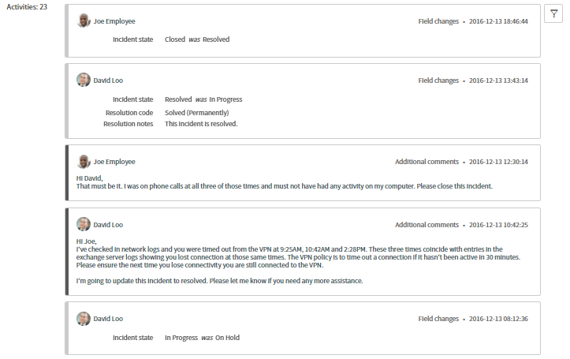
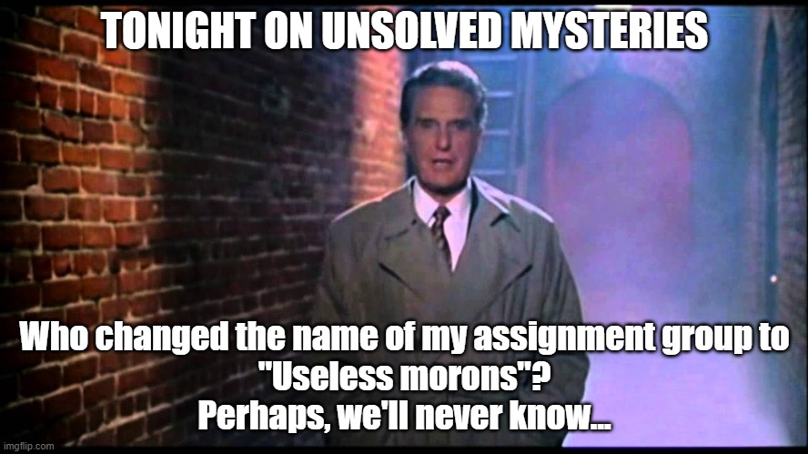
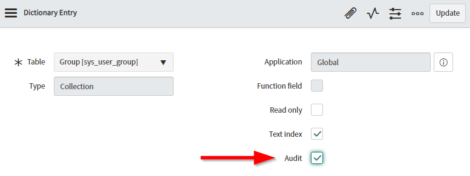
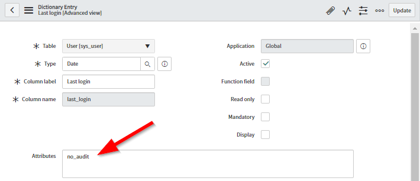
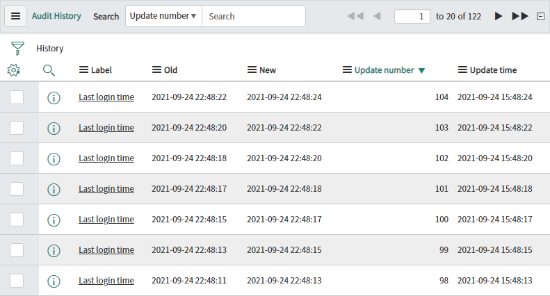

## Auditing and history in ServiceNow
ServiceNow has a very useful feature which allows changes to something to be recorded, and users can go through the history of a record to see:
* What was changed
* When it was changed
* What it changed from
* What it was changed to
* Who changed it

https://docs.servicenow.com/bundle/rome-platform-administration/page/administer/time/concept/audited-tables-2.html

This comes in handy in a lot of situations, but more commonly:
* **Review**
 "I've started looking at this job, what's its history?"
* **Investigate**
 "Something that should not have been changed has been changed and I need to know more."
 "There is unusual behavior, but the current data shouldn't have caused it. What was the data previously?"

That Investigate one comes up fairly often, and I'll be focusing on it here. If someone changes something that has broken something or is causing unusual behavior in ServiceNow, its useful to be able to go through its history to see what's happened.

## The problem
While auditing is enabled for pretty much every task table (e.g. requests, incidents, changes, etc), there are some tables that **do not have auditing enabled by default**, and auditing would be amazingly useful on these tables.

I've lost count of the times a customer has asked *"who changed this field on this user?"* and I can only shrug and say "I guess we'll never know".

ServiceNow always remembers **that last time a record was touched**, but that basic information will be overwritten and logs if it's touched again.

## The solution
I highly recommend enabling auditing on the following out-of-the-box tables. These tables don't have auditing enabled by default, but I can guarantee that ServiceNow administrators will be asked check historical data in these tables.
* User (sys_user)
 Exclude frequently changing fields, like "Last logon" and "Last seen in LDAP" if you've got it. See below.
* Group (sys_user_group)
* Department (cmn_department)
* Location (cmn_location)
* Company (core_company)
* Cost Center (cmn_cost_center)

You can do this by opening the **Dictionary (sys_dictionary)** entry for the **table** (not any of the fields, the one with the type of "collection"), checking the "Audit table" checkbox, then saving.

After that, any changes on data in that table will be audited, and you'll look like a capable champion whenever management asks "who touched that?".

### Excluding frequently changed fields
It's critically important that you also exclude frequently changing and inconsequential fields from being audited. This is typically fields on the **User (sys_user)** table such as:
	• User (sys_user) "Last logon" (updated every time the user logs into ServiceNow)
	• User (sys_user) "Last seen in LDAP" (if you have it, it will be updated every time the LDAP user sync runs). 
	• Group (sys_user_group) "Last seen in LDAP (if you have it, it will be updated every time the LDAP group sync runs).

Auditing these fields aren't important anyway, you'll typically only care about when they last logged in instead of a running history of when they last logged in (which can be fetched from elsewhere much more efficiently).

You can exclude a field from being auditing by opening the **Dictionary (sys_dictionary)** entry for that field and add the **dictionary attribute "no_audit"**.

If you don't exclude them from auditing then the audit log will get very large very quickly, introducing performance issues and difficulty reviewing a records history. Below is an example history list of a user where the **"Last login time"** was not excluded from auditing.

