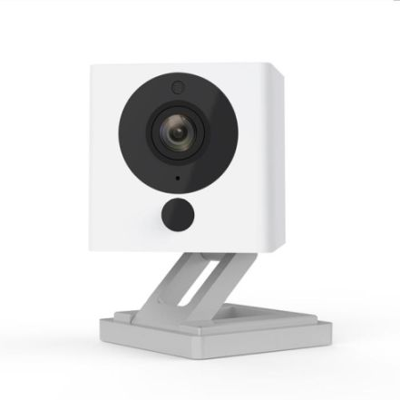
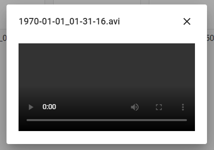
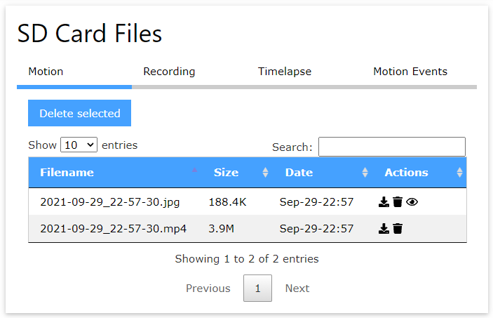
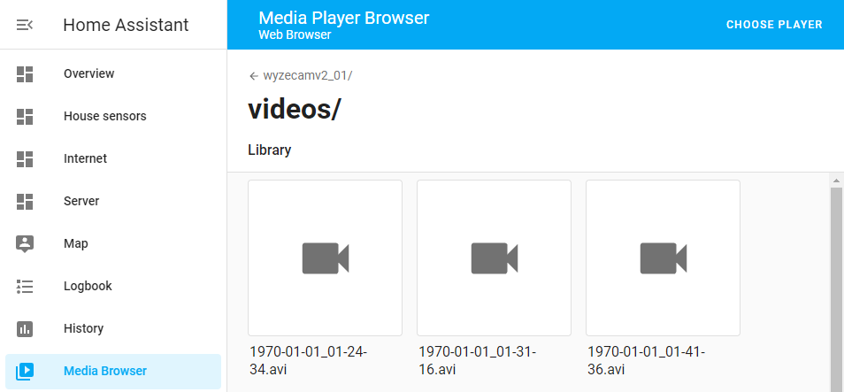
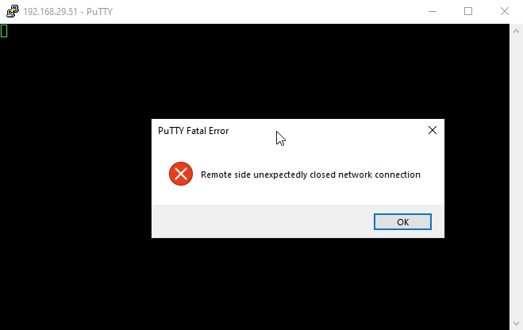
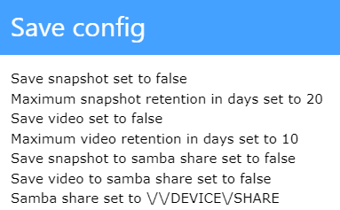
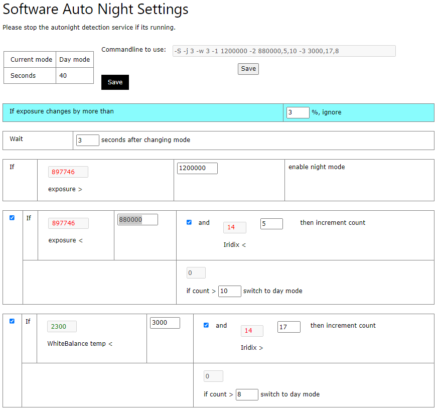

## To recap
I picked up a Wyze Cam v2 back in June 2021 with the hopes of achieving these goals as part of my smart home project. This camera came recommended by a the Home Assistant reddit, Home Assistant Discord, and some other tech blogs around the internet. 

[](wyze-cam-v2.jpg)

The camera's specs look like a very capable WiFi security camera, claiming:
* 1080p camera, 110 degree vision
* Microphone
* WiFi connectivity
* motion detection (via video analysis)
* night vision up to 9 meters, with an IR-CUT filter, and four 850nm infrared LEDs
* magnetic base with swivel mount
* micro USB power input
* microSD card storage

Out of the box, this camera will want to use the Wyze CAM online cloud to deliver services. This won't meet my challenge of keeping all of my smart home tech within my own network and independent from the internet.

However, the main reason that I chose the Wyze Cam v2 is that it's easy to replace the firmware.

The custom firmware I'm going to go with is Xiaomi-Dafang-Hacks, a firmware made by security camera enthusiasts as a replacement for a number of WiFi cameras that use a T10/T20 embedded computer, including the Wyze Cam v2.

I've written an article on how I replaced the camera's firmware here: 
https://davidmac.pro/posts/2021-07-06-wyzecamv2-1-firmware/

I've had some time to play around with the camera & the Dafang-Hacks custom firmware. There are some things I like and worked well, and there are some things that either didn't work well or I didn't much like.

I'm still not giving up on the camera, I'm going to keep doing my best to make it do what I need it to do. It's education for me as well, and I like that.

## Things I like
### Customisability
In a closed-box product, if something isn't working how you want it to, then you're stuck and there's nothing you can do.

But with the new firmware, I can jump in and play with its internal workings, something I couldn't do before.

I wanted to change how the camera handled motion detection, and I was able to modify the motion detection scripts as much as I liked. That was a big win in my books!

### It's just like a Linux computer
I do like the fact that it's now an open Linux machine, just like a computer.

This allows for all sorts of features to be added to the camera that weren't available before, including:
* FTP server
* SSH server
* ONFIV server, to interact with the camera over ONFIV
* Viewing system logs to help with debugging
* Sound shenanigans using the camera's speaker
* Auto firmware updates from GitHub, either the official or use your own repo

### No vendor cloud requirement
The new firmware doesn't talk back to a vendor cloud solution without me knowing, which is fantastic and meets my "no vendor cloud" challenge of keeping everything within my own network. Woo hoo!

The camera integrates to the rest of the network in ways that are standardised and commonplace:
* The camera provides a standard RTSP video stream so anything on the network can stream the video from it in a standard and non-proprietary way.
* It's also able to take records and push them to remote storage via FTP, Samba, Dropbox, and MQTT. 
* Event alerts like motion detection can be sent over MQTT, email, Telegram, or Matrix.

## Issues and dislikes
### Camera stream has no sound in Home Assistant
This is more of a shortcoming of Home Assistant than the camera, but it's worth mentioning.

I can open the camera's RTSP stream using VLC, and I get both video and sound.

However, if I open the camera in Home Assistant, I get video but no sound.

It turns out that Home Assistant uses a proxy-like feature to forward the video stream from the camera through to the user, but Home Assistant is a poor substitute for a DVR and doesn't support all features for cameras. This includes most camera audio codecs.

I'm still investigating this one, I'm hoping to be able to use MotionEye (a Linux-based DVR solution) to handle the camera connections and to support both video and sound.

### Video recordings don't work in Chrome or Edge
The issue I'm having here is that I can't open the video recording files made by the camera in Chrome or Edge. This is a big problem for the Home Assistant app on my Android phone which uses the phone's system browser to view things.

When I try, the player doesn't want to load the video.

[](chrome-video-not-loading.png)

The root cause appears to be that the videos are recorded using the T20 chip's internal hardware video encoder which uses MPEG H.264, which Chrome dropped support for. It works in Firefox which does support H.264 videos, but the Home Assistant Android app uses the phone's Chromium app, not Firefox.

I made this GitHub issue for it here.
https://github.com/EliasKotlyar/Xiaomi-Dafang-Hacks/issues/1770

Work-arounds include:
* Including FFMPEG built for MIPS (the camera's CPU architecture) and use that to somehow re-encode the video file into something that works with Chrome. Not sure how intensive this would be for the underpowered camera.
* Copy the video recordings from the camera to a folder on a file server, and set up a regularly running job to check that folder and use FFMPEG to re-encode the video file into something that works with Chrome.
* Don't do recordings on the camera. Use something like MotionEye on a server somewhere which records from the camera over RTSP and saves the video in whatever format you like.

### Issue downloading files from the camera
You're able to download files from the web control panel, such as recordings, photos, and config backups.

[](dafang-file-browser.png)

However, I kept running into an issue downloading files after already downloading a file. Chrome says "Failed - Network error".

[](chrome-download-error.png)

Viewing images within the browser works just fine, however this doesn't help with video files which cannot be viewed from the browser and must be downloaded.

Reloading the page seemed to fix the issue for me. Maybe it's something to do with a connection that doesn't close properly and interferes with any new connections?

### File browsing in the web GUI is slow
From the web control panel, you're able to browse videos and still images taken by the camera that are stored on the SD card.

However, browsing through lists of these files can be very slow, especially if there's a lot of files.

It can take up to **20 seconds** to move between each page of files, which gets tedious very quickly. If I wanted to get to page 5, I'd have to wait a full minute (60 seconds) or so.

I suspect the solution to this is to not use the camera as the main storage for videos and still images. Instead, they should be pushed to a central location, like the Home Assistant server which has a pretty good media browser plugin.

[](home-assistant-media-browser.png)

### Odd behaviour if the SD card runs out of space
The firmware starts to behave a odd if the SD card runs out of space. I've noticed:
* issues connecting to the camera over SSH
* issues downloading media files

This one is simple to fix, just make more room on the SD card, likely by deleting saved videos or pictures. However, it's unfortunate that it silently suffers instead of a big giant **"I have run out of space and I need that to be fixed"** warning message being shown to the user.

### SSH server issues
I'm finding that sometimes I can't connect to the camera over SSH.

When I try to use PuTTY to connect to it, I get the error message **"Remote side unexpectedly closed network connection"**.

[](putty-ssh-error.png)

Trying to use the `ssh` command in PowerShell just hangs and does nothing.

Restarting the SSH service from the web control panel doesn't fix the issue, rebooting the camera from the web control panel doesn't fix the issue either.

However, the issue fixes itself if I power cycle the camera. 

**This issue can also be caused by the SD card running out of space.**

I'm wondering if the file download issue is somehow connected? Both suggest that connections are being established, but the connections are behaving erratically. Maybe some sort of buffer or data stream gets jammed somehow? Perhaps, I'll never know.

### Corrupted configuration files
When you change an option in the web control panel, what it's actually doing is editing the configuration files in the `/system/sdcard/config/` directory. These configuration files are simple key/value text files. Below is a sample from `motion.config`.

```
# Configure how to deal with motion events:

motion_trigger_led=true
publish_mqtt_message=true
publish_mqtt_snapshot=false
publish_mqtt_video=false
send_email=false
send_telegram=false
telegram_alert_type=image
send_matrix=false
night_mode_event_delay=30
```

However, I've found that the way that the web control panel updates these configuration files isn't 100% reliable, and can sometimes mangle, corrupt, or damage the configuration files.

Issues I've experienced after saving changes in the web control panel:
* One issue I had was that the camera wouldn't work at all. The device was working, and I could see the web control panel, but it couldn't find the camera device. Reinstalling the firmware onto the SD card fixed the issue.
 [](camera-wouldnt-camera.jpg)

* Saving the motion detection settings for saving recordings to a Samba server didn't like backslashes, and motion detection functionality stopped working after saving. Undoing the change manually via SSH fixed the issue.
 [](config-file-save-web.png)

**Top tip:** make a backup of the default configuration so that you can revert back to it if you have any issues. Otherwise, you'll have to re-copy the firmware onto the SD card.

### Can't edit configuration files from the web control panel
Sometimes I'd recommend just editing the configuration files directly, because:
* As mentioned, sometimes the web control panel can damage the configuration files.
* There are some options that you can get to in the file itself, but aren't available from the web control panel.

While it's possible to connect to the camera over SSH and make the changes directly:
* You have to use `vi`, which is not user friendly.
* Doesn't work if there's issues with the SSH server.
* You don't have access to either an SSH client on your computer or don't have network access to the camera's SSH address/port.

It would be nice to be able to directly edit these configuration files within the web control panel. I might have a go at trying to implement it myself.

### Saving videos over FTP isn't a video
For some reason, the motion detection script that creates a video and uploads it to an FTP server uses a different method of creating the video. Instead of tapping into the RTSP stream and creating a video, it takes snapshots every 1 second and stitches the images together into a video.

Why? Why is it done this way for FTP but not for Samba or Dropbox?

### Issue with Samba configuration there, but can't do Samba
When motion is detected by the camera, it can be set up to make a short video recording and then upload it somewhere.

While configuration is there in the web control panel to upload video recordings to a samba server / a Windows file share, the `smbclient` binary is missing from the firmware, which means that it will never work.

It looks like the `smbclient` was originally there but it was removed for security reasons. There's been some effort made to try to compile the latest `smbclient` binary into MIPS (the camera's T20 CPU architecture) but no success just yet.

The workaround for this would be to do the recording from outside the camera. It's not ideal though, because the external recording solution might be too late to pick up on motion.
If an intruder is detected and it takes 5 seconds to start recording, they could've gone around a corner and left the camera's sight by then.

### Issues with night mode detection 
The camera has a "night mode" where it turns on a sort of night vision using infrared LEDs and an infrared cut-off lens. That part works pretty damn well.

Dafang uses a service to regularly check the camera's image and determine whether night mode should be turned on or off.

[](night-mode-settings.png)

The default out-of-the-box configuration for this isn't great.

Initially I had an issue where the camera would turn night mode on and off every 5 seconds or so. This was caused by the threshold to turn it off would be met, but it would overlap with the threshold to turn it back on, and it would be stuck in an endless cycle.

I've been tweaking the configuration, and it is much better, but it needs some work.

I changed the configuration to switch from night mode to day mode:
* Exposure from "950,000" to "880,000" or "800,000"

## Conclusion
While the custom Dafang-Hacks firmware for the Wyze Cam v2 isn't perfect, it grants flexibility that I didn't have before which I feel outweighs some of the challenges I've faced.

Because if its flexibility, challenges with the custom firmware can typically be overcome by trying an alternative approach, whereas I'd be stuck with issues that I couldn't move around if I was still using the stock firmware.

I'll keep working with the camera in my spare time to reach a solution that works well. My goal is still to use the camera for security: to capture images and videos of intruders and to receive alerts when motion is detected. I believe that this goal is still achievable.

This has been an education adventure for me which I've enjoyed for the most part, and I'm learning a lot about embedded device firmware which has been fun.