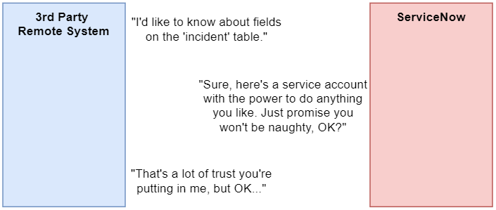

I stumbled across some excellent ServiceNow APIs, but I couldn't find much information about them so I wanted to share what I've found.

## The problem
In some previous integrations I've worked on, an external system that wanted to know about tables, fields, or field choices in ServiceNow wanted to use the Table API to pull data from some sensitive system configuration tables, including:
* Field definitions (sys_dictionary)
* Tables (sys_db_object)
* Choice field choices (sys_choice)
* Field labels (sys_documentation)

This brings up some very significant security concerns. Without changing any ACLs, **you need to give the integration user the 'admin' role**, which is the metaphorical keys to the castle. This is not good.

[](keys-to-castle-diagram.png)

If you're not comfortable granting the integration user the **'admin'** role, but still want them to be able to **read** data from those sys_ tables, then you have to make a lot of ACL changes which is a huge pain in the butt.

This isn't a big problem to grant the user the **'admin'** role if it's a data warehouse / data lake integration that is copying data from ServiceNow to an external data storage location. It's typical to prevent that integration from being able to make any changes by giving the integration use the **'snc_read_only'** role along with **'admin'**, so there's no risk of the integration breaking anything.

## The solution - meta and schema APIs
A safe alternative is to use the **meta** and **schema** APIs to get this information.
Both APIs are used by the platform interface (a.k.a the back-end, the normal one) all the time, such as populating the list filter menus with fields and conditions.

Endpoints:
```
GET /api/now/ui/meta/{tablename}

GET /api/now/doc/table/schema
```

Although the APIs are not documented, they are an API created and supported by ServiceNow, and are a much more reliable alternative to allowing access to sensitive configuration tables, or granting an integration user the **'admin'** role.
The API's don't appear in either the ServiceNow Developer documentation, or in the ServiceNow REST API explorer.

I found them while fixing a fault in ServiceNow. A plugin activation broke some ACLs and blocked all access to the **meta** API, which mande it  impossible to filter lists anymore because the list condition builder couldn't get all of the table's fields.
It looks like the ServiceNow data connector available in Azure uses them as well to get information about tables and fields.

The API's appear to allow basic authentication and doesn't require SSO authentication in SSO authenticated instances, which works well for integration users. I haven't had the chance to test with an OAuth user.

### Schema
This API returns a list of all available tables in ServiceNow.

Endpoint:
```
GET /api/now/doc/table/schema
```

I don't believe there are any other parameters available.

This API honours configuration and security restrictions, and will not include any tables that the user is not able to access.
E.g. if the user cannot open a list of the "Group members" (sys_user_grmember), then that table will not be included in the results from this API.

Each entry is rather flat, and follows the below structure. The important properties are "label", and "value". 
The "image" property would be relevant for table that have an image associated to it, typically a CI class.
The rest aren't relevant for normal tables, but may be relevant for special tables like external tables or database views.

```json
{
  "result": [
    {
      "label": "Incident",
      "used": false,
      "reference": false,
      "rawLabel": "Incident",
      "selected": false,
      "missing": false,
      "image": "",
      "value": "incident"
    }
    // more results here
  ]
}
```

### Meta
This API returns a list of all available elements / fields on a table in ServiceNow, as well as other useful details about them, including:
* reference field and auto-complete configuration
* available choices for a choice field

Endpoint:
```
GET /api/now/ui/meta/{tablename}
```

The only parameter there is the **{tablename}**, replace this with the name of the table that you want to get the fields for.

This API honours configuration and security restrictions, and will not include any fields that either the user is not able to access, or elements that are otherwise not active.
E.g. a field will not be included if the user doesn't have **read** access to that field.

Below is a sample response payload for the **incident** table, with a couple of different examples:
* a string field
* a choice field
* a reference field
```json
{
  "result": {
    "columns": {
      "number": {
        "filterable": true,
        "canmatch": true,
        "cangroup": true,
        "label": "Number",
        "type": "string",
        "max_unit": "days",
        "mandatory": false,
        "default": "",
        "base_type": "string",
        "read_only": false,
        "hint": "",
        "name": "number",
        "attributes": "edge_encryption_enabled=true,ignore_filter_on_new=true,ts_weight=50",
        "column_type": "element",
        "internal_type": "string",
        "cansort": true,
        "max_length": 40
      },

      "priority": {
        "filterable": true,
        "canmatch": true,
        "cangroup": true,
        "label": "Priority",
        "type": "choice",
        "max_unit": "days",
        "mandatory": false,
        "default": "",
        "base_type": "string",
        "read_only": false,
        "hint": "Sequence in which an Incident or Problem needs to be resolved, based on impact and urgency",
        "name": "priority",
        "choice_type": 1,
        "column_type": "element",
        "choices": [
          {
            "label": "-- None --",
            "used": false,
            "reference": false,
            "rawLabel": "-- None --",
            "selected": false,
            "missing": false,
            "image": "",
            "value": ""
          },
          {
            "label": "1 - Major",
            "used": false,
            "reference": false,
            "rawLabel": "1 - Major",
            "selected": false,
            "missing": false,
            "image": "",
            "value": "1",
            "parameters": {
              "name": "incident"
            }
          },
          {
            "label": "2 - High",
            "used": false,
            "reference": false,
            "rawLabel": "2 - High",
            "selected": false,
            "missing": false,
            "image": "",
            "value": "2",
            "parameters": {
              "name": "incident"
            }
          },
          {
            "label": "3 - Medium",
            "used": false,
            "reference": false,
            "rawLabel": "3 - Medium",
            "selected": false,
            "missing": false,
            "image": "",
            "value": "3",
            "parameters": {
              "name": "incident"
            }
          },
          {
            "label": "4 - Low",
            "used": false,
            "reference": false,
            "rawLabel": "4 - Low",
            "selected": false,
            "missing": false,
            "image": "",
            "value": "4",
            "parameters": {
              "name": "incident"
            }
          }
        ],
        "internal_type": "integer",
        "cansort": true,
        "max_length": 40
      },

      "caller_id": {
        "filterable": true,
        "reference_display_field": "name",
        "reference_attributes": {
          "display_field": "name",
          "ref_ac_columns": [
            "email",
            "user_name"
          ],
          "ref_ac_columns_search": "true",
          "ref_ac_display_value": true,
          "ref_auto_completer": "AJAXTableCompleter"
        },
        "canmatch": true,
        "cangroup": true,
        "label": "Caller",
        "type": "reference",
        "max_unit": "days",
        "mandatory": true,
        "reference": "sys_user",
        "default": "",
        "base_type": "GUID",
        "read_only": false,
        "hint": "Person who reported or is affected by this incident",
        "name": "caller_id",
        "attributes": "edge_encryption_enabled=true,encode_utf8=false,ref_ac_columns=email;user_name,ref_auto_completer=AJAXTableCompleter,ref_contributions=user_show_incidents",
        "column_type": "element",
        "internal_type": "reference",
        "cansort": true,
        "max_length": 32
      },
    }
  }
}
```