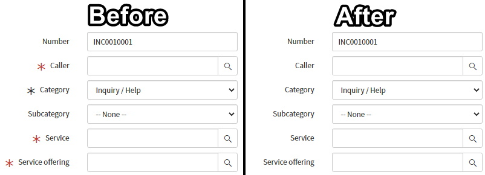
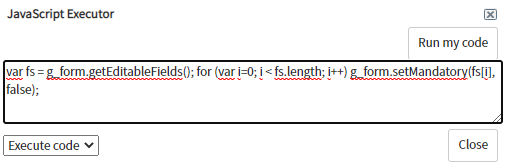
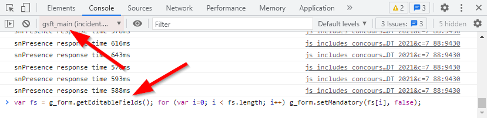

> **Warning** Do not use this to circumvent or get around a legitimate process. It is a hammer that should be used like a scalpel. Don't be "that person".

## The script
Here's a client-side script that will remove any mandatory restrictions from a ServiceNow form open in your web browser. I've found it useful during testing or working through an issue where mandatory fields just get in the way.
*"I know what I'm doing, just let me through."*

```js
var fs = g_form.getEditableFields(); for (var i=0; i < fs.length; i++) g_form.setMandatory(fs[i], false);
```

This client-side script loops through all fields on the form and makes them all optional and not mandatory. It's that simple.

This script only works in the back-end / platform UI, and doesn't work in the service portal. I haven't tried it in an agent workspace.

[](screenshot-in-effect.jpg)

To use this script in the ServiceNow Javascript Executor window ('admin' users only):
1. press Ctrl+Shift+J to open the window,
1. copy & paste the script in,
1. click on "Run my code".

[](sn-javascript-executor.png)

To use this script in your web browser's developer console (e.g. Chrome, Edge, Firefox, etc):
1. open the developer tools (press F12 in Chrome in Windows),
1. open the "Console" table / panel,
1. ensure that the console's Javascript Contex is set to "gsft_main" (because the form loads in an IFrame in the platform UI),
1. copy & paste the script in,
1. press ENTER

[](chrome-dev-console.png)

## Thoughts on security
This is a great example of why you shouldn't rely on security enforced by the client-side or on the browser. Don't think that a field cannot be changed because a UI policy makes it read-only, this can be undone and circumvented by anyone who wants to run their own code. ACL's are enforced server-side, no matter what the client-side wants to say about it, and should always be used for security instead of client-side functionality.