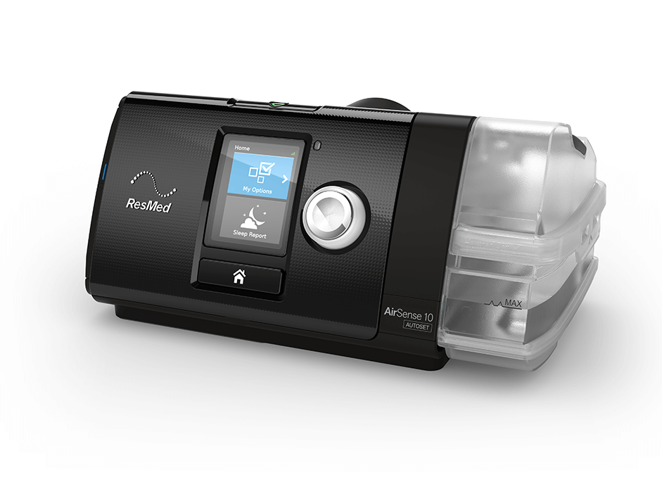

## Background
I enjoy going camping, but I also have sleep apnea which means that I have to sleep with a medical device called a CPAP so that I don't snore. I have a ResMed Airsense S10, a very popular model of CPAP.

Usually I'll go camping with my big 105Ah battery and in a generic battery box. This works great, and I can get about 2-4 nights of sleeping with the CPAP. The battery box also has USB power sockets so I can charge my phone while I sleep.

I use the 12v power supply to power my CPAP from the battery, instead of using an alternator. This saves power by going from DC to DC, instead of converting from DC to AC, then back to DC.

Using a 120W portable solar panel blanket to recharge the battery during the day, the solar blanket during the day can recharge more than a night's sleep worth of CPAP power, and I can camp indefinately.

## The challenge
I signed up to a beach camping tour where everything is provided for me, including camp sites, tents, and transport. The camp sites didn't include any power, so I'd have to provide my own power for my CPAP.

While the 105Ah battery and battery box work great, it's not portable. At around 30kg and plastic handles that dig into your fingers, you don't want to be carrying it all day at the beach. This is fine when I'm driving and I can carry it in my own car, but not when I want something more portable.

ResMed sell a lithium-ion battery pack for for Airsense S10 devices, but it costs around **$450-$550 AUD**, has a capacity of only 97Wh, and a lot of people complain about only lasting a couple of hours.

ResMed provide a power usage guide for powering their CPAP devices from batteries, link below:

https://document.resmed.com/documents/articles/198103_battery-guide_glo_eng.pdf

## The solution
I put together a simple and portable battery box using simple parts.

| This portable battery box | My big battery box | ResMed power station II |
|---|---|---|
| $112.45 | $300 | $450-$550 |
| 7kg | 30kg | 2.3kg |
| 18Ah (216Wh) | 105Ah (1,260Wh) | 97Wh |

Materials:
* A 12v 18Ah SLA battery ($79 Jaycar)
* A plastic tool box ($8 Kmart)
* 1m of red & 1m of black power cable ($4 Jaycar)
* A battery panel kit, incl. power switch, voltage display, cigarette socket and USB sockets ($20.45 eBay)
* Packing polystyrene foam
* length of shrink tubing ($1 Jaycar)

Total cost: approx $112.45 AUD.

The box is a cheap tool box from Kmart. I threw out the little tray inside as it won't be needed for this project. 
This made a nice choice because:
* the handle is sturdy and makes it easy to carry.
* the battery fit inside laying down.
* there was enough space on the sides to fit all of the panel components.

I didn't want the battery to be sliding around inside the box as I walked, so I used some  packing polystyrene foam that I took from a computer box in the garbage bin outside my office. I roughly cut out enough to wedge the battery into the middle of the box. It works pretty damn well and the battery doesn't move around at all.

The 12v 18Ah SLA (sealed lead acid) battery works well, and I can get 1 or 2 night of sleeping with the CPAP without the battery going below 50% (which damages the battery). I'd used the battery in the past for a few nights when my CPAP's 240v AC power supply died. I slept using this battery, and then recharged it in the morning, and it worked just fine.

The pack of panel components were great. Installing the panel components was straight forward. I removed each of the components from the small plastic panel they come with and attached them to the walls of the plastic tool box. I just had to drill 4 holes into the side of the box, push the components through the holes, and then tighten the nuts that come on each component.

I wired it all up like the below diagram.

The simple 1-to-1 connections were straight-forward, nothing fancy there. I connected attached the spade connectors (or ring connectors for the battery cables) provided in the panel kit and that was it. 

For the common connections to the switch where 1 positive (+) pin on the on/off switch goes to 3 other components, or negative (-) where they all came together at the switch, I joined them all with lots of solder, and then used a very short length of wire (~5cm) to connect that bundle to the spade connector, which connected to the switch. 

I finshed all of the cable joins off with shrink tubing to avoid accidental shorts & sparks from happening.

The end result worked better than I'd hoped! It was easier to carry, powered my CPAP just fine, and was very popular at the campsite because everyone wanted to charge their phones from my battery pack.