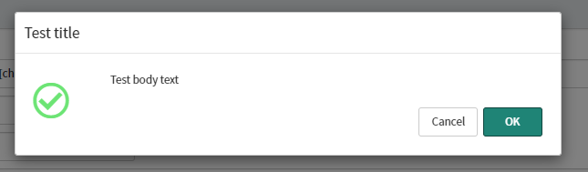

## What is a modal pop-up?
> A modal window creates a mode that disables the main window but keeps it visible, with the modal window as a child window in front of it. Users must interact with the modal window before they can return to the parent application. This avoids interrupting the workflow on the main window.
> 
> -<cite><a href="https://en.wikipedia.org/wiki/Modal_window">Wikipedia</a></cite>

In ServiceNow, a modal-style pop-up will show a pop-up window on top of the current page, and darken everything else. This forces the user to acknowledge what's in the pop-up before continuing.

GlideModal pop-up.

[](glide_modal_example.png)

Browser `alert()`.

[](browser_alert_example.png)

Browser `confirm()`.

[](browser_confirm_example.png)

**In my opinion, you should always use `GlideModal` instead of the browser `alert()` and `confirm()` functions.** Modal-style pop-up windows are a better choice in a number of different areas:
* Browser based `alert()` and `confirm()` windows can be ignored and blocked by the user. If your code depends on the user answering these, it can cause problems, it could even cause the page to lock up or prevent the user from saving the form.
* GlideModal windows can be any HTML, and can be made to look like whatever you want, whereas `alert()` and `confirm()` windows have a standard look & feel that cannot be changed.
* GlideModal windows look the same across browsers, whereas `alert()` and `confirm()` windows may appear different between browsers and devices.
* GlideModal windows can contain a wide variety of inputs and buttons, whereas `alert()` and `confirm()` windows are limited.
* GlideModal functionality is asynchronous and allows the page to keep running in the background, whereas `alert()` and `confirm()` halt the page until the user takes action.

## Using GlideModal
In short, GlideModal works by showing a **UI Page** as a modal-style window on a page.

```js
// new GlideModal(
//    UI page name,
//    Hide the 'close' button,
//    width in pixels
// );
var gm = new GlideModal('ui_page_name', false, 400);

// Setup the modal window
gm.setTitle('The title at the top of the window'); 
gm.setPreference('somePreference', 'task');
gm.setPreference('anotherPreference', 'value');

// Show the dialog
gm.render();
```

You can read about them more on the ServiceNow Developer website. Although it says `GlideModalV3`, using `GlideModal` will use the most up to date version of GlideModal.
https://developer.servicenow.com/dev.do#!/reference/api/*/client/c_GlideModalClientSideV3API

## Service Portal
Unfortunately, GlideModal does not work with the Service Portal. This includes:
* In a Client Script on a form, or a Catalog Client Script on a catalog item, it throws a Javascript error saying that GlideModal is undefined.
* In a UI action that is client-side, which aren't available in the form page of the Service Portal anyway.

If you want to use modal pop-up windows in the Service Portal, consider creating a custom widget and use the `$uibModal` Angular provider.

https://serviceportal.io/modal-windows-service-portal/

## Preferences
*"But Dave, how do I know what preferences to use with `.setPreference()`?*"

Different UI pages use different preferences. When you write `gm.setPreference("title", "I am some text")`, the UI page will something like the below to use those preferences that you pass through.

* HTML - `RP.getWindowProperties().get('title')`
* Client script - `gdw.getPreference('onPromptSave')`

### Callback function preferences
Some preferences can be functions that the modal window uses when something happens, like a user clicking a button. This can be anything available to the page, including `g_form` and `g_user` functions.

Below is an example confirmation window that will change the "Short description" field to the text "fart" if the user clicks on the "Yes" button.

```js
var gm = new GlideModal("glide_ask_standard", false, 600);
gm.setPreference("title", "Are you sure you want to change the short description to 'fart'?");
gm.setPreference("onPromptComplete", function() {g_form.setValue("short_description", "fart")});
gm.render();
```

[](glidemodal_example_callback_window.png)

[](glidemodal_example_callback_result.png)


## GlideModal windows that come with ServiceNow, with examples
ServiceNow comes with some pre-built and flexible UI pages to use in your GlideModal pop-up windows that you can use right out of the box.

I recommend that you consider using these before making your own.

### glide_alert_standard
An alert pop-up with an OK button and an info / warning icon.

[](glide_alert_standard.png)

```js
var gm = new GlideModal("glide_alert_standard", false, 600);
gm.setTitle("Test title");
gm.setPreference("title", "Test body text");
gm.setPreference("warning", "false");
gm.render();
```

[](glide_alert_standard_warning.png)

```js
var gm = new GlideModal("glide_alert_standard", false, 600);
gm.setTitle("Test title");
gm.setPreference("title", "Test body text");
gm.setPreference("warning", "true");
gm.render();
```

### glide_ask_standard
A confirmation pop-up with "Yes" and "No" buttons.

[](glide_ask_standard.png)

```js
var gm = new GlideModal("glide_ask_standard", false, 600);
gm.setTitle("Test title");
gm.setPreference("title", "Test body text");
gm.setPreference("warning", "false");
gm.setPreference("onPromptComplete", function() {alert("You clicked on 'Yes'")});
gm.setPreference("onPromptCancel", function() {alert("You clicked on 'No'")});
gm.render();
```

### glide_confirm
A confirmation pop-up with "Don't save", "Cancel", and "Save" buttons.

[](glide_confirm.png)

```js
var gm = new GlideModal("glide_confirm", false, 600);
gm.setTitle("Test title");
gm.setPreference("title", "Test body text");
gm.setPreference("warning", "false");
gm.setPreference("onPromptSave", function() {alert("You clicked on 'Save'")});
gm.setPreference("onPromptDiscard", function() {alert("You clicked on 'Don't save'")});
gm.setPreference("onPromptCancel", function() {alert("You clicked on 'Cancel'")});
gm.render();
```

### glide_confirm_basic
A confirmation pop-up with "OK" and "Cancel" buttons without an icon.

[](glide_confirm_basic.png)

```js
var gm = new GlideModal("glide_confirm_basic", true, 600);
gm.setTitle("Test title");
gm.setPreference("title", "Test body text");
gm.setPreference("onPromptComplete", function() {alert("You clicked on 'Ok'")});
gm.setPreference("onPromptCancel", function() {alert("You clicked on 'Cancel'")});
gm.render();
```

### glide_confirm_standard
A confirmation pop-up with "OK" and "Cancel" buttons and an info / warning icon.

[](glide_confirm_standard.png)

```js
var gm = new GlideModal("glide_confirm_standard", true, 600);
gm.setTitle("Test title");
gm.setPreference("title", "Test body text");
gm.setPreference("warning", "false");
gm.setPreference("onPromptComplete", function() {alert("You clicked on 'Ok'")});
gm.setPreference("onPromptCancel", function() {alert("You clicked on 'Cancel'")});
gm.render();
```

### glide_info
A simple pop-up with an info icon and an "OK" button that stretches with width of the modal window.

[](glide_info.png)

```js
var gm = new GlideModal("glide_info", true, 600);
gm.setTitle("Test title");
gm.setPreference("title", "Test body text");
gm.setPreference("onPromptComplete", function() {alert("You clicked on 'Ok'")});
gm.render();
```

### glide_warn
A simple pop-up without an icon.

[](glide_warn.png)

```js
var gm = new GlideModal("glide_warn", true, 600);
gm.setTitle("Test title");
gm.setPreference("title", "Test body text");
gm.setPreference("onPromptComplete", function() {alert("You clicked on 'Ok'")});
gm.render();
```

### glide_prompt
Prompt the user to enter some text.

[](glide_prompt.png)

```js
var gm = new GlideModal("glide_prompt", true, 600);
gm.setTitle("Test title");
gm.setPreference("title", "Test body text");
gm.setPreference("onPromptComplete", function(value) {alert("You clicked on 'Ok', value was: "+value)});
gm.setPreference("onPromptCancel", function(value) {alert("You clicked on 'Cancel', value was: "+value)});
gm.render();
```

### glide_progress_standard
Window with a "Close" button, an info / warning icon, and a scrolling progress bar. The progress bar is an animated GIF image and cannot be updated as a typical progress bar.

[](glide_progress_standard.png)

```js
var gm = new GlideModal("glide_progress_standard", false, 600);
gm.setTitle("Test title");
gm.setPreference("title", "Test body text");
gm.setPreference("warning", "false");
gm.setPreference("onPromptClose", function() {alert("You clicked on 'Close'")});
gm.render();
```

### glide_progress_no_button
Window with an info / warning icon and a scrolling progress bar. The progress bar is an animated GIF image and cannot be updated as a typical progress bar.

[](glide_progress_no_button.png)

```js
var gm = new GlideModal("glide_progress_no_button", false, 600);
gm.setTitle("Test title");
gm.setPreference("title", "Test body text");
gm.setPreference("warning", "false");
gm.render();
```