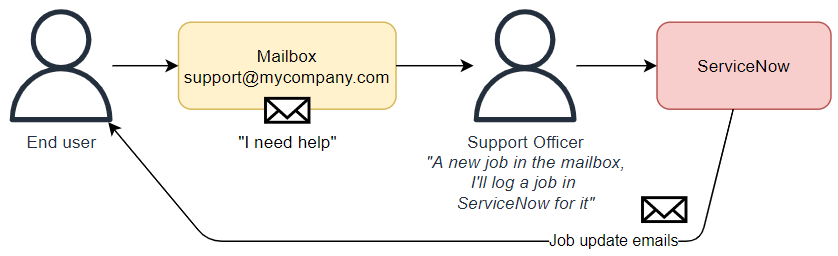
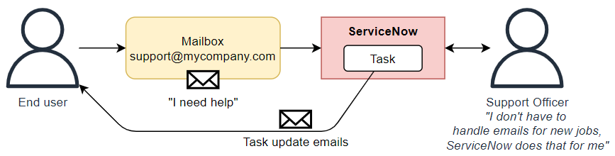
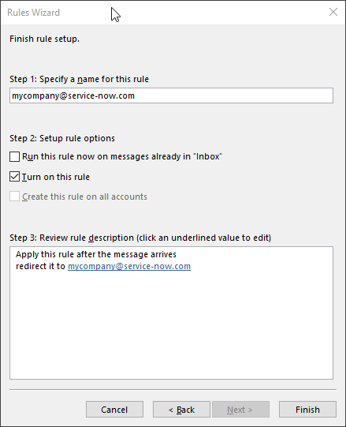
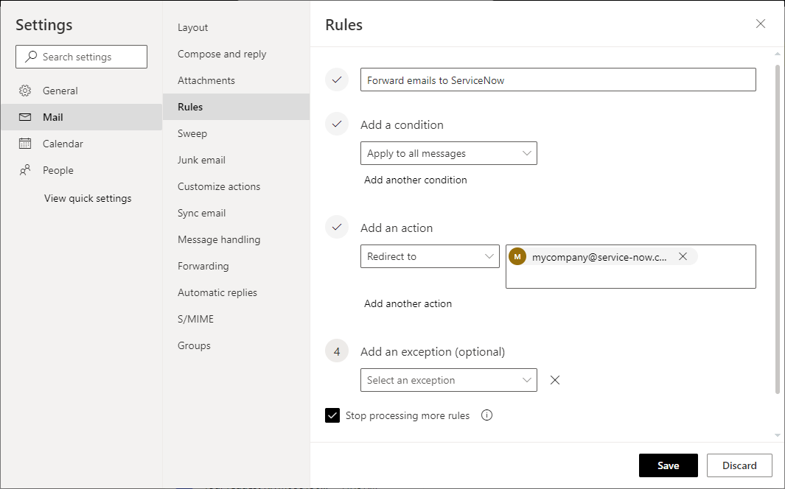
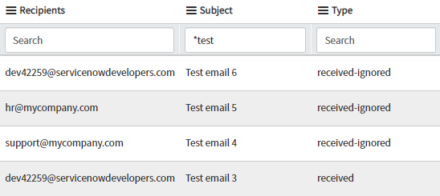
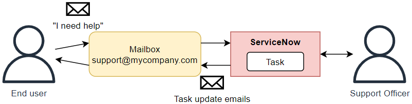

## The scenario
We've all needed to have ServiceNow receive and process emails from a shared mailbox in some form or another. COnsider the below example, but know that this process works for almost any other scenario involving ServiceNow processing emails from a shared mailbox.

You run a service desk for a company and the support staff have been answering emails sent to a support mailbox (support@mycompany.com) by manually creating jobs from the emails.

## Redirecting incoming emails
Your company has just purchased ServiceNow and you'd like ServiceNow to automatically create jobs from emails sent to the support mailbox.

* You don't want to ask users to send emails to the ServiceNow email address (instancename@service-now.com)
* You don't want to change the email address users send emails to, it must remain "support@mycompany.com".
* You still want emails to be received by the support@mycompany.com mailbox so you can see the emails outside of ServiceNow.

To do this, you'll want to set up a **mailbox rule** on the mailbox (not in ServiceNow) to forward emails to your ServiceNow email address. This email address is "instancename@service-now.com".
E.g. companyname@service-now.com

This will forward the initial email from the support mailbox to ServiceNow. After that, emails will be sent out from the ServiceNow email address, and users will send reply emails back to the ServiceNow email address instead of the support mailbox.

> It's important that this rule **redirects** the email instead of **forwards** it. Redirecting keeps the "From:" part of the email as it is, but forwarding it sets the email's "From:" to the mailbox it bounces off of.
> In this scenario, using a **forward** rule will cause every incident created from an email to have a "Caller" of "support@mycompany.com".
> Check out this article to learn more about the different between **redirect** and **forward**:
> https://www.outlook-apps.com/redirect-emails-in-outlook

In Microsoft Exchange, you can create an **Email rule** on the mailbox to **redirect** the email to ServiceNow. Here's what such a rule looks like when you make it in Microsoft Outlook.

You can do create the same mailbox rule from the https://outlook.office365.com web portal.

In the out-of-the-box configuration, an **inbound email action** will run on the forward email and create a ServiceNow incident for it.

## Testing
Testing the setup is easy.

Send an email to the mailbox, and wait up to 10 minutes. The email should eventually show up in the ServiceNow **Emails** [sys_email] as an entry with the "type" of "received". 

This table contains all emails either sent or received by the instance. If it's not in this table, it was never received.

## Sending ServiceNow emails from the support mailbox
So emails send to the mailbox are being received by ServiceNow, and now you want to go a step further and have ServiceNow send emails out of the support mailbox instead of "mycompany@service-now.com".

This is a bit more complex, and I'll cover it in a separate post.

[How to use your own mailbox with ServiceNow](/posts/2023-09-14-sn-email-accounts/)

## Troubleshooting
### Restrictions on email forwarding
Some companies have security restrictions which prevent emails from being automatically forwarded outside of the company. If you put the email rule in place, but none of the emails are ever received by ServiceNow, I'd recommend reaching out to your IT department to check if such a restriction is in place.

### Email is always "From:" the mailbox, instead of the actual sender
The mailbox rule has been created as a **forward** rule instead of a **redirect** rule.

A **forward** rule will update the "From:" on the email to the mailbox that it bounced off of, a **redirect** keeps the email's "From:" as it originally was.
