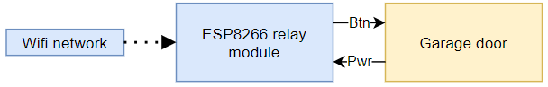

## The background 
I'm terrified of accidentally leaving the garage door open. There have been accidents where I've had a garage door remote in my pocket and sat down in a way that pressed the "open garage door" button, and the door has been open for hours. There have been times when I've left the house, thinking that I've closed the garage door, but I actually hadn't.

It rarely happens, but I'm always questioning myself after I leave the house, "did I actually close the garage door?". 

I've got a lot of stuff in my garage, and leaving the garage door open leaves it open to thieves.

My garage has a Merlin MT60P Sectional Door Opener.

[](Merlin_MT60P_sectional_door_opener.jpg)

The garage door is those sectional doors that roll up on rails.

[](sectional_garage_door.png)

## The plan
The plan is to set up a "safety net" for me using my smart home network. It'll include:
* Door sensors on the door to sense if it's open or closed. 
* A way of opening and closing the door from my smart home network, likely using a wifi relay to simulate a garage door button.
* An automation so that if I leave the house and the garage door is open, an alert will be sent to my phone saying "hey, you left the garage door open".
* (Optional) A camera in the garage so I can visibly see whether or not I closes the garage door.

All of which should be available through my Home Assistant smart home controller that I can use on my phone.

## The door sensor
I'm planning on using some magnetic reed sensors like the SONOFF SNZB-04. It's a Zigbee sensor, which means long battery life, and it'll work with the Zigbee network we set up earlier.

[](sonoff_snzb_04_door_sensor.jpeg)

The sensor works by that small part having a magnet in it, and the big part has a magnet sensor in it called a **hall effect sensor**. When the 2 parts are together, "door is shut". When the 2 parts are separated, "door is open". 

I'm going to attach one to the frame, and one to the door.  When the garage door rolls up, it'll take the little part with it and the sensor will say "door is open".

## Opening the door
### Method 1 - Hack a remote
I could use an existing Merlin remote control and somehow trigger it using a controller connected to my smart home network.

The remotes themselves aren't that expensive, around $30 AUD for a cheap one that can be paired to my opener.

I could open the case and connect the "open door" button line to one of the GPIO pins of an ESP8266 WiFi controller. That way, the ESP8266 can connect to my smart home network and I can push the button from anywhere, and the garage door opener will work as normal without doing any modifications to the opener.

https://www.bunnings.com.au/merlin-key-ring-3-button-remote-control-for-garage-door-opener_p3961841

[](hacked-remote-diagram.png)

[](merlin_3_button_remote.jpg)

[](merlin_3_button_remote_inside.jpg)

Pro:
* The box with the hacked remote can be placed anywhere near a power socket, being more portable.
* Doesn't require any changes to the door opener itself.
* I have all the parts required to make it.

Cons:
* I'll need to make a circuit board to connect everything together, including power for the ESP8266 controller.

### Method 2 - Relay module to simulate button
The door opener has a panel full of wire jacks for optional extras, including for a classic button.

[](hacked-door-openener-diagram.png)

The plan is to use one of these ESP8266 WiFi relay modules to pretend to be the garage door button, turning on for 1 second then turning off again.

[](esp8266-relay-module.jpg)

In the below image, wires 1 and 2 are for the "open / close door" button. I'm hoping to use the door opener's power to power the wifi controller. The instructions suggest that one of those pins provides 12V for accessories, which could be stepped-down to the 5V the controller module needs.

[](Merlin-MT60P-wiring.jpeg)

Pro:
* Fewer points of failure, the controller connects straight into the door opener.
* I have all the parts required to make it.

Cons:
* Does involve making changes to the door opener itself.

### A problem with ESPHome
Both methods will use an ESP8266 wifi module as the controller, which will talk to the smart home network over wifi. The ESP8266 controllers will need some sort of firmware to work.

I tried using an existing solution for the wifi controller,**ESPHome**, which is feature rich, relatively mature, and includes all sorts of ready-to-go integrations to Home Assistant.

However, it didn't seem to want to work with the ESP8266 relay module.

The module works by there being a second smaller controller on the wifi, which is connected to the ESP8266 over serial.  If the ESP8266 sends the serial data:
```cpp
{0xA0, 0x01, 0x01, 0xA1}
```
the relay opens, and sending:
```cpp
{0xA0, 0x01, 0x01, 0xA2}
```
will close it. Simple enough.

The problem is the way that ESPHome sets up components that work over serial messages.
I can set it up as a switch, but ESPHome will only allow me to set 1 serial payload, and it send that whenever the ESPHome is switched "ON" or "OFF".

I tried setting up an ESPHome button with instructions of what serial messages to send, but I noticed that the component didn't exist on the finished firmware which was weird.
```yaml
uart:
  baud_rate: 9600
  tx_pin: GPIO1
  
button:
  - platform: template
    name: "Garage door"
    id: garage_door
    on_press:
      - uart.write: [0xA0, 0x01, 0x00, 0xA1]
      - delay: 1s
      - uart.write: [0xA0, 0x01, 0x00, 0xA2]
```
### DIY Firmware
With ESP not working the way I want it to work, it has me thinking that I should try to make my own firmware. It'll be time consuming, but it could be a lot of fun! Also, I'll learn some new skills along the way, which is the real reason for me doing this sort of thing. 

I'd have to learn:
* how to have a configuration object, instead of hard-coding settings.
* how to store the configuration in PROGMEM to survive power cycles.
* how to host a configuration web page from an ESP8266.
* how to self-host a WiFi access point form an ESP8266, for first-time configuration.
* how to factory reset everything if I want to start again, without needing to reflash the controller.
* how to connect an ESP8266 to an MQTT network, and how to subscribe to and publish MQTT messages.

DIY-ing my own firmware will delay things, and it's going to be frustrating at times, but it should be educational and fun!