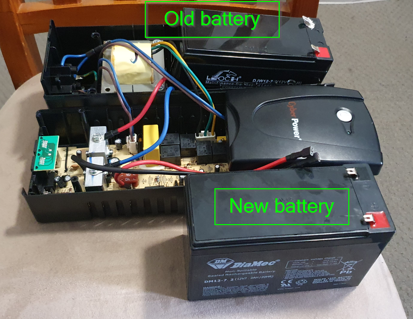
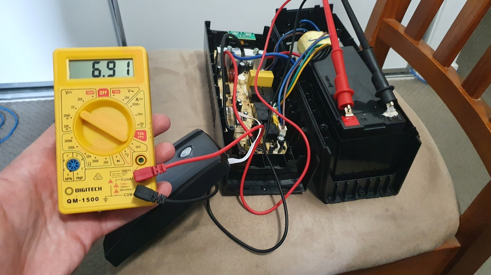
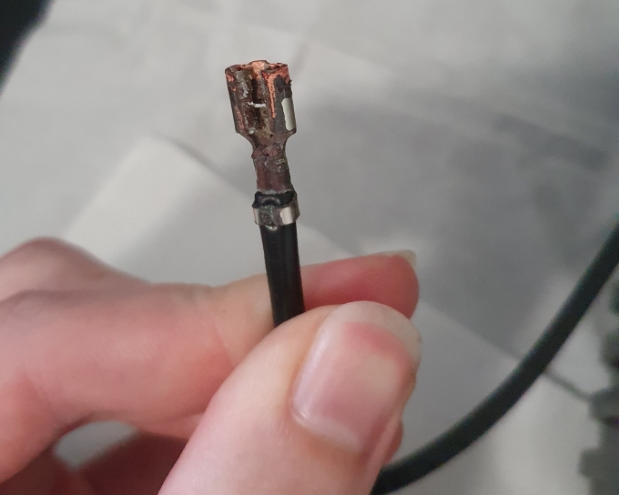
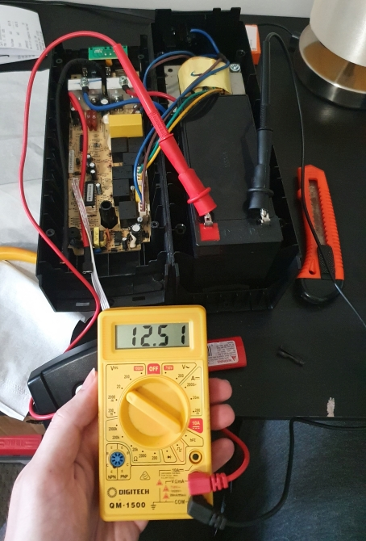

## The background
I have a UPS (uninterruptable power supply) for my home server, so that:
* if the power goes out for a quick moment, my home server keeps going without skipping a beat.
* if the power goes out for a long time, my home server gracefully turns itself off before the battery runs out.

I use my server for home automation and file storage (family photos, media, and backups), and the hard-stop of losing power cause irreperable data loss, which is bad.

Having a UPS solves all of those problems. I use a CyberPower Value600EI-AU UPS that I purchased for $80 AUD about 5 years ago.
https://www.umart.com.au/product/cyberpower-value600ei-value-soho-600va-360w-simulated-sine-wave-ups-33214

## The problem
After recently moving house, the UPS refused to start.
It would click, the front blue light would flash for a quick moment, and then it would go silent. It wouldn't power anything either.

Normally, the light should stay on, and it should beep for 3 seconds when it starts.

Here's a video of the issue.

<video controls>
    <source src="ups-issue-video.mp4">
</video>

## The fix
I read somewhere that this issue can sometimes be caused by the battery dying. The UPS is about 5 years old after all. I figured I'd try to replace the battery before buying a whole new UPS.

I opened up the UPS by preying off the face panel and removing the 2 screws from the bottom of the case. Once the case was open, I could see the battery at the front. I also noticed that there was some buildup of stuff on the - negative terminal. Could it be battery acid or corrosion?

The battery that the UPS came with is a LEOCH 12v 7.2Ah SLA (sealed lead-acid) battery.
Testing with my voltmeter showed the abttery only had around 7v, that's not great for a 12v battery.

Luckily, the battery form-factor and dimensions are pretty common. In fact, they are the same battery used in Australian NBN battery backup boxes. I purchased a new battery of the same size and specs from Jaycar, a 12v 7.2Ah SLA for $34.95 AUD.
https://www.jaycar.com.au/12v-7-2ah-sla-battery-nbn-back-up-battery/p/SB2486

Replacing the battery was easy enough. I removed the 2 leads connecting the old battery, and it wiggled right out.

Before plugging the new battery in, I wanted to clean up the stuff from the - negative lead and get some of that buildup off. I used a brass metal brush and my fingernails to get the buildup off. It's much cleaner now, and should conduct electricity better.

I installed the new battery into the case, connected the 2 leads to the new battery, and it started up like a champ! It's working as good as new so far.
So a dead battery turned out to be the cause, and a $35 replacement part beat a $80 replacement for the whole thing.

Here's a video of the UPS after replacing the battery.

<video controls>
    <source src="ups-issue-fixed-video.mp4">
</video>