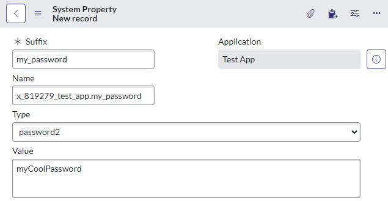
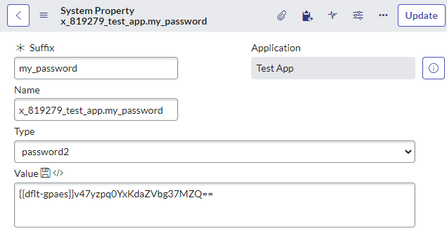
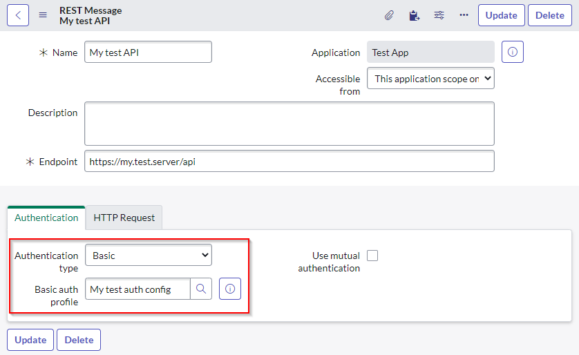
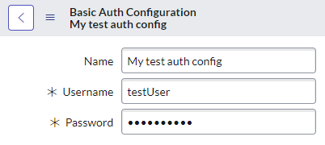

## What is GlideEncrypter
In ServiceNow, you'll use the class `GlideEncrypter` for:
* encrypting text to secure storage in ServiceNow.
* decrypting text that had previously been encrypted.

You'll see this used commonly in ServiceNow when dealing with passwords. Some examples include working with:
* the Credentials table.
* the authentication profiles table for SOAP and REST messages.
* configuration tables for 3rd party integrations that store a password.
* ServiceNow Orchestration workflows when setting an Active Directory user's password.

Here's a quick example of how to use it:

```js
var encrypted = GlideEncrypter().encrypt("myCoolPassword");
gs.print(encrypted); // PYCU2EQJ7NzSakEYDM3lDA==
var decrypted = GlideEncrypter().decrypt(encrypted);
gs.print(decrypted); // myCoolPassword
```

I've covered `GlideEncrypter` in a previous post, have a look if you're keen to know more.
https://davidmac.pro/posts/2020-12-24-sn-encrypt-decrypt/

## The problem
The `GlideEncrypter` class is not available from *scoped applications*. If you try, it will throw an error similar to the below.

```js
GlideEncrypter().encrypt("myCoolPassword");
// Evaluator.evaluateString() problem: java.lang.SecurityException: GlideEncrypter is not allowed in scoped applications: 
//	com.glide.script.fencing.GlidePackageScopeHandler.found(GlidePackageScopeHandler.java:28)
//	com.glide.script.ARhinoScope.get(ARhinoScope.java:82)
//	com.glide.script.RhinoScope.get(RhinoScope.java:52)
//	com.glide.script.PackageScope.get(PackageScope.java:33)
```

This means that scoped applications will not be able to encrypt and decrypt passwords in custom script-heavy functionality.

***Sort of…***

## Let ServiceNow handle the passwords
Scoped applications can still work with passwords but you have to let ServiceNow handle them, instead of handling it yourself in script.

I suspect ServiceNow did this to push developers to more secure methods of dealing with passwords and sensitive encrypted data.

### Password fields on GlideRecords
You can get decrypt a password from a field (a `GlideElement`) on a `GlideRecord` by using `.getDecryptedValue()`. ServiceNow will automatically encrypt and decrypt data in password fields without needing to use `GlideEncrypter`.

Here's an usage example. The script is getting the plain-text value from the password field on a Basic Authentication Profile record.
```js
var gr = new GlideRecord("sys_auth_profile_basic"); // basic authentication profile
gr.get("…"); // get the record with the password on it
gs.info(gr.password); // Bad: 8d0c855047501110e41e690cd36d4347  1  Z8zUoih1UnEy8Q2KOAZl_Q==3fahknnBYIpxKsKyoP9NVW0ssndDDyef8wek5g==
gs.info(gr.password.getDisplayValue()); // Bad: **********
gs.info(gr.password.getDecryptedValue()); // Good: myTestPassword
```

### System properties and passwords
System properties (`sys_properties`) can have the **type** of **password2**. These are great because ServiceNow will automatically encrypt and decrypt the value as you go.

Before saving changes to a password system property:

[](sys-properties-pwd-before.png)

After saving a password system property:

[](sys-properties-pwd-after.png)

***BAM!*** Automatically encrypted!

Getting and using the password is made easy for you. Even though it's encrypted in the database, it will be decrypted when you fetch it in your script:
```js
gs.getProperty("x_819279_test_app.my_password"); // myCoolPassword
```

### SOAP and REST message authentication profiles
For REST and SOAP integrations, credentials can be stored as **authentication profiles**.

[](rest-msg-auth.png)
[](rest-msg-auth-profile.png)

You can use this REST or SOAP message when you make the web call in your script, and all of the authentication (including passwords) are taken care of for you.

```js
// call RESTMessageV2 with the name of the message and name of the method to use.
var request = new sn_ws.RESTMessageV2('My Test API', 'get'); 
// don't need to set authentication, it's already done for you.

var response = request.execute();
```

## Expose GlideEncrypter to scoped apps using a global wrapper class
If you really must use `GlideEncrypter` in your scoped app, you can create a **global** class and wrap it around `GlideEncrypter` as an adapter of sorts, and allow that wrapper class to be used either from any scope, or specifically from your scoped application.

Create a new script include.
**Name:** ScopedEncrypter
**Application:** Global
**Accessible from:** All application scopes
**Script:**
```js
var ScopedEncrypter= Class.create();
ScopedEncrypter.prototype = {
    initialize: function() {
		this._ge = new GlideEncrypter();
    },
	
	encrypt: function(a) {
		return this._ge.encrypt(a);
	},
	
	decrypt: function(a) {
		return this._ge.decrypt(a);
	},

    type: 'ScopedEncrypter'
};
```

Using it in your scoped application:
```js
new global.ScopedEncrypter().encrypt("myCoolPassword");
```

**A big problem with this approach** is that you cannot include this global script include in your scoped application. This is a problem if you're creating a ServiceNow app that you want to sell on the ServiceNow Store, or deploy to other instances.
You will have to ask the customer to add this script include manually themselves, metaphorically and explicitly asking them to allow your app access to something that it doesn't come with, which doesn't look great for you.

> **Warning:** ServiceNow does not want you to do this! This approach is not supported, and doing so may introduce some security concerns across the entire instance by allowing any scoped application to access encrypted data.
> 
> I don't recommend you do this. Instead, store passwords in sys_properties or GlideRecords and decrypt them from there, unless you have no other option.

## Links
This topic has been talked about in a few other areas. I'll include some links to other articles and discussions if you're interested in knowing more.
* https://community.servicenow.com/community?id=community_question&sys_id=23fdc7addb9cdbc01dcaf3231f9619b6
* https://community.servicenow.com/community?id=community_question&sys_id=178ecb21dbdcdbc01dcaf3231f961929
* https://community.servicenow.com/community?id=community_question&sys_id=642107e5db98dbc01dcaf3231f961973
* https://community.servicenow.com/community?id=community_question&sys_id=c34dc2b6db3aef80656a5583ca961913
* https://developer.servicenow.com/dev.do#!/reference/api/sandiego/server_legacy/GlideEncrypterAPI
* https://docs.servicenow.com/bundle/paris-platform-administration/page/administer/encryption/task/t_EncryptAPasswordSystemProps.html