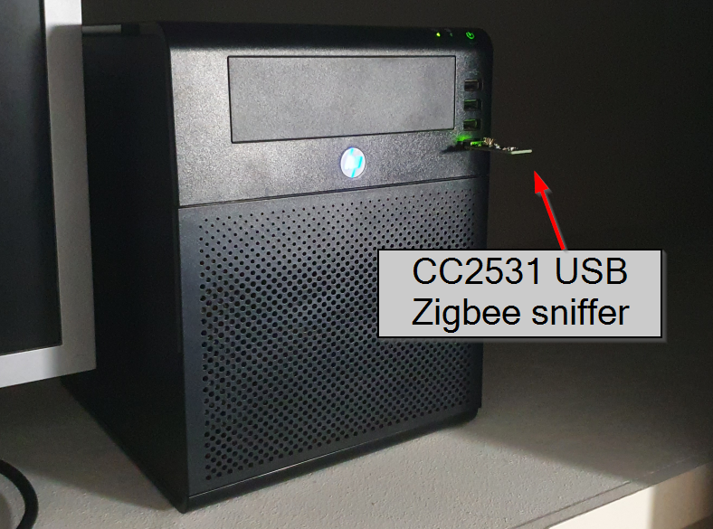
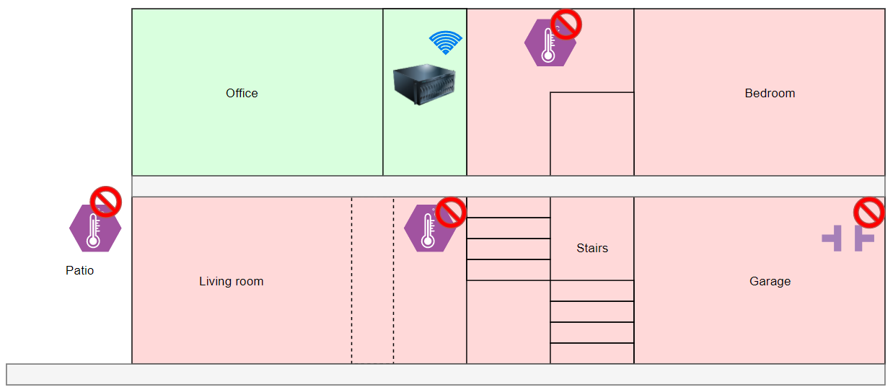
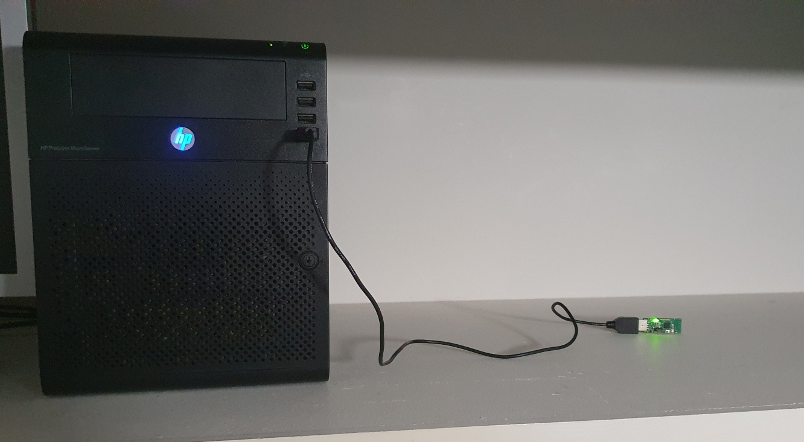
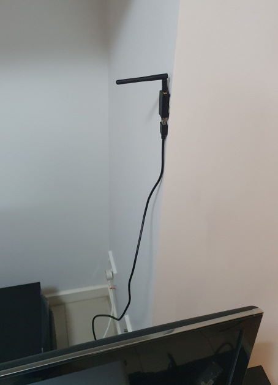
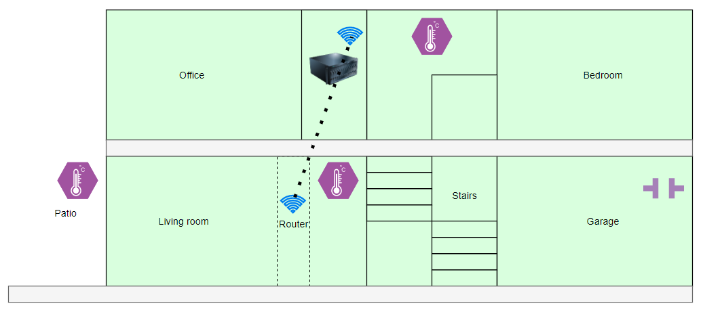
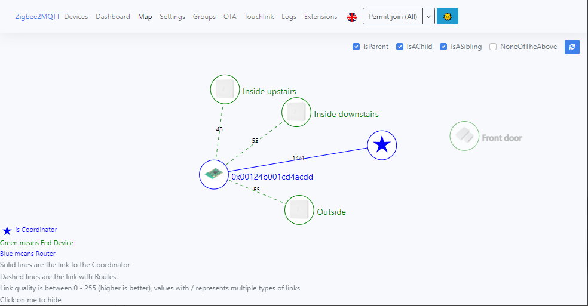

## The background
I've got a couple of Zigbee devices around my smart home:
* thermometer inside upstairs
* thermometer inside downstairs
* thermometer outside
* door sensor on the front door
* door sensor on the garage door

They all connect to my smart home network (Home Assistant) through a little CC2531 Zigbee network sniffer USB stick in my home server in my office. I use the software Zigbee2MQTT to join the Zigbee network to the rest of my smart home network.

## The problem
The problem is that since I moved houses and into a townhouse, none of the sensors can connect to my smart home network unless they are **inside my office**.

The thermometer upstairs drops in and out of the network, but the ones downstairs can't connect at all.

I suspect this is because there's something in the floor, either something really thick like concrete or metal like pipes or wiring that's in just the wrong spot. I tested my theory using my Bluetooth headphones connected to my laptop in the office. The headphones went choppy and almost disconnected as soon as I went downstairs, and came right back when I went back upstairs.

## The solution
After weeks of wondering what I could do, I was able to fix the problem and get them all talking to each other.

These articles by the Zigbee2MQTT project were very helpful in my mission:
* https://www.zigbee2mqtt.io/advanced/zigbee/02_improve_network_range_and_stability.html
* https://www.zigbee2mqtt.io/advanced/zigbee/05_create_a_cc2530_router.html

### 1. Moving the USB stick away from the computer
As it turns out, having the USB stick plugged right into my server was a mistake. Interference from the computer's electronics and the metal case was enough to impact reception.

This fix was easy: I put the Zigbee sniffer USB on a short USB extension lead (about 30cm) and moved it away from the server. The signal improvement was impressive!

### 2. Adding a router to the Zigbee network
Zigbee devices have this cool feature where they will automatically form a mesh network. If a device can't connect back to the Zigbee coordinator (the USB stick in my home server), then it'll automatically try to relay messages off of other Zigbee devices that act as **routers**. Typically, any Zigbee device that is powered by mains power will also act as a **router** (e.g. power switches, light bulbs).

Zigbee power switches are difficult to find for Australian power sockets.

Zigbee in-line power relays are no good, I'm in a rental and can't go making changes to mains wiring.

Zigbee lights are no good, I'd need to keep the lights turned on at the light switch at all times.

However, I had another spare CC2531 USB stick which had a case and an antenna. I've been using them as a Zigbee coordinator, but it looks like I can use them as routers as well. I could install it in in a USB power charger downstairs in the living room and relay Zigbee traffic up to the coordinator upstairs.

One of these for $12.99 AUD.
https://www.ebay.com.au/itm/224741527257

Instead of flashing the usual **coordinator** firmware onto the USB stick:
https://github.com/Koenkk/Z-Stack-firmware/tree/master/coordinator/Z-Stack_Home_1.2

I flashed the **router** firmware instead:
https://github.com/Koenkk/Z-Stack-firmware/tree/master/router/Z-Stack_Home_1.2

*Note: After flashing the router firmware, I didn't hear the "ding diddl-ing" noise from Windows whenever I plug it into my computer. I think that's because this version of the firmware doesn't enable USB on the stick because USB data isn't needed, just the USB power.*

I installed the router behind the TV in the living room using Bluetac to stick it to the wall roughly straight down underneath the server upstairs. I powered it through a spare USB phone charger.

## The result

**BAM!** Adding a router downstairs and moving the USB stick away from the computer worked a treat! All of a sudden, everything was connecting back to my home network.

**Success!**

Zigbee2MQTT shows a map of how things are connecting back to the coordinator which I thought was cool.

