Here's a front-end I made for a multiplayer game. Give it a go, I hope you like it!

The game:
<a href="https://coruscating-longma-859850.netlify.app/" target="_blank">https://coruscating-longma-859850.netlify.app/</a>

The source:
<a href="https://github.com/towerofpower256/MySpaceTraderClient" target="_blank">https://github.com/towerofpower256/MySpaceTraderClient</a>

## What is Space Traders?
https://spacetraders.io/

Space Traders is a multiplayer game where you fly space ships around and trade goods, trying to make as much money as you can.

The gist of the game is simple: trade goods through space to make a profit. You can buy better ships that are faster and with larger cargo holds to make more profit. The market fluctuates as you and other players buy and sell goods.

The unique spin on this game is that there's no front-end, it's all just web APIs. It's up to **you** to create the front-end to the game.

[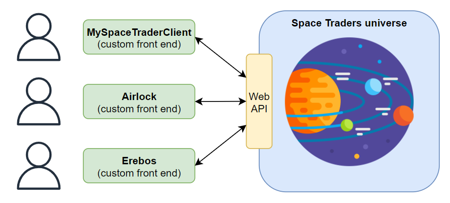](space-trader-diagram.png)

## My front-end
I thought I'd have some fun and make a Space Traders front-end of my own to learn how to made a web app from scratch. A lot of my web dev experience comes from working in the ServiceNow platform, and I wanted to see if I could make something new.

The ship command page.
[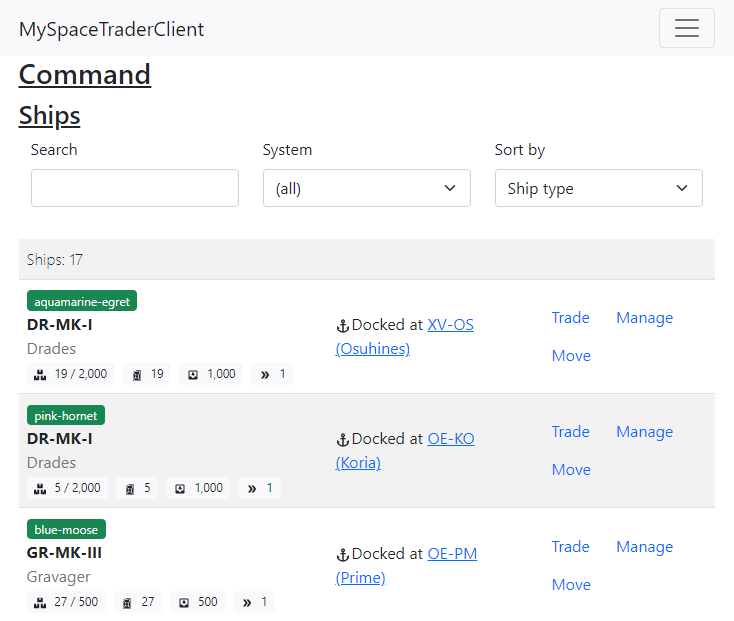](my-client-command.png)

Managing a ship.
[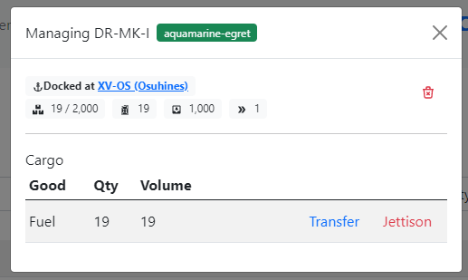](my-client-command-manage.png)

Moving a ship.
[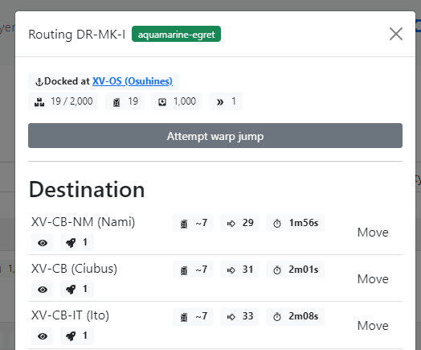](my-client-command-move.png)

Buying and selling goods.
[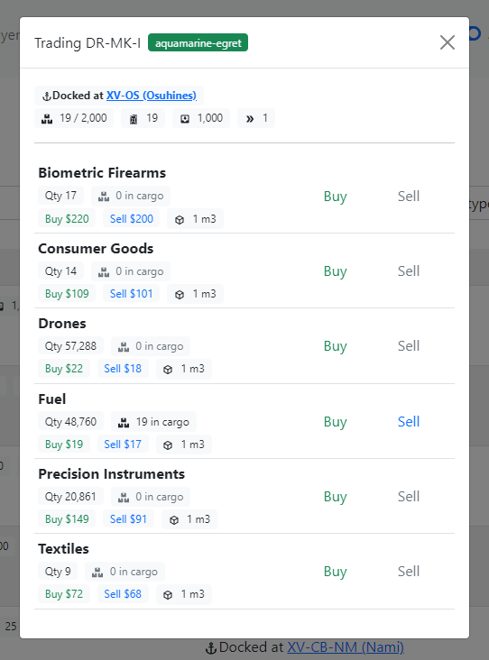](my-client-command-trade-select.png)

[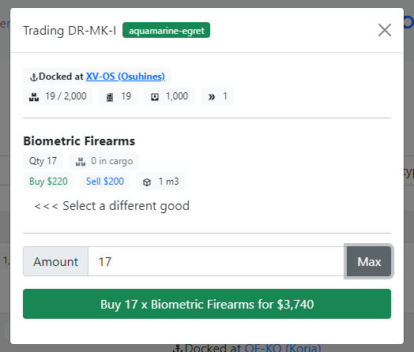](my-client-command-trade.png)

Viewing a system, what's in it, and what's traded.
[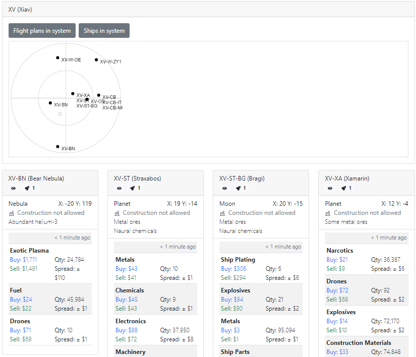](my-client-system-view.png)

My super-cool Deal Finder!
[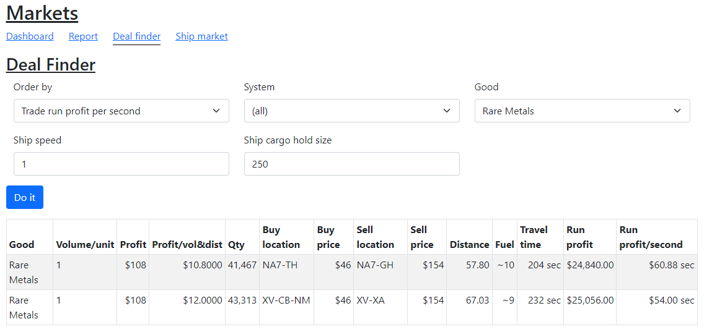](my-client-deal-finder.png)

I wanted to add in some additional features that I felt some of the other clients were missing, or features that I wanted for myself.

* I made a **"Deal Finder"** which searches market data that you know, and identifying profitable trade runs.
* I wanted to be able to move, trade, and manage my ships all from the same page, without jumping around from page to page.
* I made a little diagram of the systems so I could visualise the layout of a system and what's in it.
* I made a **"Welcome"** splash page to introduce new placers to what the game was and how to play it. Otherwise, they go in blind.
* I made a **"History"** page to view a history of trades and ship movement, to help in reviewing what's happened in the past.
* I made my client mobile-friendly using Bootstrap. I found that many of the other clients appeared clunky when used on mobile phones (e.g. tables overflowing out to the side and stretching the page).

I used inspiration from other clients that people had made, including:
* Airlock by Eli Lamb
 [airlock.elilamb.nz](https://airlock.elilamb.nz/)

* Erebos by Kaishiyoku
 [erebos.kaishi.de](https://erebos.kaishi.de/)

* Vocivos by kurt1288
 [kurt1288.github.io/Vocivos](https://kurt1288.github.io/Vocivos/)

* Exo by Nick Howell
 [spacetraders.nickhowell.com](https://spacetraders.nickhowell.com/)

## What did I learn?
Oh wow, I learned a lot!

### JavaScript ES6
I learned to love Javascript ES6 and what comes with it.

I used the **array** functions a lot, they made it easier to do things without writing out big blocks of code.
* `.filter` to filter out results from an array easily
* `.find` to find an entry in an array
* `.sort` to sort an array, useful for sorting an array of objects
* `.forEach` and `.map` to loop through the array with very little code, instead of writing a the full `for (var i=0; blah blah; blah) { … }`

JavaScript **promises** and asynchronous functions took a bit to wrap my head around, but once I figured them out, I achieved some really cool features!

### Logging into the app and remembering
I learned how to remember that a user is logged into the app, even after the page is closed.

It does so by storing the user's login token in the browsers storage. When the app starts, it checks with the game whether the token is still valid and either keeps using the valid token, or clears the token and forces the user to log back in if the token has expired.

### React contexts
I used **React contexts** heavily throughout the app to store game data, and automatically update components when game data changes.
E.g. updating a ship's location as the ship moves around.

I first used contexts to automatically update the player's bank balance in the top right, as the game is played.

I also learned some caveats and gotcha's to watch out for with React contexts. If you use contexts too much, it forces too many components to reload every time something changes, which can cause problems:
* forms "jitter" and blink a lot as they are reloaded a lot.
* modals open and close frequently as the components that they live in are frequently reloaded.
* browser dev tools looking at elements jitter and freak out, as large chunks of the page are re-drawn.

I learned to use contexts as low down in the tree of components as possible. Instead of using contexts, I'd usually load the data from the browser's storage.

### Browser data storage
At first I was scared to store data within the browser's internal storage, but it turned out to be very easy!

I stored a lot of game related data into the user's browser storage as JSON objects. This had a big advantage of remembering a lot of the game data (locations, ships, market data) after the page has been closed, instead of having to refresh everything in-bulk every time the user opens the app.

### HTML canvas
For the system diagrams I used a HTML canvas for drawing. It's a manual process of drawing and re-drawing components, but it was education and now I know how to do it.

I really like the system radar diagrams, I think it looks neat.

[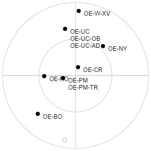](my-client-system-view-diagram.png)

### Sequential querying and promise-chaining
The app regularly refreshes its data by fetching from the server, however if you hit the server too frequently, it'll lock you out because you hit a throttle limit.

I found a way to have these data refreshes happen sequentially using **Javascript promise chaining**. This **chains** the requests to the server, one after the other, and each request for data waits for the one before it to finish before going.

I found a quick way to do this by using the Array `.reduce` function. I feel much smarter knowing this!

[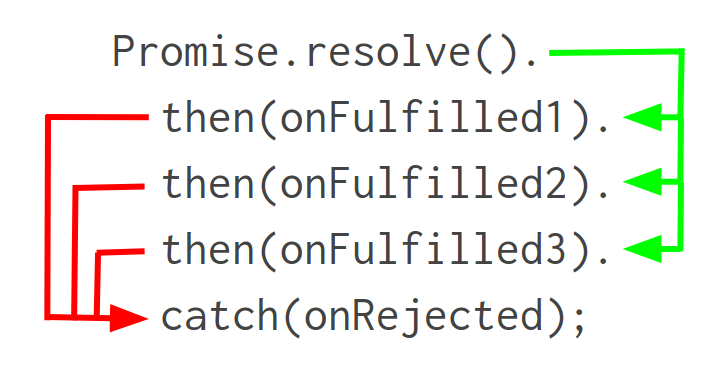](chaining-diagram.png)

### React Router
I used **react-router-dom** for page functionality that would work with the URL, but still remain a SPA (single page app). Very nice utility.

https://reactrouter.com/

### Toastify
I used **react-toastify** to make some good looking alerts for the app.

https://aleab.github.io/toastify/

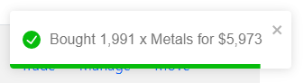

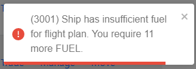

### React Icons
I used the **react-icons** library of SVG icons. Lightweight and scalable, SVG icons made the app even smaller in size and didn't rely on images.

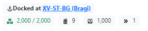

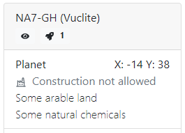

### Generating names
I used **unique-names-generator** to generate names for all of the ships.

Once you get over 5 or so ships, they start to all look the same. Big thanks to Eli for this idea in his own client **Airlock**.

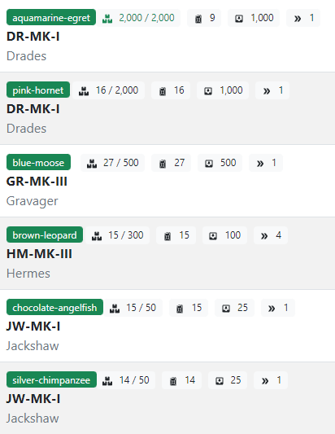

### Easily humanising strings
I learned how to "humanise" text that would normally be for computers to read. I'll be remembering this function!

* Removing "_" underscore characters.
* Properly capitalising text.

E.g. "MOON" becomes "Moon"
E.g. "SOME_TECHNOLOGICAL_RUINS" becomes "Some technological ruins"

## What's in the future?
If I find the time, there are some features that I might add later on.
* Improving the Deal Finder to find deals between systems, which would involve some path finding which would be cool.
* Building and running your own structures, which unfortunately isn't balanced in the game and not worth the effort.
* A dark mode to make it easier on the eyes.

That said, the developers are working on a v2 of the game with many more features and gameplay mechanics, so watch this space!