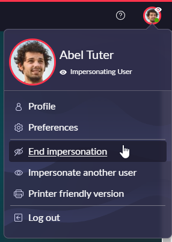
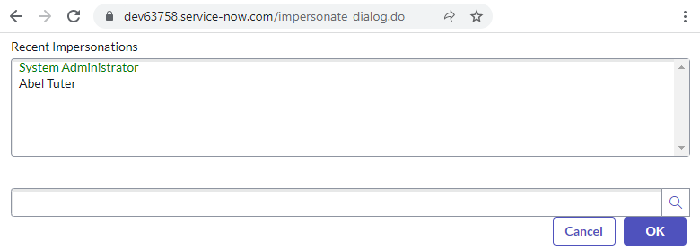
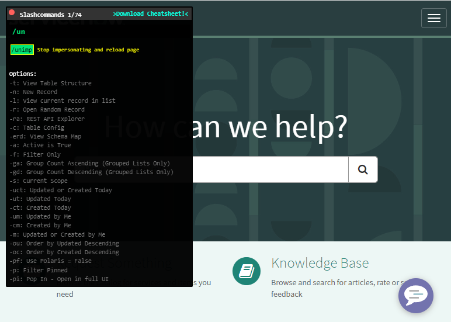

So you've impersonated a user in ServiceNow, but there's a redirect that forces that user into the service portal and you can't end the impersonation. How do you un-impersonate and get back to your own admin user?

In the platform UI, you can just click on the user icon in the top-right then click on "End impersonation".

Sadly, this option is not available in the service portal, which doesn't help if you're stuck in there.

## Option 1 - log out
The easy option is to log out and back in again, but this can get annoying and time-consuming, especially when there's multi-factor authentication to do and big passwords to remember. 

Do that 30 times in a row, and it's enough to make you dread system testing.

Surely there's a better way... right?

## Option 2 - impersonate_dialog.do
Simply change the URL to **"/impersonate_dialog.do"**. That'll take you back to the impersonation dialogue, and you can go end the impersonation by double-clicking on your own user without having to log out and back in again. 

It's quick and easy, and a lot faster than logging out and back in. Magic!

## Option 3 - SN Utils /unimp
The popular browser plugin **SN Utils** has a shortcut to stop impersonating a user. It's available for Chrome, FireFox, Edge, and Safari. 

You can get it here: www.arnoudkooi.com

Even from the service portal, just use the slash command **/unimp** to end your impersonation.

