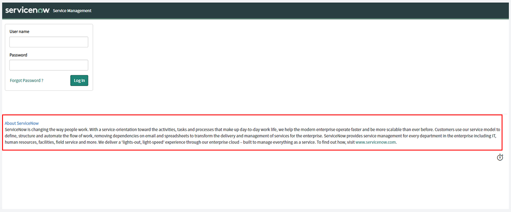

## ServiceNow login pages
Right now, there are 3 kinds of login pages that come with ServiceNow:
* The out-of-the-box login page from before Polaris / Next Experience
* The out-of-the-box login page with Polaris / Next Experience
* Service Portal login pages

UI16 / pre-Polaris login page.

Polaris login page.

The default Service Portal (/sp) login page.

## Why use a different login page?
So you might be asking yourself *"the default platform login page works just fine, why use anything else?"*.

The standard platform login page is enough to get the job done, but it is inflexible and difficult to customise. This means that it's not possible to do any of the following in a standard supported way:
* Can't change the look and feel of the login page.
* Can't do much rebranding of the login page, or add security disclaimers which may be required by your company.
* Can't change the user experience, or make any company-specific process changes.
* Can't include any use-case specific changes to support specialised authentication mechanism.

Have UI16? You're stuck with the banner at the top, and the little form in the top left.

Have Polaris / Next Experience? You're stuck with the login page from a trendy cupcake factory website.

> Even if you don't customise the service portal login page, I feel that it has a better login experience overall compared to the standard "/login.do". You can use it as your default login page without needing to customise it, and you'll still get a better user experience.
> <cite>- David McDonald</cite>

## How to use a custom login page
### Step 1: add the redirect
This step involves activating a system property that will redirect unauthenticated users to the Service Portal (/sp) login page. 

Create a new System Property [sys_properties] with the following details:
* **Name:** glide.entry.page.script
* **Description:** Script to redirect unauthenticated users to a login page. Default value: new SPEntryPage().getLoginURL()
* **Value:** new SPEntryPage().getLoginURL()

This calls the script include **"SPEntryPage"**. You can modify this script include if you wanted to change the behaviour or change the service portal that it uses.

More information can be found here: 
https://docs.servicenow.com/bundle/quebec-servicenow-platform/page/build/service-portal/concept/c_SPSSOLoginAndRedirects.html

> If you're happy using the Service Portal login page as it is, you can stop here.
> Your login page is now beautiful, reward yourself with a coffee.

### Step 2: customise the login page
At this point, users will be using the default Service Portal login page that comes out-of-the-box. This page is typically great as-is.

If you want to customise the login page (change cosmetics, add images, modify the form, etc), create a custom widget and update the login page by replacing the existing login widget with your customised login widget.

For basic / local login, you'll want to start by cloning the existing "Login" `(widget-login)` widget. This already has a lot of the plumbing that ServiceNow wants, so just use that. Trust me, don't try to make your own login widget on your first attempt, just clone it and go from there.

## FAQ
### What are some other cool things I can do with an SP login page?
I've had a customer with a requirement to prepend user names with a domain when they login.
E.g. MYDOMAIN\average.joe

Instead of requiring the user to provide the prefix, they used a drop-down box in the form to allow the user to select where they're from, and the login widget would do the magic automatically.

Another requirement I've had in the past was to not to ask the user to log in with a username and password, but to have them select one of many SSO providers that they can log in (one company, many sub-companies) with big friendly buttons for each of them. However, I included the classic "username and password" login that you could get to by clicking "Advanced login".

### Can I still use default login page?
Yep, you sure can!

If you've implemented the typical redirect to a service portal login page, you can still get to the out-of-the-box login pages by navigating to:
* /login.do
* /side_door.do

### Does it work the same?
I did some testing to check whether a custom service portal login page behaves the same as the traditional `login.do` page. 

**In conclusion, it pretty much works the same.**

<table class="table table-striped">
<thead>
<tr>
<th>Scenario</th>
<th>Normal login page</th>
<th>Service Portal login page</th>
</tr>
</thead>
<tbody>
<tr>
<td>Navigate to just the instance (instance)/</td>
<td>Redirected to /login.do 
After logging in, sent to platform UI home page.</td>
<td>Redirected to /sp/?id=landing 
After logging in, redirected to "/sp/login_redirect.do?sysparm_stack=no", then the platform UI homepage.
</td>
</tr>
<tr>
<td>Navigate to somewhere specific (instance)/incident_list.do</td>
<td>Redirected to "/session_timeout.do", then /login.do 
After logging in, sent to a list of incidents, where I wanted to go.
</td>
<td>Redirected to "/session_timeout.do", then "/sp/?id=landing". 
After logging in, redirected to "/sp/login_redirect.do?sysparm_stack=no", then "incident_list.do" in the platform UI.
</td>
</tr>
<tr>
<td>Navigate to a service portal (instance)/sp</td>
<td>
URL unchanged, shows service portal login page. 
After logging in, navigated to (instance)/sp, SP home page.
</td>
<td>No redirection, URL still "/sp", is login page. 
After logging in, navigated to (instance)/sp, SP home page.
</td>
</tr>
<tr>
<td>Navigate to a different service portal (instance)/esc</td>
<td>No redirection, URL still "/esc", is login page. After logging in, navigated to (instance)/esc, ESC home page.
</td>
<td>No redirection, URL still "/esc", is login page. 
After logging in, navigated to (instance)/esc, ESC home page.
</td>
</tr>
</tbody>
</table>

## Customizing the login page, the old way
### Customising the welcome page content
Back in the day, the only thing that you could change about the login page was that little blurb of text at the bottom.

You'd customise this by navigating to **System UI > Welcome Page Content**. You can also create additional entries in the "Welcome Page Section" table to add additional blocks of content to the older-style login page.

However, these have no effect on service portal login pages, or the new Next Experience (Polaris) login pages.

https://docs.servicenow.com/en-US/bundle/tokyo-platform-user-interface/page/administer/navigation-and-ui/concept/c_WelcomePageContent.html

### Customising the UI page 'login'
You can create your own login page by creating a UI Page with the name "login", which will replace the default login page that ServiceNow uses.

However, because the source for the default ServiceNow login page is typically hidden away, you will have to start the login page from scratch, including the form layout and the login functionality. **If you stuff it up and your login page doesn't work, you will not be able to log into your ServiceNow instance,** unless you log in another way, such as the service portal or single sign-on.

I wasn't able to get a replacement login page working well enough to be proud of. Let me know if you have a replacement login UI page that works, I'd be keen to see what it looks like!
