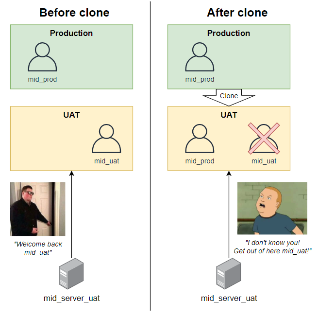
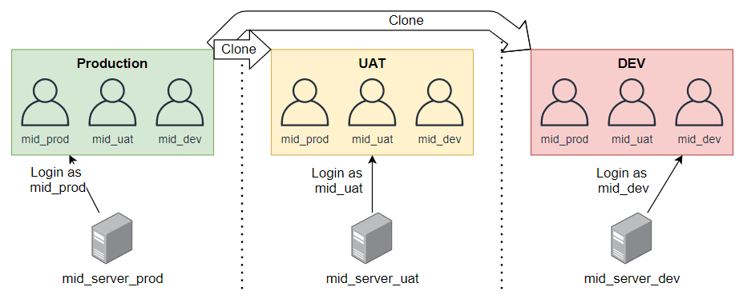
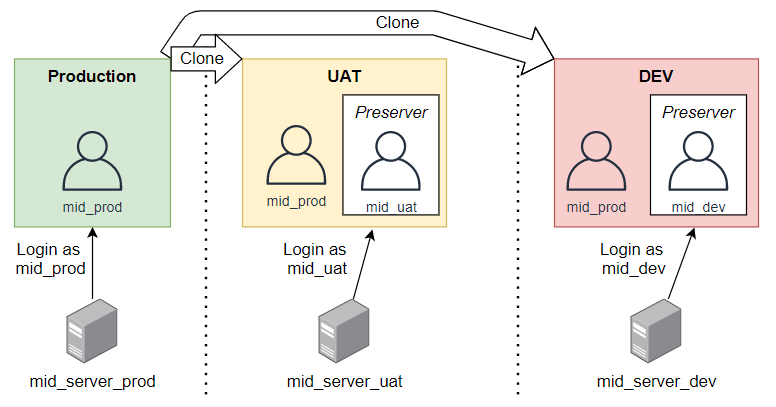

## The problem
When you do a system clone in ServiceNow, you lose almost all of the data in the target instance, replacing it with data from the source instance.

This is especially true with user accounts that the ServiceNow MID servers use to connect back to the ServiceNow platform. These are User [sys_user] records with usernames and passwords, and the role "mid_server".

When you do a clone, these users get deleted. This causes issues where any MID servers belonging to the target instance won't be able to connect anymore because the user credentials they were using got deleted in the clone. 
If you didn't write the password down, you'll need to reconfigure each MID server with a new password.
If you don't have access to the machine that the MID server is running on, it could be hours or days before your IT Infrastructure team will let you make that change.

## Solution 1 - All MID server users in production
The easiest solution that is "fire and forget" is to have all of the MID server users in your production instance / source-of-truth instance.

That way, any clones from your production / source-of-truth instance will always include those users, and the clone won't cause MID server authentication problems.

However, this approach has some considerations which may be very acceptable, but it's up to you to accept them:
* Active users will exist in your production instance that may not be relevant to production, and may be considered a security problem.
* Because non-production MID server users will be active in production, someone with the non-production credentials will be able to add non-production MID servers to your production instance of ServiceNow. However, these newly added MID servers will still need to be validated by a system administrator before they can do anything, so it's not that big of a security problem.

## Solution 2 - Clone data preservers
Another easy solution to prevent this problem is to use **"Clone data preservers"** to preserve those users and their roles in the target instance.

> A clone data preserver is something that preservers data after a clone takes place. 
> It first exports the data before the clone, lets the clone take place, and then restores the data back into the instance after the clone has completed.

The main benefit of this approach is that the MID server user accounts can be configured however you like in those instances. They won't be destroyed by a clone, and you won't need to copy the user or the credentials into other instances, not even production.

In your production instance (or whatever instance you do all of your cloning from), create Clone Data Preserver records as below:

 **Name**: MID server users
 **Table**: User [sys_user]
 **Conditions**: Roles is "mid_server"

 **Name**: MID server user has role
 **Table**: User Role [sys_user_has_role]
 **Conditions**: User.Roles is "mid_server"

 **Name**: MID server user group membership
 **Table**: Group Member [sys_user_grmember]
 **Conditions**: User.Roles is "mid_server"
 
 **Note:** Preserving group memberships can cause issues if the group doesn't exist after the clone. I have seen some companies grant the "mid_server" role via a "MID server" group, but you must ensure that the group is not deleted.

With these clone data preservers in place, any user that has the "mid_server" role will now be preserved, along with their roles and group memberships. This prevents MID servers going offline because a clone removing all of the MID server users.

## Further reading
* ServiceNow also has a KB article on the topic and includes other options on how to preserve similar users.
 https://support.servicenow.com/kb?id=kb_article_view&sysparm_article=KB0716380

* Here's an SN KB article discussing cloning and how it can impact MID servers.
 https://support.servicenow.com/kb?id=kb_article_view&sysparm_article=KB0786475
