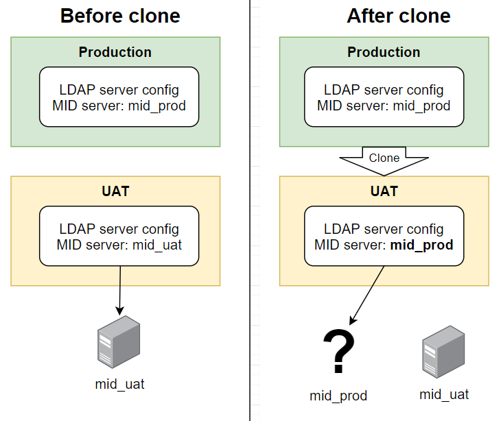

## The problem
A common issue with ServiceNow clones is that LDAP servers are included in clones but MID servers are not. This causes issues for LDAP server configurations that specify a MID server. After the clone, those LDAP server configs are trying to point to a MID server that used to exist where they came from, but are missing in instance that was cloned-over.

[](ldap-mid-server-after-clone.png)

## Solution 1 - Just update it after a clone
The simplest approach is just remember to update the LDAP Server's chosen MID server after every clone.

But we are ServiceNow administrators! We automation should be automating as much as we can!

## Solution 2 - Clone cleanup script and the first MID server you find
A quick-and-cheap solution is to use a **clone cleanup script** to automatically update the "MID Server" field on LDAP server configs to the first MID server available.

This approach only really works if you only have 1 single MID server in your instance.

Create a new **Clone cleanup script**.
**Name**: Auto update LDAP server MID servers
**Script**:
```js
autoSetLdapMid();

function autoSetLdapMid() {
    // Find a MID server to use
    var grMid = new GlideRecord("ecc_agent");
    grMid.setLimit(1);
    grMid.query();
    if (!grMid.next()) {
        gs.info("Couldn't auto update LDAP server MID servers, no valid MID servers to use");
        return;
    }
    var midSysId = grMid.getUniqueValue();
    gs.info("Found MID server to auto update LDAP servers to: "+midSysId);

    // Set any LDAP server configs with MID server values to the auto-selected MID server
    var grLdap = new GlideRecord("ldap_server_config");
    grLdap.addNotNullQuery("mid_server"); // Only care about LDAP server configs that use a MID server
    grLdap.query();
    if (!grLdap.hasNext()) {
        gs.info("No LDAP servers with MID servers to update");
    }
    while (grLdap.next()) {
        var ldapServerName = "\""+grLdap.getDisplayValue()+"\" ("+grLdap.getUniqueValue()+")";
        gs.info("Updating LDAP server "+ldapServerName+" MID server from "+grLdap.mid_server+" to "+midSysId);
        grLdap.mid_server = midSysId;
        grLdap.update();
    }
}
```

However, this approach isn't great.
* If you have more than 1 MID server, there's no guarantee which one will be used as the replacement.
* This will replace the MID servers on **all** of the LDAP server configs. This is a problem if you have multiple LDAP server configs that don't all use the same MID server.

## Solution 3 - Clone cleanup scripts and system properties
LDAP server configurations can be automatically updated using a **clone cleanup script** and **system properties** that are **private**. This much cleaner approach allows you to update multiple LDAP servers and multiple MID servers, without accidentally crossing paths.

> **Private** system properties are system properties that are specific to the current instance, and are not moved from site to site. They are preserved during a clone, and are not overwritten during a clone. They are also excluded from update sets.

**Step 1** - Create a new **System property** for each of your LDAP server(s) that you want to auto update.

**Name**: companyname.ldap.mid_server.(sys_id of LDAP server)
**Description**: Sets the MID server on the target LDAP server after a clone.
**Type**: string
**Private**: true
**Value**: (sys_id of the MID server from the ecc_agent table)

Here's an example for an LDAP server with the sys_id "eecd75a30a0a0b2600791193785025b2" which we want to use the MID server with the sys_id "711d97732f5421106b87d7a72799b61e".

[](example-system-property.png)

**Step 2** - Create a new **Clone cleanup script**.

**Name**: Auto update LDAP server MID servers
**Script**:
```js
autoSetLdapMid();

function autoSetLdapMid() {
	var propPrefix = "companyname.ldap.mid_server."; // Change this as needed

	var grLdap = new GlideRecord("ldap_server_config");
	grLdap.addNotNullQuery("mid_server"); // Only care about LDAP configs that have a MID server selected
	grLdap.query();
    if (!grLdap.hasNext()) {
        gs.info("No LDAP servers with MID servers to update");
    }
	while (grLdap.next()) {
		var ldapServerName = "\""+grLdap.getDisplayValue()+"\" ("+grLdap.getUniqueValue()+")";
		// Check if that MID server exists
		if (getMidById(grLdap.mid_server).isValidRecord()) {
			// MID server exists, don't change
			gs.info("Not auto selecting MID server for LDAP server "+ldapServerName+", chosen MID server is already valid");
			continue;
		} else {
			// MID doesn't exist.
			// See if a sys_property exists
			var propName = propPrefix+grLdap.getUniqueValue();
			var propVal = gs.getProperty(propName);
			if (propVal) {
				// An auto prop exists for this LDAP server.
				// MID servers are preserved as part of the clone,
				// lets validate that the MID server still exists.
				if (getMidById(propVal).isValidRecord()) {
					gs.info("Auto updating MID server for LDAP server "+ldapServerName+" from "+grLdap.mid_server+" to "+propVal);
					grLdap.mid_server = propVal;
					grLdap.update();
				} else {
					// Couldn't find the MID server specified in the system property.
					gs.error("Failed to update the MID server for LDAP server "+ldapServerName+", invalid MID server sys_id: "+propVal);
				}
			} else {
				gs.info("Not auto updating MID server for LDAP server "+ldapServerName+", current MID server is not valid but system property isn't set: "+propName);
			}
		}
	}
}

// Quick helper function to get a MID server by its sys_id
// Want to avoid issue where using "gr.get()" with an empty value
// just gets any random record. E.g. if a system property is empty.
function getMidById(sys_id) {
	var grMid = new GlideRecord("ecc_agent");
	grMid.addQuery("sys_id", sys_id);
	grMid.setLimit(1);
	grMid.query();
	grMid.next();
	return grMid;
}
```

**Congratulations**, your LDAP server connections will now survive a system clone automatically!

The next time you do a system clone, the cleanup script will automatically update the MID server field on the given LDAP servers to whatever MID server you've selected.

The script will also add logs to tell you what it did when it ran, in case you need to watch what happened.

```
> Auto updating MID server for LDAP server "corp.local" (e8375ffb2f1421106b87d7a72799b694) from 57af7aec73d423002728660c4cf6a71c to ed92e8d173d023002728660c4cf6a7bc

> Not auto updating MID server for LDAP server "Example LDAP Server" (eecd75a30a0a0b2600791193785025b2), chosen MID server is already valid
```