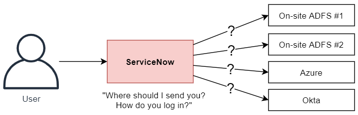
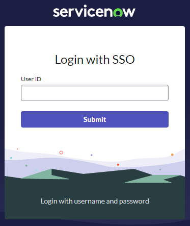
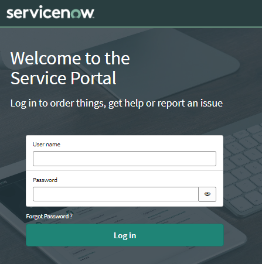
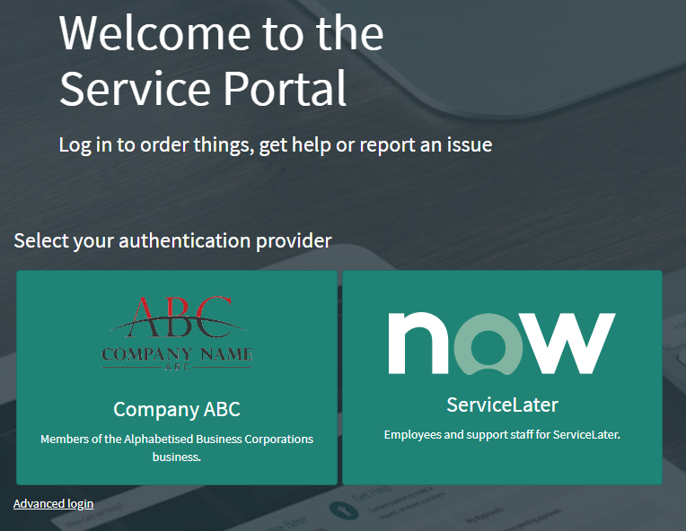

## The problem
When you configure ServiceNow to use your company's SSO identity provider (IdP), you'd typically set that SSO IdP the **default** provider so that any users that aren't logged in get automatically redirected to your SSO login page instead of ServiceNow's login page.

This works just fine if you have 1 single SSO identity provider, users should only ever be logging in through 1 way: the SSO IdP.

But what if you have multiple SSO Identity Providers?
What if you are a larger company that contains multiple smaller companies that each have their own SSO solutions?
What if you're a managed service provider, and users could be logging in from any number of customer companies?

[](login-confusion-diagram.png)

## Out of the box
Out of the box, ServiceNow provides the "External login" process where the user can enter their username (or something else like their email) and ServiceNow will:
1. Try to find their user.
2. See if the user has something in their "SSO source" field.
3. Redirect them to that SSO.

Here's what the "External login" form looks like.

[](sn-login-locate-sso.png)

This approach can come with some issues:
* It can quickly become tedious, especially if you need to do this every time you get logged out.
* It's an issue if ServiceNow isn't aware of the user yet, such as when someone's account has only just been created but a nightly import of user data hasn't occurred yet.
* It's an issue if the user record in ServiceNow hasn't been associated to an SSO provider, which means ServiceNow won't know where to send you to login. If things have been done properly, that data should already be there, but that's not always a guarantee.

Can we make this better?

## A better login page using buttons
The solution that I've used in the past was to use a custom login page that allowed the user to select the SSO provider that they want to use.

We talked about creating a custom login page in this previous post:
[How to use a custom ServiceNow login page, and why you should](/posts/2022-11-09-custom-login-page)

Here's the default Service Portal login page.

[](sn-login-default.png)

Here's an example of a login page that allows the user to select the way that they want to log in, using buttons.

[](sn-login-sso-buttons.png)

To do this you'd want to create a custom login service portal widget and show your SSO providers as buttons that the user can click on. Clicking on the buttons redirects the user to the SSO login URL:
```
/login_with_sso.do?glide_sso_id=<sys_id of the sso configuration>
```

There is also a button which shows the regular login page for local ServiceNow users.

Remember: **always** keep the classical login available somehow. In the above example, I've got it hidden behind that "Advanced login" link, which reveals the classic username & password login.

### Advantages
* This approach doesn't rely on ServiceNow already having the user's data, which supports scenarios where ServiceNow auto-updates itself with user data from an SSO provider as the user logs in. If the user doesn't exist in ServiceNow yet, then doing the OOTB "external login" approach wouldn't work because the user would need to enter their email address, which SN doesn't know yet.
* Uses big friendly buttons only a single click away, instead of a select box or a text field asking for your email address.

### Disadvantages
* If the list of SSO providers gets too long, it could be tedious for frequent visitors to ServiceNow.
* While this works great if you're all friends, it's not appropriate for service provider companies that don't want to reveal who their customers are to other customers. For this, I'd recommend a 2-step login page that first asks for the user's email address, and then ServiceNow can decide if they should be redirected. I'll talk about this in a future article.

### Configuring the buttons
For the buttons, you could populate these a number of different ways.

The easiest but least recommended would be to hard-code them in the widget. I'd recommend doing so in the widget's data to make it easier to update later.

```js
// ...
c.data.providers = [
    {
        name: "Azure ABC",
        desc: "Log in using the ABC Azure portal",
        icon_src: "/azure_logo.png"
    },
    {
        name: "Acme Okta",
        desc: "Log in using your Acme Okta login",
        icon_src: "/acme_okta_logo.png"
    }
    // and so on...
]
// ...
```

A better way would be to use the Identity Provider [sso_properties] table and some custom fields. This works well if you add a "Description" (string) and "Logo" (image) field to the table, and use those to populate the buttons with the title, logo image, and blurb by using a GlideRecord lookup on your widget's server script.

If you really wanted to avoid hard-coding and customising system tables, you could save them as a JSON payload in a system property, but that's a pro-code solution that isn't as easy for non-technical people to maintain.