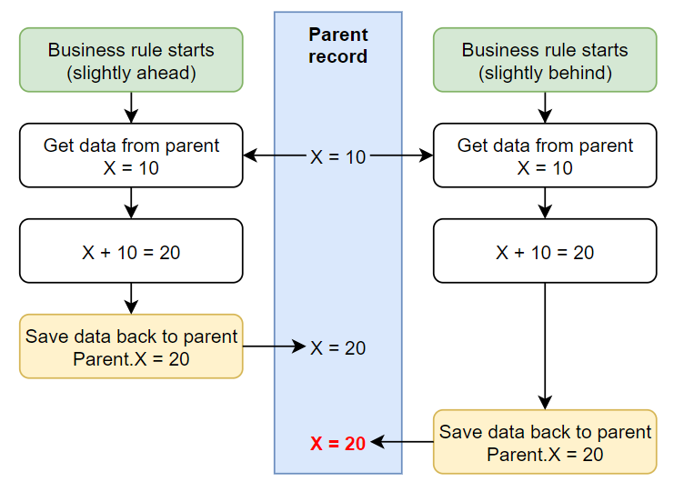
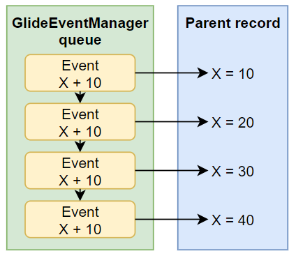
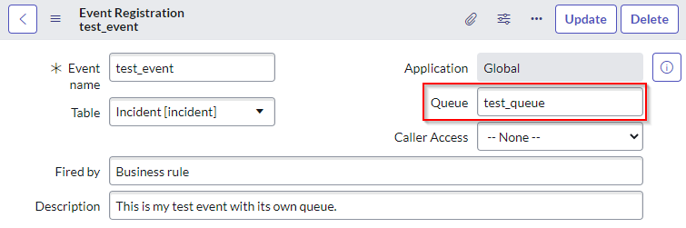
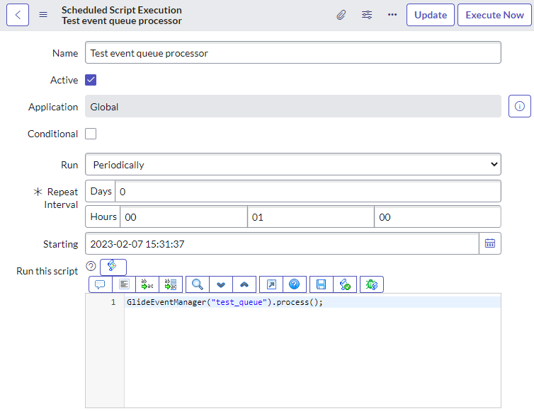

## The problem
A colleague came to me with an issue involving business rules and race conditions where multiple business rules are triggered at the same time, and they all try to update the same parent record.

The issue would result in the parent record being updated in chaotic and unexpected ways. 

Ideally, the business rules on the children records would happen one after the other, instead of all-at-once.

Here's an example of race conditions causing a problem. A business rule should add +10 to a field called "X" on a record, but it's been triggered twice at the same time. X should be updated from "10" to "30" (+10 twice), but due to race conditions, it's only updated to "20".

[](race-condition-diagram.png)

## The solution, DIY dedicated event queue
On solution would be to use your own **event queue** and **GlideEventManager** to process the events in a single thread, one after the other.

As child records get updated, use a business rule to trigger an event in your queue. Then your queue items will be processed one-after-another by your own **GlideEventManager** at an interval of your choosing.

[](glideeventmanager-diagram.png)

### Events are processed one-after-another
By using GlideEventManager, the events will be processed one-after-another

This is instead of the usual way that events are processed which is to process as many as possible as fast as possible across multiple workers.

An example of this is the queue "text_index" and the schedule item [sys_trigger] that processes it called "text index events process".

### Events that won't bog-down an instance
By using scheduled event processor jobs that are triggered periodically, you can help prevent a large flood of certain events from hogging  ServiceNow resources. This also ensures that these events only consume a single ServiceNow thread, instead of bogging down all possible workers with your events which prevents other events from being processed until all of yours are finished.

An example of this is the queue "cmdb_ci_affected" and the scheduled script execution "CIAffected Event Processor 0". Rather than have a flood of affected CI's hog all of ServiceNow, they use their own queue which handles events on a single thread instead of all threads.

### Step 1: the event registration
First, create your event, but this time you'll want to put something in the "queue" field of the event registration.
This must be all lower case and only contain letters, numbers, and underscores (unconfirmed).

[](event-registration.png)

> At this point, any of these events triggered by ```gs.eventQueue("test_event", …)``` and the "queue" parameter is empty will automatically be added to the "test_queue" queue, because that's the queue that you've specified in your event registration.
> However, you can still override this by specifying the queue in the ```gs.eventQueue("test_event", …)``` function.
> E.g. 
> ```js
> gs.eventQueue("test_event", gr, "", "", "a_totally_different_queue")
> ```

### Step 2: the event processor
By default, ServiceNow only processes events that aren't in any queue. If you don't create a processor, events will be added to your queue and just sit there doing nothing.

You can create a processor to process events in your queue by:
1. Navigate to "System Definition > Scheduled jobs".
1. Click on "New" and click "Automatically run a script of your choosing".
1. Give it a name and set it to run periodically (e.g. Periodically, every 1 minute).
1. Add the below script, and then save:
```js
GlideEventManager('test_queue').process();
```

[](scheduled-script-with-glideeventmanager.png)

### Conclusion
Now that you've got:
* Events going into their own queue.
* A processor to process the events in that queue
Your events are now in their own queue, being processed one-after-another, and not hogging ServiceNow resources when there's a bajillion of events created all at once.

### Testing
I used the below to test how a custom event queue is processed.

I used a **Script Action** to fire a script for each event. It logs when it starts and stops, and then sleeps for a random amount of time, between 1 and 5 seconds.

```js
var sleep = Math.floor(Math.random() * 4000) + 1000;
gs.log(["Running", event.parm1, event.parm2, sleep].join(" "));
gs.sleep(sleep);
gs.log(["Finishing", event.parm1, event.parm2].join(" "));
```

I then used a background script to create some events and then process them.
The page paused and waited while it processed all of the events.
```js
// Get any incident, I don't care which one
var gr = new GlideRecord("incident");
gr.setLimit(1);
gr.query();
gr.next();
gs.print(gr.getDisplayValue());

// Enqueue some events
gs.eventQueue("test_event", gr, 1, "");
gs.eventQueue("test_event", gr, 2, "");
gs.eventQueue("test_event", gr, 3, "");
gs.eventQueue("test_event", gr, 4, "");

// Process them
GlideEventManager("test_queue").process();
```

Here was the output.
```
*** Script: INC0000060
*** Script: Running 1  4915
*** Script: Finishing 1 
*** Script: Running 3  4882
*** Script: Finishing 3 
*** Script: Running 2  2954
*** Script: Finishing 2 
*** Script: Running 4  4377
*** Script: Finishing 4 
```

This tells me:
* Running `GlideEventManager().process()` waits until all of the events have been processed.
* The events are processed one-after-another. Otherwise, some events would start before others had finished.
* The events added all at once are not processed in order. Likely sorted by the "Process on" field, which is only accurate to the nearest second.

## Alternative, process holistically
In the above example, we talked about multiple child records that need to update a parent record with data from themselves.

An alternative is to use a script that updates the parent by first looking back at **all children**, instead of just reflecting the child record that triggered the update.

Consider the "Approvers" list field that I talked about in my previous article: 
[Better SN Approvals #4 - Approver Fields on Tasks](/posts/2021-05-15-approval-summary-fields).

It triggers a script which looks back at ***all approvers*** for that record and populates the field, reflecting them all at once, instead of just adding a single user for the one approval record that triggered the update.

Fewer checks, fewer updates, better user experience, and better performance. If a holistic is possible, in most cases you should do it.

## Links
* https://support.servicenow.com/kb?id=kb_article_view&sysparm_article=KB0676909
* https://www.servicenow.com/community/developer-forum/gs-eventqueue/m-p/1529243
* https://developer.servicenow.com/dev.do#!/learn/learning-plans/tokyo/new_to_servicenow/app_store_learnv2_automatingapps_tokyo_using_custom_queues_advanced_topic
* https://docs.servicenow.com/bundle/utah-api-reference/page/app-store/dev_portal/API_reference/GlideEventManagerGlobal/concept/GlideEventManagerGlobalAPI.html
* https://docs.servicenow.com/bundle/utah-api-reference/page/script/useful-scripts/task/queues-create.html
