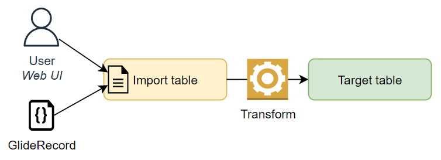
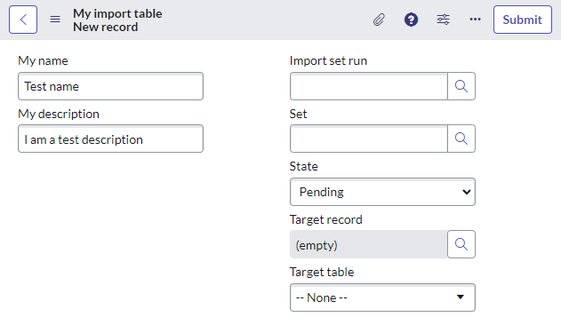
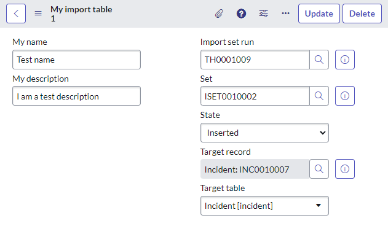

## The problem
Typically to import data into ServiceNow, there's a song and dance to make a spreadsheet and upload that into ServiceNow.

But what if you already have an import table and transform map, and just want to import a small handful of data?

## Solution - Just whack it in an import table
Out of the box, there are business rules on all import tables (any tables that extend from [sys_import_set_row]) that will automatically import and transform any new records that are added to those tables without an import set.

[](diagram-single-record-import.png)

### Do it yourself by hand
Importing a new row manually is as easy as:
1. Open the import table.
1. Create a new record and save it.

Here's a form for a new record in my import table.

[](screenshot-saving-before.png)

And here it is after I've saved it. Notice how it's automatically been imported, just by saving it. **Easy as that.**

[](./screenshot-saving-after.png)

### GlideRecord
For example, the below script will use GlideRecord to add a new record to an import row, and then get the transform result.

**Note:** the process is **synchronous** and your script will wait until the transform has been completed.

```js
// Insert the new record into the import table
var grInsert = new GlideRecord("u_my_import_table");
grInsert.u_my_name = "Test name";
grInsert.u_my_description = "I am a test description";
var sysId = grInsert.insert();

// Although it's been inserted and imported, the GlideRecord doesn't have the 
// details of the import, because the business rule is onAfter, not onBefore.
// Import state: Pending
// Target: 
// Import set run: 

// Go and get the record again
var gr = new GlideRecord("u_my_import_table");
gr.get(sysId);

// Import state: Inserted
// Target: incident.a776e3682ff32110d1d641e72799b6b5
// Import set run: TH0001007
```

### How does it work?
There are 2 business rules that make this work.

If you want to learn more about how to use the scriptable import classes, this is a great place to see them in action.

#### Set synchronous import set
If a new record is added to an import table [sys_import_set_row] and the **sys_import_set** field is empty, this onBefore business rule will automatically create an import set for it.

Notably, the import set is set to be **synchronous**, this is important for the next business rule.

#### Transform synchronously
This onAfter business rule will automatically transform any newly created records in [sys_import_set_row] tables where the row's import set's **mode** is **synchronous**.

## Solution 2 - Script it all yourself
If you want more control over the transform process, you can utilise the transform classes and script includes to import the data yourself. It's a little more involved, but easy enough to follow.

It involves using the below ServiceNow classes:
* **GlideImportSetLoader** to load data from a data source into an import set table.
* **GlideImportSet** to create or manage an import set to group together the rows of data to be imported.
* **GlideImportSetRun** to create and manage the import set execution.
* **GlideImportLog** to capture logs and events for the import.
* **GlideImportSetTransformer** to perform the import / run the transform maps.

Learn more about this in this article: [Scripts to start imports](posts/2023-07-04-sn-import-2-script-import-transform/)

## Links
* https://community.servicenow.com/thread/145203
* The Script Include "DataSourceLoader"
* The Script Include "ScriptInclude.BillingRollup"