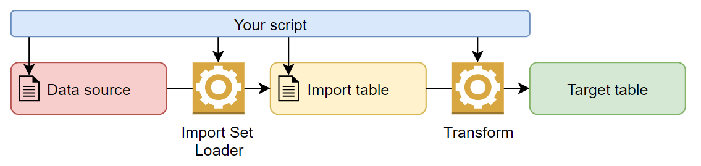

## The problem
Typically to import data into ServiceNow, there's a song and dance to make a spreadsheet and upload that into ServiceNow.

But what if you already have the import table and transforms, and you want to import data using a script, scheduled job, or UI action?

* Importing spreadsheets attached to emails.
* Creating a custom scripted REST API to import data using a custom payload.
* Importing and transforming data that is already in ServiceNow.
* Using a script to fetch data from a remote system and push it through an import & transform.

## Solution - Do it yourself
Luckily, ServiceNow has scriptable API's where you can control the import process yourself.

Data can be loaded into the import table either by loading from a data source, or you can populate it yourself, as long as it gets grouped under an Import Set.

[](diagram-script-import.png)

It involves using the below ServiceNow classes:
* **GlideImportSetLoader** to load data from a data source into an import set table.
* **GlideImportSet** to create or manage an import set to group together the rows of data to be imported.
* **GlideImportSetRun** to create and manage the import set execution.
* **GlideImportLog** to capture logs and events for the import.
* **GlideImportSetTransformer** to perform the import / run the transform maps.

## Examples

### Example - Just transform it
This example will just run the transform, nothing fancy.
It shows all you need to kick-off a transform.

```js
var grImportSet = GlideRecord("sys_import_set");
grImportSet.get(importSetSysId); // Replace withthe import set sys_id

var importTransformer = new GlideImportSetTransformer();
importTransformer.transformAllMaps(grImportSet); 
```

Or without using GlideRecord.

```js
var importTransformer = new GlideImportSetTransformer();
importTransformer.setImportSetID(importSetId); // Replace withthe import set sys_id
importTransformer.transformAllMaps(); 
```

### Example - Importing from a data source
This example will work when you have a data source and you want to 
1. Load data from an existing data source
1. Import the data

```js
// Get the data source as a GlideRecord
var dataSourceSysId = "SYSID_GOES_HERE";
var grDataSource = new GlideRecord("sys_data_source");
grDataSource.get(dataSourceSysId);

// Load the data from the import set
var loader = new GlideImportSetLoader();
var grImportSet = loader.getImportSetGr(grDataSource);
loader.loadImportSetTable(grImportSet, grDataSource);

// Setup the import set run
// GlideImportSetRun(String importSetID)
var importSetRun = new GlideImportSetRun(grImportSet.sys_id);
// GlideImportLog(GlideImportSetRun importSetRun, String source)
var importLog = new GlideImportLog(importSetRun); 

// Import the data, run the transformer
var importTransformer = new GlideImportSetTransformer();
importTransformer.setLogger(importLog);
importTransformer.setImportSetRun(importSetRun);
importTransformer.setSyncImport(true); // If true, script will wait for transform to finish
importTransformer.transformAllMaps(grImportSet); // <-- The goods happen right here
```

### Example - Importing from manually created data
This example will work if you want to:
1. Manually create the import set
1. Manually populate the data in the import table under the import set
1. Import the data

```js
var importTableName = "u_my_import_table";

// Create the import set, data will be grouped under this import set
var importSet = new GlideImportSet(importTableName);
var importSetId = importSet.create();

// Populate your data into the import table
var grTestData = new GlideRecord(importTableName);
grTestData.sys_import_set = importSetId;
// 1
grTestData.u_my_name = "Test data 1";
grTestData.insert();
// 2
grTestData.u_my_name = "Test data 2";
grTestData.insert();
// 3
grTestData.u_my_name = "Test data 3";
grTestData.insert();

// Run the transformer over the import set
var importSetRun = new GlideImportSetRun(importSetId);
var importLog = new GlideImportLog(importSetRun);
var importTransformer = new GlideImportSetTransformer();
importTransformer.setLogger(importLog);
importTransformer.setImportSetRun(importSetRun);
importTransformer.setImportSetID(importSetId);
importTransformer.setSyncImport(true); // If true, script will wait for transform to finish
importTransformer.transformAllMaps(); 

// Don't need to specify the GlideRecord of the Import Set because we've already done it using .setImportSetID()
```

## GlideImportSetLoader
Use this class to load data from a data source into an import table.
There isn't much documentation on how to use this class, so I'll share what I know.

You do need to get the Data Source as a GlideRecord, but that's the only requirement.

```js
// Get the data source as a GlideRecord
var dataSourceSysId = "SYSID_GOES_HERE";
var grDataSource = new GlideRecord("sys_data_source");
grDataSource.get(dataSourceSysId);

// Load the data from the import set
var loader = new GlideImportSetLoader();
var grImportSet = loader.getImportSetGr(grDataSource);
loader.loadImportSetTable(grImportSet, grDataSource); // <-- The magic happens here
```

## GlideImportLog usage
Both of these scripts produce the same result, it doesn't make much difference.
1. An import set run and logger is created.
1. Log messages are added against the import set run.

Using `new GlideImportLog(importSetRun, "My custom importer")` with a **source** provided (e.g. "My custom importer") didn't seem to make any difference in the logs.

You can skip them and let the GlideImportSetTransformer create it.

```js
var importSetId = "0f7f0f292f372110d1d641e72799b6c7"; // A test import set

var importTransformer = new GlideImportSetTransformer();
importTransformer.setImportSetID(importSetId); // Replace withthe import set sys_id
importTransformer.transformAllMaps(); 
```

Or you can manually create everything yourself.

```js
var importSetId = "0f7f0f292f372110d1d641e72799b6c7"; // A test import set

var importSetRun = new GlideImportSetRun(importSetId);
var importLog = new GlideImportLog(importSetRun);

var importTransformer = new GlideImportSetTransformer();
importTransformer.setLogger(importLog);
importTransformer.setImportSetRun(importSetRun);
importTransformer.setImportSetID(importSetId); // Replace withthe import set sys_id
importTransformer.transformAllMaps(); 
```

## Links
* SN Docs - GlideImportSetTransformer
  https://docs.servicenow.com/bundle/utah-api-reference/page/app-store/dev_portal/API_reference/GlideImportSetTransformer/concept/GlideImportSetTransformerAPI.htm