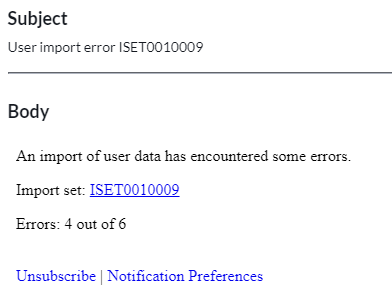

## The problem
In the past, I've faced a requirement where I needed to take action if something bad happened in an import at transform in ServiceNow. The requirement was to create an incident if an imported CSV document contained a serial number that already existed in the CMDB.

However it highlights a common but dangerous problem: **imports that fail silently and nobody knows it has failed.**

If a scheduled import of user data fails, nobody would know until someone's user is whacky or their user is missing entirely.
If a scheduled import of computer data fails, it's possible nobody would notice for weeks or months.

[](meme-fire-import-working-fine.jpg)

## Solution - onComplete post-import checks
The easy and simple solution to this problem is to use an onComplete transform script to look at the results of the import and take action on anything that needs a spotlight on it.

The simplest solution is to use an onComplete transform script to send a notification email if any of the import rows result in an error.
It will send out this email at the end of each transform run.

*Note that we're not going to use an onAfter transform script, we don't want to send 50 emails about 50 errors.*

First, create an event registration that the script will trigger if there is an error found.
E.g. An event for errors in a user data import.
**Name:** sys_user.ldap.import_error
**Table:** Import Set [sys_import_set]

Next, create an onComplete script on your transform map.
[](screenshot-transform-scripts.png)
**Active:** true
**Type:** onComplete
**Script:**
```js
(function runTransformScript(source, map, log, target /*undefined onStart*/) {
    var totalCount = undefined;
    var stateCounts = { "error": 0, "ignored": 0, "updated": 0, "inserted": 0 };

    // Get the import set details from the "source" parameter, which is a GlideRecord of the last row in the import set
    var sourceTable = source.getRecordClassName();
    var sourceSet = source.sys_import_set;

    // Count some results from the import set
    var ga = new GlideAggregate(sourceTable);
    ga.addQuery("sys_import_set", sourceSet); // Count the rows in this import set
    ga.addNotNullQuery("sys_import_set");
    ga.addAggregate("COUNT"); // Total count
    ga.addAggregate("COUNT", "sys_import_state"); // Group by import state & count
    ga.query();

    while (ga.next()) {
        if (!totalCount) totalCount = ga.getAggregate("COUNT");
        stateCounts["" + ga.sys_import_state] = ga.getAggregate("COUNT", "sys_import_state")
    }

    if (stateCounts.error > 0) {
        // There is at least 1 error
        log.error("Errors found, triggering alert event"); // Add log to the transform log
        
        // Get the Import Set as a GlideRecord, we need this to trigger the event
        var grIS = new GlideRecord("sys_import_set");
        grIS.get(sourceSet);

        // Trigger the event: sys_user.ldap.import_error
        // Parm1: error count
        // Parm2: total count of rows in the import set
        gs.eventQueue("sys_user.ldap.import_error", grIS,  stateCounts.error, totalCount, null);
    }
})(source, map, log, target);
```

Lastly, create a new notification which will be sent out when an error occurs.
Here's an example:
**Name:** User data import error
**Send when:** Event is fired
**Event:** sys_user.ldap.import_error
**Groups:** My system administrators (change this to whoever you want to email)
**Subject:** User import error ${number}
**Message:**
```
An import of user data has encountered some errors.

Import set: ${URI_REF}

Errors: ${event.parm1} out of ${event.parm2}
```

**And that's it!** Now whenever there is an error in the import an alert will be sent out to someone to let them know, and errors shouldn't fly under the radar unnoticed anymore.

[](sample-test-email.png)

## Links
* Map with transformation event scripts 
 https://docs.servicenow.com/bundle/utah-integrate-applications/page/script/server-scripting/reference/r_MapWithTransformationEventScripts.html
