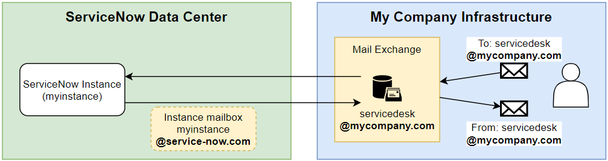
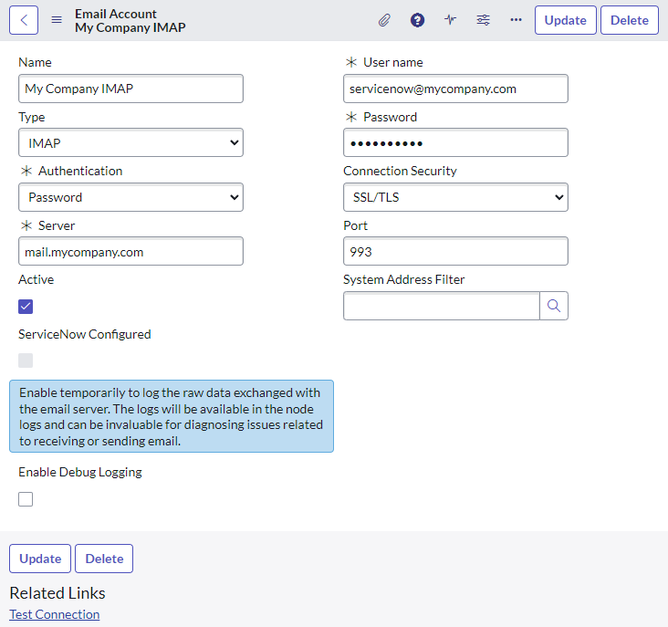

## How emails work out-of-the-box
Each instance of ServiceNow is automatically provided with its own mailbox provided by ServiceNow (the company). This is how an out-of-the-box instance is able to send and receive emails. This mailbox is fairly "no-frills" and simple in nature compared to most enterprise mailboxes such as MS Exchange or Google Gsuite, but it does come with a basic level of protection.

[![Default email account configuration(diagram-default-email-account.png)]](diagram-default-email-account.png)

In the background there are jobs run by the instance which send and receive email, and are typically cannot be customised. They are Java classes triggered by system jobs, and their actions do not appear to trigger business rules.
* The "Email Reader" (com.glide.email_accounts.EmailReaderJob) job checks the mailbox for any new emails and adds them to the "Emails" [sys_email] table every 2 minutes.
* The "SMTP Sender" (SMPTSenderJob) job sends any "send-ready" records in the "Emails" [sys_email] table via the instance's SMTP server every minute.

While convenient, this comes with some limitations:
* In rare circumstances, ServiceNow's mailbox protection may interfere with legitimate emails. However, this will likely happen because you are using suspicious email attachments, such as Excel documents with macros or emailing sample phishing emails to ServiceNow for reporting.
* Emails will be sent out from ServiceNow's email servers, which may not be desired or align with your company requirements.
* Emails sent with a sender address from your company (e.g. servicedesk@mycompany.com) may be blocked by Outlook by SPF security checks.
* Emails will be received and stored (even if temporarily) within the ServiceNow mailbox, which may not align to your company's requirements or data handling policy.

## Use your own mailbox
2 kinds of **Email Accounts** [sys_email_account] can be configured within ServiceNow: incoming (POP3 / IMAP) and outgoing (SMTP). Out-of-the-box there are email accounts created for the instances own ServiceNow mailbox.

If you want to use your own mailbox, it's as simple as creating new **Email Account** records. Depending on your setup, you'll need to provide:
* a name
* a hostname for the mail server
* a username and password
* security type

Here's an example email account for ServiceNow to pull new emails from the mailbox "servicenow@mycompany.com" on the server "mail.mycompany.com".

> You cannot use the MID Server to as part of the email accounts. The ServiceNow instances will need to be able to reach the mail server from the internet.

Only 1 of each kind can be active at once. If you create a new outgoing (SMTP) email account and tick "Active", ServiceNow will automatically mark any other SMTP email accounts inactive. The instance's own mailbox will still be there and won't be deleted, it will just be inactive.

## Why would you do this?
I've come across a couple of use cases where using your own mailbox instead of ServiceNow's was a must-have requirement.
* On-premise instances of ServiceNow where you don't get your own ServiceNow mailbox.
* Legal and regulatory requirements around data storage.
* High-security configurations where data and emails are tightly controlled.

## Limitations and alternatives
Letting ServiceNow directly connect to your own mailbox may not always be possible. I often encounter company security policies that outright prevent this approach.

For receiving emails from a mailbox, only POP3 and IMAP email protocols are supported. Many companies that use Exchange or Exchange Online do not allow POP3 or IMAP for security reasons. If this cannot be worked around, then ServiceNow will not be able to receive emails by reading that mailbox.

However, have a look at these articles for alternatives if you still want ServiceNow to send or receive emails with different addresses:
* [The Right Way to Forward Emails From a Mailbox to ServiceNow](/posts/2022-05-23-sending-emails-to-servicenow/)
* [Send out emails from a different sender address](/posts/2023-09-14-sn-email-sender-address/)

## Links
* SN Docs - Basic email setup
 https://docs.servicenow.com/bundle/rome-servicenow-platform/page/administer/reference-pages/concept/c_StandardEmailConfiguration.html
* SN Docs - Email Accounts
 https://docs.servicenow.com/bundle/tokyo-servicenow-platform/page/administer/notification/concept/c_EmailAccounts.html
