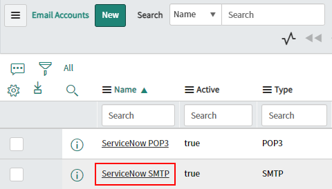
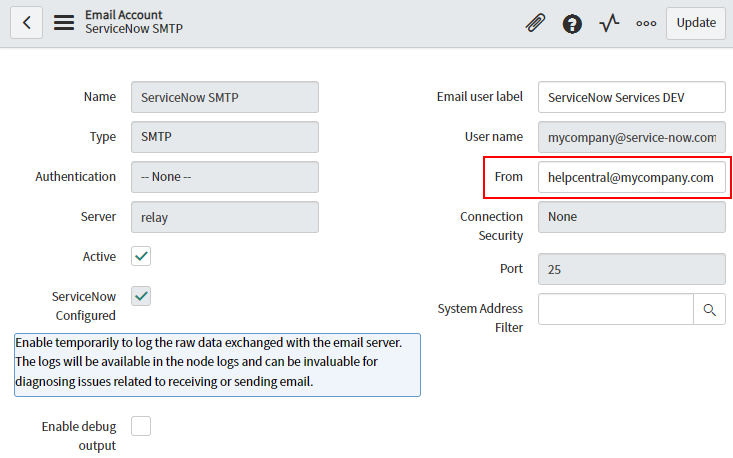
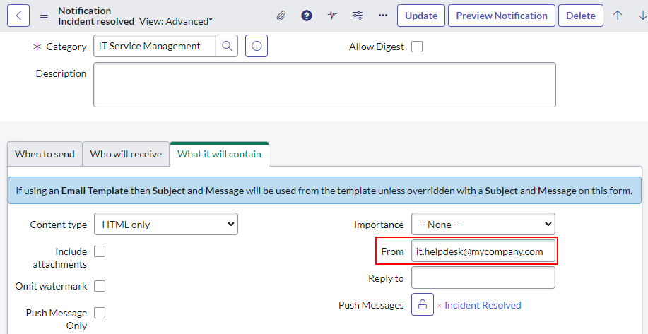
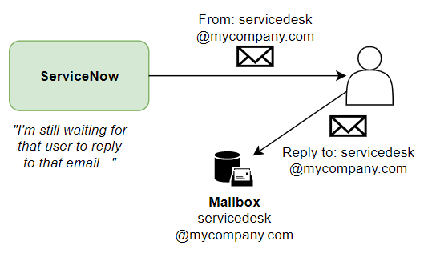
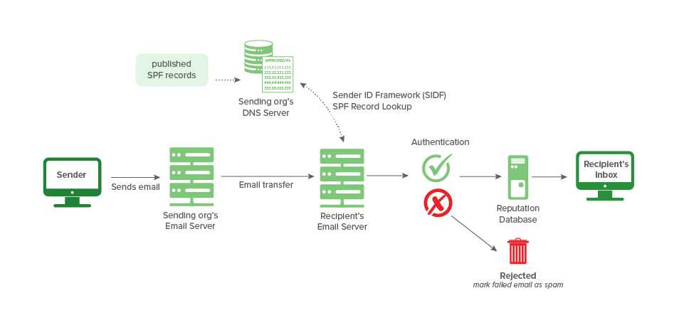

## The challenge
As ServiceNow comes out-of-the-box, emails sent out automatically come from the instance's own mailbox **"instance@service-now.com"**

```
From: Help Desk <mycompany@service-now.com>

To: David McDonald <david.mcdonald@mycompany.com>

Subject: Incident created INC00123456
===

Hi you,

Your incident INC00123456 has been created.

From your IT Department, you have to believe me.
```

Emails don't look official or legitimate when they're meant to come from within your company but come from an email address **outside** of your company.

What you really want is for emails to have a sender address within your own company:
```servicenow@mycompany.com```
or even a custom name or branding
```helpcentral@mycompany.com```

## Configuring the "From" for emails sent by the instance
You can tell ServiceNow to send out emails with a custom "From" or sender address in 2 main ways.

### Change the instance default
The first way is **instance-wide**, where you set the "From" address for all emails by default. You can do this by opening up the "Email account" [sys_email_account] that ServiceNow uses to send emails, and set the "From" field to whatever you'd like to use. The email account will be the one where the **type** is "SMTP" and **Active** is true. If you haven't added any custom email accounts, there should just be the 1 default account provided by ServiceNow (the company).

[](screenshot-email-accounts-list.png)

[](screenshot-smtp-email-account.png)

### Per-notification email
Each Notification [sysevent_email_action] can have a custom "From" address set against it. You can use this to specify the sender address used when this notification sends an email.

This can come in handy if you wanted to use a sender address for a specific application or set of notifications. 
E.g. any HR Service Delivery emails from from `hr.helpdesk@mycompany.com`.

[](screenshot-notification-from.png)

### Think about replies
So you've got emails coming out of ServiceNow with a custom sender address. You should also be aware of what happens when someone replies to the email.
It's good if ServiceNow is sending emails from `hr.helpdesk@mycompany.com`, but what if replies can't be captured by ServiceNow?

For consistency, I recommend you make sure that ServiceNow receives emails from any address that it sends out emails from.

[](diagram-send-but-cannot-recieve.png)

### Watch out for SPF
SPF (Sender Policy Framework) is a security feature that may catch you when ServiceNow sends emails from your company's domain.
In a nutshell, the recipient (e.g. MS Exchange or Office 365) will recieve the email from ServiceNow, check if your company's DNS entry includes ServiceNow's email servers, and then reject it.

If ServiceNow is sending emails and none of them are being recieved, it's likely an issue with SPF. This is a common problem to come across when you first give ServiceNow a custom sender address.

Image credit to www.dmarcian.com/what-is-spf/
[](diagram-how-spf-works-dmarcian.png)

Have a look at this ServiceNow KB article on how to solve the problem. It involves updating your company's DNS records or linked SPF lists to include ServiceNow's email servers.

Enabling email delivery using SPF records to allow SN mail servers
https://support.servicenow.com/kb?id=kb_article_view&sysparm_article=KB0535456

## Sending from a custom mailbox (SMTP)
Alternatively, you can get ServiceNow to send out all emails from one of your own company mailboxes, which will automatically give it a different sender address.

You can read more about this topic in this article:
[COMING SOON](/posts/2023-09-14-sn-email-accounts/)

## Links
* SPF - Sender Policy Framework
 https://en.wikipedia.org/wiki/Sender_Policy_Framework
* How Microsft 365 uses Sender Policy Framework (SPF) to prevent spoofing
 https://learn.microsoft.com/en-us/microsoft-365/security/office-365-security/email-authentication-anti-spoofing
* Enabling email delivery using SPF records to allow SN mail servers
 https://support.servicenow.com/kb?id=kb_article_view&sysparm_article=KB0535456
* SN Community - SPF Security - Servicenow Sending Email Using Company Email Doamin Name
 https://www.servicenow.com/community/now-platform-forum/spf-security-servicenow-sending-email-using-company-email-doamin/m-p/1130330
* How to change email from address
 https://support.servicenow.com/kb?id=kb_article_view&sysparm_article=KB0823655 