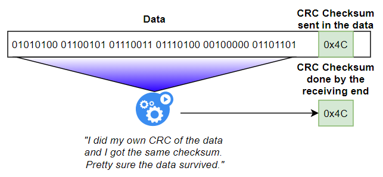
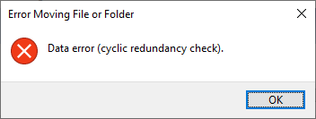
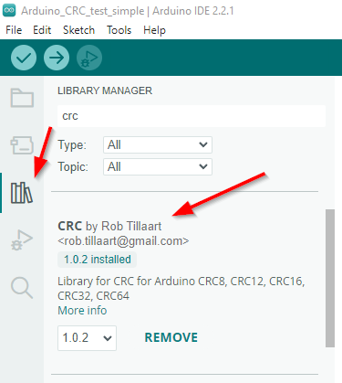

## What is CRC?
CRC **(Cyclic Redundancy Check)** is a great way to check if 2 things are the same. Typically, this is used for checking data integrity when moving data from one thing to another and you want to validate if the data is still good after transport.

[](crc-overview-diagram.png)

The **CRC checksum** is a small number made by looping over bytes of data, adding it together as it scans the data, and produces a "sum" at the end. I won't go into the process in detail here, but it's kinda cool. The process it typically very fast.

The **CRC check** first creates a new CRC checksum of the data and then compares it to the expected checksum. If the new checksum matches the expected checksum, the data should be good. If not, something has happened along the way.

You'll often see CRC checks used in a number of different ways, including:
* CRC checks on the end of serial messages. If the CRC of the received message doesn't match the CRC checksum sent in the message itself, the message was likely corrupted along the way.
* CRC checks within data or settings stored on a microcontroller's EEPROM data storage. If the CRC of the stored data doesn't match the CRC checksum stored in the file itself, the data is likely corrupted.

Anyone remember how CD ROMs used to fail with the error "Cyclic redundancy check failed" if it was really scratched or really old? Yep, that's a CRC check and that data didn't match the CRC checksum that it carries for safety.

[](windows-cyclic-redundancy-check-error.png)

## Simple CRC-16 in Arduino
Here is a simple CRC-16 function in C++ Arduino. The code works just fine with other microcontrollers, such as the ESP32, ESP8266, or pretty much any other microcontroller.

```cpp
// Simple CRC-16 function.
// data: pointer to the data in memory
// length: length of the data footprint in memory
uint16_t checksumCalculator(uint8_t * data, uint16_t length)
{
   uint16_t curr_crc = 0x0000;
   uint8_t sum1 = (uint8_t) curr_crc;
   uint8_t sum2 = (uint8_t) (curr_crc >> 8);
   int index;
   for(index = 0; index < length; index = index+1)
   {
      sum1 = (sum1 + data[index]) % 255;
      sum2 = (sum2 + sum1) % 255;
   }
   return (sum2 << 8) | sum1;
}

// EXAMPLE - Checksum an array of bytes / 8-bit integers
uint8_t buf[10] = {1,2,3,4,5,6,7,8,9,0};
uint16_t crc = checksumCalculator(buf, 10);
Serial.println(crc, HEX); // Print value in HEX, looks nicer
// CRC: 0xD22D

// EXAMPLE - Checksum a struct object
struct myStruct_t { 
   int myInt;
   float myFloat;
} myStruct;

myStruct.myInt = 1234;
myStruct.myFloat = 123.456;

// Pass the struct object as a pointer to a byte array, 
// along with the memory footprint size of the struct.
// Creates a CRC checksum for the entire object.
uint16_t crc = checksumCalculator(myStruct, sizeof(myStruct_t));
Serial.println(crc, HEX); // Print value in HEX, looks nicer
// CRC: 0x8637
```

## The CRC Arduino library
Alternatively, just use the CRC library which comes all sorts of CRC functions, as well as a suite of additional features. This library has been tried and tested, and I'd recommend using this library compared to making your own in most cases.

This library should work on pretty much any microcontroller.

https://github.com/RobTillaart/CRC

### Install the library
The CRC library can be installed using the Arduino IDE.

[](arduino-ide-install.png)

### Example - Simple usage

```cpp
#include <CRC.h>

//…

// Calculate the CRC of the test value.
// Give it a pointer to something and say how big it's memory footprint is
// (how many bytes of memory the variable is)

float myValue = 123.456;

// Calculate the CRC
uint8_t crcValue = calcCRC8((byte*) &myValue, sizeof(float));
// CRC = 0xC3
```

### Example - CRC check multiple values
This example includes an initial value and an array of other values. The code will:
1. Calculate a CRC for the initial value.
1. Perform a CRC check on the other values to check if they are the same as the initial value.

```cpp
#include <CRC.h>

//…

  int originalValue = 123456789;
  uint16_t originalCrcValue = calcCRC16((byte*) &originalValue, sizeof(int));

  Serial.print("Original value: "); Serial.println(originalValue);
  Serial.print("Original CRC: "); Serial.println(originalCrcValue, HEX);
  int testValues[6] = {
    123456789,
    987654321,
    12345,
    67890,
    0,
    1234567890
  };

  // Init variable for looping
  uint16_t crcValue; 
  bool crcCheck;
  for (byte i=0; i < 6; i++) { // Loop the array of test values
    // Calculate the CRC of the test value.
    // Give it a pointer to something and say how big it's memory footprint is
    // (how many bytes of memory the variable is)
    crcValue = calcCRC16((byte*) &testValues[i], sizeof(int));
    crcCheck = (crcValue == originalCrcValue); // CRC check. Does it match the original?
    Serial.print("VAL "); Serial.println(testValues[i]); 
    Serial.print("CRC "); Serial.print(crcValue, HEX); // Print CRC as HEX, looks prettier
    Serial.print(' '); Serial.println(crcCheck ? "PASSED" : "FAILED"); 
  }

// Output
// Original value: 123456789
// Original CRC: 7C5E
//
// VAL 123456789
// CRC 7C5E PASSED
//
// VAL 987654321
// CRC FFA6 FAILED
//
// VAL 12345
// CRC B43F FAILED
//
// VAL 67890
// CRC C35E FAILED
//
// VAL 0
// CRC 0 FAILED
//
// VAL 1234567890
// CRC F38C FAILED
```

### Example - Struct with CRC inside
Sometimes the CRC checksum variable is a property within your object that you want to perform the CRC on.

For example, a settings struct with all of the controller's saved settings might have a CRC checksum property at the end of it.

To do this:
* Always have your CRC at the end of your struct, or in a consistent location in memory.
* Calculate the CRC checksum on the size of the struct MINUS the size of your CRC property. Don't want to include the CRC in the CRC.

This code will:
1. Set up an object with configuration values in it: a wifi name and password.
1. Calculate the CRC for the object and store it back inside the object.
1. Repeat multiple times to demonstrate that the CRC itself has not been included in the CRC calculation.

```cpp
#include <CRC.h>

struct myConfig_t {
  char wifiName[32]; // Wifi network name
  char wifiPass[32]; // Wifi network password
  uint8_t wifiTimeout; // Wifi connection timeout

  uint8_t crc; // Keep this at the end
};
myConfig_t myConfig;

void printCrc() {
  Serial.print("CRC 0x"); Serial.println(myConfig.crc, HEX);
}

void updateConfigCrc() {
  // Update the CRC checksum on the config data struct
  myConfig.crc = calcCRC8((byte*) &myConfig, sizeof(myConfig_t) - sizeof(uint8_t)); // Length = size of the struct MINUS the size of the CRC property. Don't want to include the CRC in the CRC.
}

void setup() {
  // put your setup code here, to run once:
  Serial.begin(115200);
  Serial.println("Starting");

  // Set the config
  Serial.println("Initial config");
  strncpy(myConfig.wifiName, "MyWifi", 31);
  strncpy(myConfig.wifiPass, "abc123", 31);
  myConfig.wifiTimeout = 30;
  // Update the CRC, should be the same every time. 
  // If it changes after every calc, the CRC checksum is being included in the CRC calculation, and that's wrong.
  updateConfigCrc();
  printCrc();
  updateConfigCrc();
  printCrc();
  updateConfigCrc();
  printCrc();
  // Initial config
  // CRC 0xB1
  // CRC 0xB1
  // CRC 0xB1
  // It's the same every time, this is good

  Serial.println("Making a change");
  strncpy(myConfig.wifiName, "AnotherWifi", 31);
  strncpy(myConfig.wifiPass, "def456", 31);
  updateConfigCrc();
  printCrc();
  updateConfigCrc();
  printCrc();
  updateConfigCrc();
  printCrc();
  // Making a change
  // CRC 0x2A
  // CRC 0x2A
  // CRC 0x2A
  // It's the same every time, this is good

}

void loop() {
  // put your main code here, to run repeatedly:
}
```

### Example - Testing multiple CRC sizes
Here's an example to demonstrate the various CRC sizes.

```cpp
#include <CRC.h>

//…

// Create a struct object with some data in it
struct myStruct_t { 
   int myInt;
   float myFloat;
};
myStruct_t myStruct;
myStruct.myInt = 1234;
myStruct.myFloat = 123.456;

// Do some CRC checksums on the object

uint8_t crc8 = calcCRC16((byte*) &myStruct, sizeof(myStruct_t));
Serial.print("CRC8  0x"); Serial.println(crc8, HEX);
uint8_t crc12 = calcCRC12((byte*) &myStruct, sizeof(myStruct_t));
Serial.print("CRC12 0x"); Serial.println(crc12, HEX);
uint16_t crc16 = calcCRC16((byte*) &myStruct, sizeof(myStruct_t));
Serial.print("CRC16 0x"); Serial.println(crc16, HEX);
uint32_t crc32 = calcCRC32((byte*) &myStruct, sizeof(myStruct_t));
Serial.print("CRC32 0x"); Serial.println(crc32, HEX);

// Output
// CRC8  0xC0
// CRC12 0xD7
// CRC16 0xD6C0
// CRC32 0xBF65E8A5
```

## What size CRC should I use?
The size of the CRC checksum defines how big the numbers are in the CRC calculation. Large data will need to use larger larger CRC checksums to avoid duplicates.

The maximum total block length is `2**r - 1` or `2^r - 1`, with r being the CRC size.

For example, doing an 8-bit CRC over 16K bytes of data can have possible duplicate checksums depending on the data, and would be better to use a 16-bit CRC.

CRC checksums can come in various sizes but you'll typically see these in use:
| Type | Supported data size | Example |
| -- | -- | -- |
| CRC-8 (1 byte / 2 hexadecimal characters) | < 32 bytes | 0xA7 |
| CRC-16 (2 bytes / 4 hexadecimal characters) | < 8.196 K bytes | 0xA749 |
| CRC-32 (4 bytes / 8 hexadecimal characters) | < 4.294 M bytes| 0xA7492BC4 |

## Links:
* Cyclic Redundancy Check (CRC) in Arduino
 https://www.tutorialspoint.com/cyclic-redundancy-check-crc-in-arduino
* GitHub - RobTillaart/CRC
 https://github.com/RobTillaart/CRC
* Arduino Tutorial - EEPROM CRC
 https://wiki-content.arduino.cc/en/Tutorial/LibraryExamples/EEPROMCrc/
* Wikipedia - Cyclic Redundancy Check
 https://en.wikipedia.org/wiki/Cyclic_redundancy_check
* Stack Overflow - Data Length vs CRC Length
 https://stackoverflow.com/questions/2321676/data-length-vs-crc-length