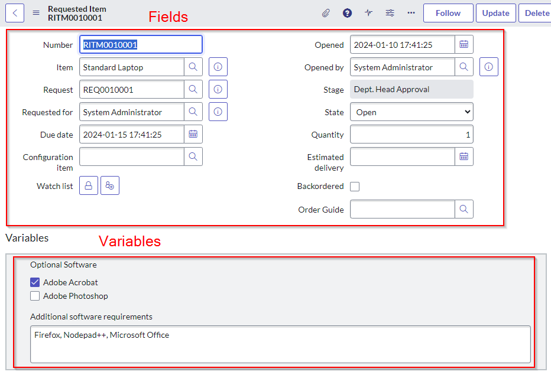
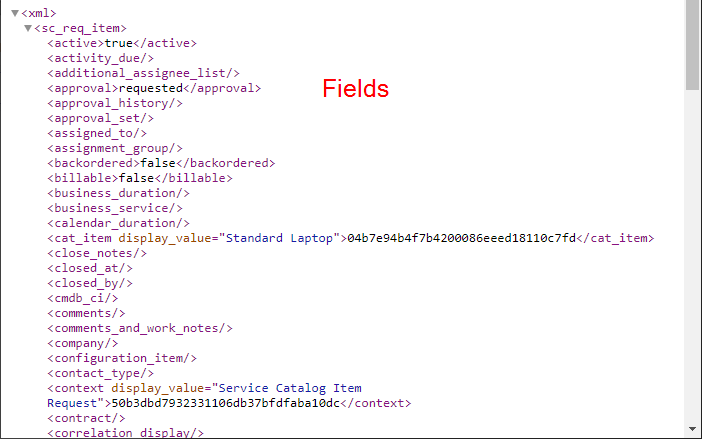
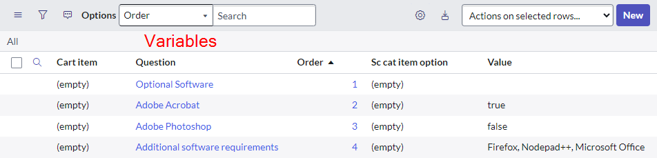
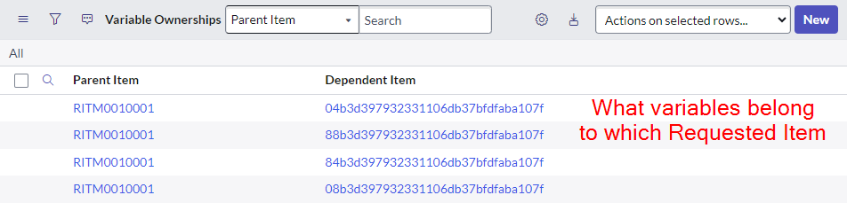
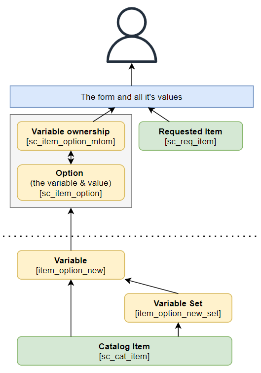

## What are "variables" and how are they different to fields?
In short, variables in ServiceNow are arbitrary fields on something that can take many forms and aren't tied to columns or fields in a table.

Typically, they are stored in a variable table of sorts in a key-value layout of "this variable has this value".

This is different to columns or fields in ServiceNow which are firmly-defined columns on a database table.

Almost all kinds of variable definitions extend from the parent "Variable" [var_dictionary] table.

Here's some examples of the differences between fields and variables.

## Catalog variables
There are 2 main areas for variables in catalog items:

* The variables configured for the catalog items and variable sets. They form a "template" of sorts.
* The variable instances & values themselves for the requested items. These are copies of the variable "templates" configured on the catalog items. 

This method of making copies of the variables whenever they are used prevents variables from being broken on existing catalog requests whenever changes are made to the catalog items.

This includes formatting variables, including section starts & ends, and annotations.

Here's a diagram of the most common kinds of catalog variables.

Here's a list of all of the tables involved in catalog variables that I could find.

| Table | Notes |
| --- | --- |
| Variable   [item_option_new] | Extends "Question" [question]   The variable as it is configured on the Catalog Item / Variable Set. |
| Options   [sc_item_option] | The variables and values for a request. |
| Producer Set   [item_option_new_producer_set] | Extends "Variable Set" [item_option_new_set]   Same as Options [sc_item_option] but for record producers. |
| Variable ownership   [sc_item_option_mtom] | A many-to-many table linking requested items [sc_req_item] to variables [sc_item_option]. |
| Variables   [sc_item_variables_task] | Which variables are visible on what catalog tasks. |
| Multi Row Question Answers   [sc_multi_row_question_answer] | Appears to be a many-to-many table for multi-row variable sets, including what the question was, what set it's for, and the answer / value. |
| Variable Set   [item_option_new_set] | Definitions for variable sets. |
| Item Options   [sc_cat_item_option] | Appears unused. |
| Variable Category   [item_option_category] | Appears unused. |
| Variable Layout   [item_option_layout] | Extends "Question" [question]   Appears unused. |

## Questions
Underneath a large portion of variable functionality is something called "Questions". Some of the variable tables extend from "Questions" functionality, but not all of them.

| Table | Notes |
| --- | --- |
| Questions   [questions] | The definition of some variables / questions. |
| Question Answers   [question_answer] | The instances and values of some kinds of variables, including the below. I suspect that records created by record producers have the variables saved in this table. |
| Variables on CSM cases   [sn_customerservice_case] | |
| Variables on Incidents   [incident] | |
| Variables on Standard Change Proposals   [std_change_proposal] | |
| Variables on User Groups   [sys_user_group] | |
| Question Choice   [question_choice] | Choice values & price data for choice question variables. |
| Question Regular Expressions   [question_regex] | Regular expression validations that can be used on question variables. |

## System variables
There are many areas within the system of ServiceNow which utilise arbitrary forms and fields, including Integration Hub and Connections. These are typically stored within the below tables.

| Table | Notes |
| --- | --- |
| Variables   [var_dictionary] | Holds the definition of the variables. |
| Value   [sys_variable_value] | Holds the values of variables. A lot of Workflow (not Flow) and Integration Hub values live in here. |
| [var__m_*] | Auto-generated tables to hold variable values.   E.g. [var__m_sys_hub_step_ext_output_4f1590a253a1301026b0ddeeff7b1279] |

## ATF related variables
Variables relating to the ServiceNow Automated Testing Framework.

| Table | Notes |
| --- | --- |
| Test Variable   [sys_atf_variable] | Extends "Variables" [var_dictionary]   The parent for all of the different kinds of ATF variables |
| Input Variables   [atf_input_variable] | Extends "Test Variable" [sys_atf_variable] |
| Output Variables   [atf_output_variable] | Extends "Test Variable" [sys_atf_variable] |
| Parameter Variable   [sys_atf_parameter_variable] | Extends "Variables" [var_dictionary] |

## Flow related variables
| Table | Notes |
| --- | --- |
| Flow Data Variable   [sys_flow_data_var] | extends "Variables" [var_dictionary] |
| Flow Catalog Variable   [sys_flow_cat_var] | extends "Variables" [var_dictionary] |

## Workflow related variables
| Table | Notes |
| --- | --- |
| Activity Variables   [wf_activity_variable] | extends "Variables" [var_dictionary] |
| Workflow SC Variable   [wf_variable] | extends "Variable" [item_option_new] |

## Links
* SN Docs - Reporting on Catalog item Variables
 https://www.servicenow.com/community/platform-analytics-articles/reporting-on-catalog-item-variables/ta-p/2298979
* SN Docs - Debug a Service Catalog variable 
 https://docs.servicenow.com/bundle/sandiego-servicenow-platform/page/product/service-catalog-management/task/debug-a-service-catalog-variable.html
* Reddit - What table do the variables live in for a specific RITM?
 https://www.reddit.com/r/servicenow/comments/punkyt/what_table_do_the_variables_live_in_for_a/
* Reddit - What table has Variables for a specific sc_task
 https://www.reddit.com/r/servicenow/comments/15kx7bz/what_table_has_variables_for_a_specific_sc_task/