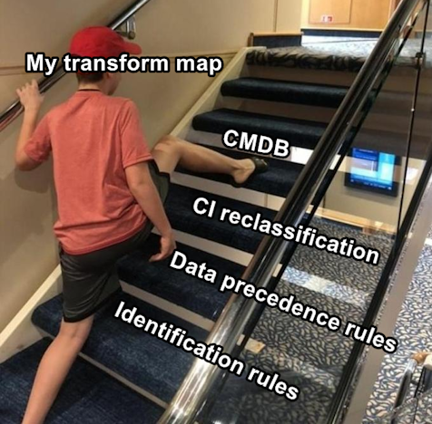
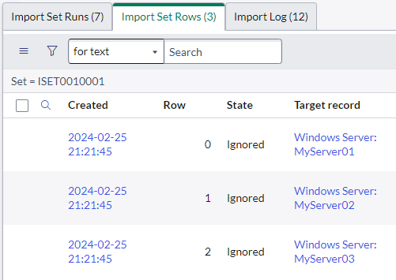
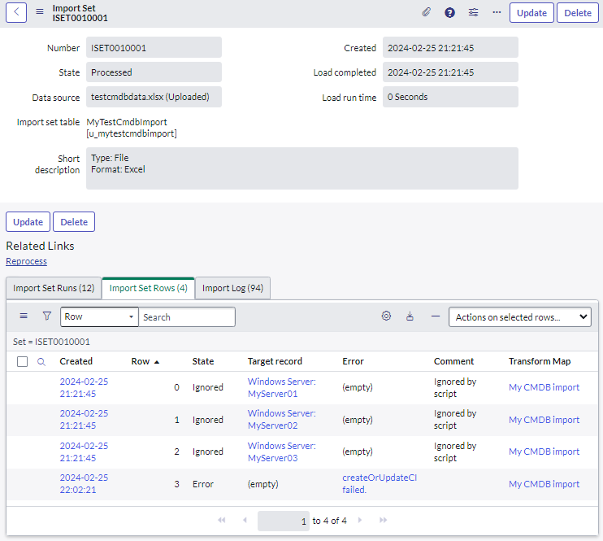
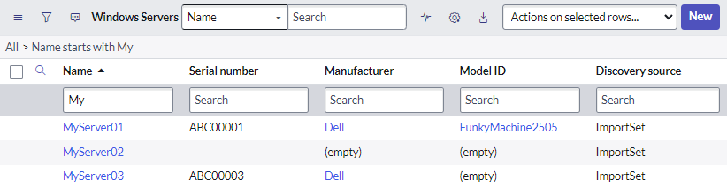
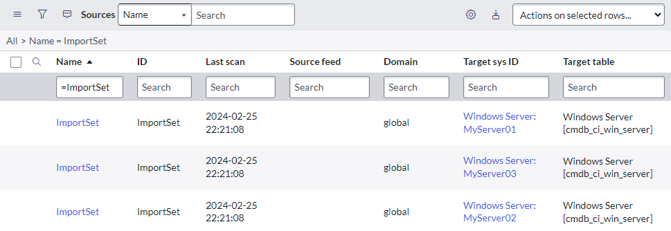

## Why use CMDBUtil to import CI data?
So you want to import configuration item into the ServiceNow CMDB. This could be from a spreadsheet, a data source, or another integration. You just push it through a simple transform map, right?

**Wrong!** Importing CI data using a simple straight-forward transform map skips a lot of the *magic* and useful features of the ServiceNow CMDB. You'll miss out on things like:
* Automatically finding existing CIs using identification rules. You might accidentally create duplicate data.
* Data precidence rules and data source prioritisation. You might overwrite something you shouldn't have.
* Automatically creating new models.



A lot of this *magic* comes from the **IRE (Identification and Reconciliation engine)**. To quote ServiceNow:

*IRE is an underlying key component in Identification and Reconciliation, providing a centralized framework to perform identification and reconciliation processes across different data sources. IRE uses identification rules, reconciliation rules, and IRE data source rules when processing incoming data before inserting that data to the CMDB.*

*IRE processes help maintain data integrity in the CMDB.*
* *IRE prevents duplicate CIs by uniquely identifying CIs.​*
* *IRE reconciles CI attributes by allowing only authoritative data sources to write to CMDB.*

## How to use it in a Transform Map
It's simple to change your transform map to use CMDBTransformUtil and the *magic* of the IRE.

1. On your transform, tick "Run script".
1. On your transform, add the below script into your transform map's "Script" field.

```js
(function runTransformScript(source, map, log, target) {
	// Call CMDB API to do Identification and Reconciliation of current row
	var cmdbUtil = new CMDBTransformUtil();
	// cmdbUtil.setDataSource("MyDataSource"); // Data source for data precedence 
	cmdbUtil.identifyAndReconcile(source, map, log);

	// "Ignore" all of the rows. The CMDBTransformUtil will handle all the magic.
	ignore = true;

	// Log any outputs, handle any errors.
	if (cmdbUtil.hasError()) {
		var errorMessage = cmdbUtil.getError();
		log.error(errorMessage);
		error = true; // Update the import row to show the error
		error_message = errorMessage;
	} else {
		log.info('IE Output Payload: ' + cmdbUtil.getOutputPayload());
		log.info('Imported CI: ' + cmdbUtil.getOutputRecordSysId());
		target.get(cmdbUtil.getOutputRecordSysId()); // Not in the SN example, but super helpful. Sets the "target" to the CI it found.
	}
	
})(source, map, log, target);
```

So what's going on here?

```js
var cmdbUtil = new CMDBTransformUtil();
cmdbUtil.identifyAndReconcile(source, map, log);
```

This script uses the `CMDBTransformUtil` to
* Read your transform mappings so it understands which source fields map to the CI's fields.
* Reads the data from the source import row and imports it using the IRE.
* Handles the whole import process itself, and sets the row's status to "Ignored".

Under the hood it uses the library `IdentificationEngineScriptableApi`.

```js
cmdbUtil.setDataSource("MyDataSource"); // Data source for data precedence 
```

Data Precedence is a feature of the ServiceNow CMDB where different sources of data have different priorities.
E.g. if SN Discovery and SCCM have data showing different OS Version numbers for the same CI, trust SN Discovery over SCCM.

This function call is how you tell the IRE what precedence this import has over any existing data. You can't just make up your own in this script, it must match the name of a data source defined as a Choice [sys_choice] on the CI [cmdb_ci] Discovery Source (discovery_source) field. 

```js
ignore = true;
```

The `ignore = true` prevents Import Sets from creating the same record again after it is processed by the identification engine.

```js
// Log any outputs, handle any errors.
if (cmdbUtil.hasError()) {
        var errorMessage = cmdbUtil.getError();
        log.error(errorMessage);
        error = true; // Update the import row to show the error
        error_message = errorMessage;

} else {
        log.info('IE Output Payload: ' + cmdbUtil.getOutputPayload());
        log.info('Imported CI: ' + cmdbUtil.getOutputRecordSysId());
        target.get(cmdbUtil.getOutputRecordSysId()); // Not in the SN example, but super helpful. Sets the "target" to the CI it found.
}
```

This part of the script updates the import row if there are any errors during the import.
If there wasn't any errors, some debugging information is still logged to the import log.

> If you can't see the import details added to the transform logs, that's because the system property "**glide.importlog.log_to_table**" is not set to "true".

```js
target.get(cmdbUtil.getOutputRecordSysId()); // Not in the SN example, but super helpful. Sets the "target" to the CI it found.
```

This line isn't in the ServiceNow example script, but I find it super helpful because it sets the "Target record" column of the import rows. Great for debugging and following what the transform has done.

[](screenshot-import-set-rows.png)

## Using it and reading the results
I used a transform map with CMDBTransformUtil to import the below data into the Windows Server [cmdb_ci_win_server] table, along with some empty values to see what would happen.

|**Name**|**Serial number**|**Manufacturer**|**Model ID**|
|:-----:|:-----:|:-----:|:-----:|
|MyServer01|ABC00001|Dell|FunkyMachine2505 |
|MyServer02|ABC00003|Dell| (empty) |
|MyServer03| (empty) | (empty) | 
| (empty) | (empty) | (empty) | (empty) |

Here's what the import set results look like. Note that:
* The "State" is "Ignored" for each successful row. Rows that error still get the state of "Error".
* The "Target record" column is set because we set it in the script.

[](screenshot-import-set-results.png)

Here's the CI's in the CMDB. Note that:
* The model of the Dell FunkyMachine2303 was automatically created.
* The "Discovery source" was set to "ImportSet" because we didn't specify the data source in the script.

[](screenshot-imported-cis.png)

The IRE has also created Object Source [sys_object_source] records for the new CI's. This table is used by the IRE to quickly look up CI's and to track data sources that have updated the CI over its lifetime.

[](screenshot-sys-object-source.png)

## Disadvantages
While the CMDBTransformUtil is incredibly useful, it does have some disadvantages and limitations:
* It will set the state of any import rows to "Ignored", even if it was imported successfully.
* An import set should be associated with a single transform map. Otherwise, things will get very strange as multiple transform maps fight over the same set of data that's been updated by CMDBTransformUtil.
* The CMDBTransformUtil API does not check if mandatory fields have values when used with Import Sets . Regardless of how enforce mandatory fields is set in the transform map, data import fails if a mandatory field does not have a value.
* CI Identification and Reconciliation cannot be applied to Import Sets for dependent CIs (CIs with dependent identification rules).
* You cannot set the ID of the Object Source [sys_object_source] record, it will always be the same as the data source name. E.g. Data source = "ImportSet", ID = "ImportSet".
 This is unlikely to be a problem, but may be incompatible with integrations which look up CIs by their Object Source ID, for example the [Dynatrace Incident integration](https://store.servicenow.com/sn_appstore_store.do#!/store/application/9f77f7a94f9f1200dbec7bb28110c7c2).

## The RTE (Robust Transform Engine)
Another option for intelligently importing into the CMDB is to use the RTE (Robust Transform Engine). However, this deserves its own article.

## Links
* SN Docs - Apply CI Identification and Reconciliation to Import Sets
 https://docs.servicenow.com/bundle/washingtondc-servicenow-platform/page/product/configuration-management/concept/identification-import-sets.html
* SN Developer - CMDBTransformUtil
https://developer.servicenow.com/dev.do#!/reference/api/utah/server_legacy/c_CMDBTransformUtilAPI
* SN Community - Populating the CMDB
 https://docs.servicenow.com/bundle/rome-servicenow-platform/page/product/configuration-management/concept/c_OptionsToPopulateCMDB.html
* SN Docs - Multisource CMDB
 https://docs.servicenow.com/bundle/rome-servicenow-platform/page/product/configuration-management/concept/multisource-cmdb.html
* SN Docs - Identification and Reconciliation engine (IRE)
 https://docs.servicenow.com/bundle/washingtondc-servicenow-platform/page/product/configuration-management/concept/ire.html
* SN Community - CMDBTransformUtil Usage in Transform Maps
 https://www.servicenow.com/community/cmdb-articles/cmdbtransformutil-usage-in-transform-maps/ta-p/2608369
* SN Developer - IdentificationEngineScriptableApi
 https://developer.servicenow.com/dev.do#!/reference/api/utah/server_legacy/c_IdentificationEngineScriptableApiAPI