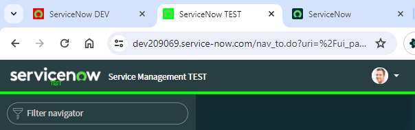
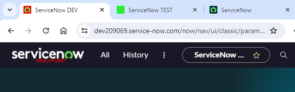
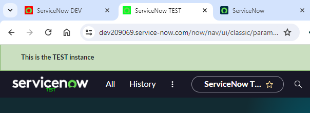

## Making instances look unique
To make it easier to tell what instance you're in, a common practice is to add some theming to non-production instances to make them stand out. 

The goal of these changes is to prevent accidents from occurring because changes were made in the wrong instances. You don't want to be that guy who uploaded test data into production, or send a bajillion test emails from production!

## Theming examples
Here's some examples of different unique instance changes to get you thinking.

### Sample 1
UI16 with custom logo, favicon, product name, product description, UI16 header divider colour.

### Sample 2
UI16 with custom logo, favicon, product name, product description, UI16 header divider colour, **but the user has selected the "Blues" theme**.

### Sample 3
Next Experience with logo, favicon, and product name.

### Sample 4
Next Experience with banner announcement, logo, favicon, and product name.

## Instance favicon
You can set a unique favicon / page icon for each instance which helps users identify the instance just be glancing at the browser tab.

> **Note:** Custom favicons are not visible on the Service Portal.

Here's how it looks out of the box.

And here's how it looks with custom icons.

First, add the image to ServiceNow.
1. **In production** navigate to "**System UI &gt; Images > Images**" or the table Images [db_image].
1. Click on "**New**".
1. Enter a "**Name**" for your image. Valid names must end in .gif, .png, .jpg, .ico, or .bmp. I'd recommend "favicon_(instance name)" e.g. "favicon_dev.png".
1. Click the "**Click to add**" link in the Image field, then select and upload the image.
1. Click "**Update**" to save the new image.
1. Repeat the above steps for as many unique favicon images you need (e.g. 1 for DEV, 1 for TEST).
1. Get the new Image [db_image] to the other instances either by doing a clone, or repeating the above steps in the other instances.

> **Why did we add the images in production?**
> While the system property that specifies which image to use will survive the clone, the image itself will not. The Image [db_image] table has no clone data preserves. This means images for all of the instances must be in production so that they come down in a clone.
>
> This also allows you to update the non-production favicon images from a single spot, so this isn't a bad thing.

Then, set up ServiceNow to use the new favicon image.
1. Open the instance you want to change the favicon for.
1. Navigate to "**System Properties &gt; System**".
1. Change the field "**Icon image displayed in the bookmarks and browser address bar**" [glide.product.icon], enter the file name of the uploaded image.
1. Click "**Save**".

Fun fact, "**glide.product.icon**" is one of the system properties preserved by the clone because it is considered part of the "theme". 

## Instance window title 
Another way of telling instances apart by the browser tab is to have unique window titles.

However, it's impact is minimal as the ends of window titles are usually cut off at the end.

> **Note:** Custom window titles are not visible on the Service Portal.

To quote ServiceNow:

[Modify the banner](https://docs.servicenow.com/bundle/washingtondc-platform-user-interface/page/administer/navigation-and-ui/concept/c_ModifyTheBanner.html)

> *These properties are used to set the window title as follows:*
> 
> *glide.product.name*
> *glide.product.description*
> 
> *If glide.product.name is blank, then the ServiceNow name is used as the product name for the window title.*

Here's how the page titles look out-of-the-box.

Here's an example of instance-specific "**glide.product.name**" of "**ServiceNow DEV**". You can see how it is visible in the first tab, but it cut-short in the other tabs.

## Product logo
You can give instances their own unique logo to tell them apart. This method is super easy to do.

This logo is used:
* In the top-right of the banner (incl. UI16).
* On the login page for the Next Experience.

> **Note:** Custom product banner logos will not affect the Service Portal.

For more information on changing the banner logo and the different ways to do it, check out SN Docs.
* [Create a company profile](https://docs.servicenow.com/bundle/washingtondc-platform-user-interface/page/administer/navigation-and-ui/task/t_CreateACompanyProfile.html)
* [Customize the banner logo in Core UI](https://docs.servicenow.com/bundle/washingtondc-platform-user-interface/page/administer/navigation-and-ui/task/t_CustomizeTheLogoInSysProps.html)

### How it looks

Here's how it looks out of the box in Polaris / Next Experience UI.

If you hover the mouse over the logo, the "Product Description" appears.

Here's how it looks out-of-the-box in UI16.

**Customised**

Here's an example in the Next Experience with a slight change to denote which instance that you're in.

The custom logo also appears on the Next Experience login page.

And in UI16.

### How ServiceNow decides what logo image to use
The logo (a.k.a. product image) is set by the following, in order.
1. The **UI16 Banner Image** image field on the Company that your User [sys_user] is set to. Does not affect login page. **Not clone safe**.
1. The **UI16 Banner Image** image field on the **System Properties > My Company** record / the Company [core_company] where "Primary" is TRUE. **Not clone safe**.
1. System Property **glide.product.image.light**. Should be an image name, not an attachment sys_id.
1. System Property **glide.product.image**. Should be an image name, not an attachment sys_id.

The logo on the login page will use the same order.

Note that **glide.product.image.light** overrides any other logo image configuration for the Platform UI or the login page.

Changing the "UI16 Banner Image" field on the "My Company" record **will update the glide.product.image.light property**. These changes will be lost during a clone over the instance.

### How to change the product image
> Do not use the **System Configuration > Basic Configuration** page to upload a new logo. This will attach the image to the system property which will be lost during a clone.

Here's how to upload a new logo image and update ServiceNow to use that image as a logo.

First, add the image to ServiceNow.
1. **In production** navigate to "**System UI &gt; Images > Images**" or the table Images [db_image].
1. Click on "**New**".
1. Enter a "**Name**" for your image. Valid names must end in .gif, .png, .jpg, .ico, or .bmp. I'd recommend "favicon_(instance name)" e.g. "favicon_dev.png".
1. Click the "**Click to add**" link in the Image field, then select and upload the image.
1. Click "**Update**" to save the new image.
1. Repeat the above steps for as many unique favicon images you need (e.g. 1 for DEV, 1 for TEST).
1. Get the new Image [db_image] to the other instances either by doing a clone, or repeating the above steps in the other instances.

> **Why did we add the images in production?**
> While the system property that specifies which image to use will survive the clone, the image itself will not. The Image [db_image] table has no clone data preserves. This means images for all of the instances must be in production so that they come down in a clone.

Then update the system properties to use your new image.
1. Navigate to the list of system properties by entering **sys_properties.list** in the navigator search field, then press ENTER.
1. Search for the system property **glide.product.image** and open it. (If it's missing, create a new one with the same name).
1. Set "Value" to the name of the Image [db_image] you created earlier.
1. Save the changes.
1. Repeat the above steps for **glide.product.image.light**.

Here's some examples with placeholder images.

Here's how it looks with **glide.product.image.light** configured. Note that this property is confiugured by default.

Here's how it looks without **glide.product.image.light** configured, but still a logo on the "My Company" record.

### Warning: Image attachments on Company records
Unique banner images on Company [core_company] **will be lost and replaced during a clone**, even though the record itself is preserved.

I don't recommend setting the logo for non-production instances using the Company [core_company] method.

### Warning: Image attachments on system properties

**Do not attach images to system properties.** Images attached to Sytem Property [sys_properties] records **are not** preserved during a clone. This is a problem for "uploaded image" system properties because the system property and it's value will be preserved, but the value will be a sys_id of the image attachment which gets deleted by the clone. 

This will cause your logo image to be missing after a clone.

*Banner with a missing logo.*

*Next Experience login page missing logo.*

## Product description text

To change the "Product Description".
1. Navigate to "**System Properties &gt; Basic Configuration**".
1. Look for and update the "**Page header caption**" [glide.product.description] field.
1. Click on "**Save**".

> As of the Utah release in the Next Experience UI, ServiceNow recommends not changing the "Product description" [glide.product.description] and instead using Banner Announcements with "Non-dismissible" enabled so it's always there.

## Banner theming
A great option for visibly identifying each instance is with a visually striking coloured banner.

> **Note:** Custom Platform UI banner themes are not visible on the Service Portal.

However, the approach is different between UI16 and the Next User Experience.

### UI16 Banner Theming
Theming the banner in UI16 is easy, and can be done using system properties.

When it comes to making the instances look unique, I recommend changing the colour of the banner border, the thin line that sits on the bottom of the banner. If this line is visually striking, the difference between instances can be obvious.

> **Note:** The banner colouring will **not** be visible if the user has selected their own theme.

1. Navigate to "**System Properties &gt; Basic Configuration UI16**".
1. Find "**Header divider stripe color**" [css.$navpage-header-divider-color] and set it to a new colour (e.g. #FF0000 for red).
1. Click on "**Save**".

Here are some variations of instance-unique banners.

### Next Experience Banner Theming
Theming in the Next Experience is a bit different. It uses it's own Themes [sys_ux_theme] configuration records, and doesn't use any of the system properties for theming.

This means that instance-unique Next Experience themes will **not** survive a clone in the out-of-the-box configuration.

> **Note:** Unique themes will **not** be visible if the user has selected their own theme.

Theming in the Next Experience is a complex topic and deserves its own article. You can read more about it here.

* [Configure a Next Experience theme](https://docs.servicenow.com/bundle/washingtondc-platform-user-interface/page/administer/navigation-and-ui/task/configure-next-experience-theme.html)
* [Override the (default) Next Experience theme](https://docs.servicenow.com/bundle/washingtondc-platform-user-interface/page/administer/navigation-and-ui/task/override-next-experience-theme.html)
* [Preserve your custom Next Experience theme during clones](https://docs.servicenow.com/bundle/washingtondc-platform-user-interface/page/administer/navigation-and-ui/task/preserve-next-experience-theme-during-clone.html)

## Next Experience / Unified Navigation Banner Announcements
ServiceNow Docs recommends that you use **Banner Announcements** instead of customising the Produce Description. This is not available in UI16.

In a nutshell, all you have to do is create a new "**Banner Announcement**" [sys_ux_banner_announcement] record and enable "**Non-dismissible**" to the banner announcement is always visible.

> **Note:** Next Experience Banner Announcements are not visible on the Service Portal.

The benefit of using Banner Announcements is that it will not be affected if the user has selected a different **theme**. In contrast to colouring the banner, which can be undone by the user selecting a different theme.

You can read more about them here in ServiceNow docs.
[Next Experience banner announcements](https://docs.servicenow.com/bundle/washingtondc-platform-user-interface/page/administer/navigation-and-ui/concept/next-experience-banner-announcements.html#config-next-experience-banners)

> **Note** these banners will **not** survive a clone with the out-of-the-box clone profile. 
>
> I'd recommend adding a Clone Data Preserver to preserve "Banner Announcement" [sys_ux_banner_announcement] records where "Non-dismissible" is set to TRUE, and set the preserver's "Theme" field to TRUE so it honours the clone "Preserve theme" setting.

Here's an example of a banner announcement for a DEV environment and the Banner Announcement record that made it happen. Note that the banner announcement cannot be dismissed and will always be present.

## How does cloning preserve theming?
A common issue with instance-specific theming is that these changes are lost during a clone from production.

Let's have a look at how a clone handles theme configuration. When you request a new clone there's a checkbox called "Preserve Theme". But what does this actually do?

To quote ServiceNow:
*"Preserve theme: Preserves the theme and CSS elements on the target clone. This option is selected by default."*

What this means is that there are **Clone Data Preservers [clone_data_preserver]** with a true/false field called "Theme". These data preservers only take effect if the clone has "Preserver Theme" set to TRUE.

Here's the out-of-the-box configuration of data preservers for themeing, preserving:
* Application categories
* The "My Company" record (the Company [core_company] record where "Primary" is TRUE)
* Theming related System Properties [sys_properties], notably those that start with "css" and some other specific properties.

This tells us how to make our changes survive clones. The "My Company" record and some specific system properties.

## Links
* SN Pro Tips - Customizing UI16 though CSS and System Properties
 https://snprotips.com/blog/2016/4/9/customizing-ui16-through-css-and-system-properties
* Create a company profile
 https://docs.servicenow.com/bundle/washingtondc-platform-user-interface/page/administer/navigation-and-ui/task/t_CreateACompanyProfile.html
* Customize the banner logo in Core UI
 https://docs.servicenow.com/bundle/washingtondc-platform-user-interface/page/administer/navigation-and-ui/task/t_CustomizeTheLogoInSysProps.html
*  Customize the favicon
 https://docs.servicenow.com/bundle/washingtondc-platform-user-interface/page/administer/navigation-and-ui/task/customize-favicon.html
* Configure a Next Experience Theme
 https://docs.servicenow.com/bundle/washingtondc-platform-user-interface/page/administer/navigation-and-ui/task/configure-next-experience-theme.html
* Modify the banner
 https://docs.servicenow.com/bundle/washingtondc-platform-user-interface/page/administer/navigation-and-ui/concept/c_ModifyTheBanner.html
* Examples of how to modify the banner
 https://docs.servicenow.com/bundle/washingtondc-platform-user-interface/page/administer/navigation-and-ui/concept/c_ExamplesOfHowToModifyTheBanner.html
* Request a clone
 https://docs.servicenow.com/bundle/washingtondc-platform-administration/page/administer/managing-data/task/t_StartAClone.html
