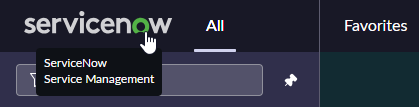
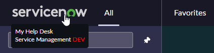
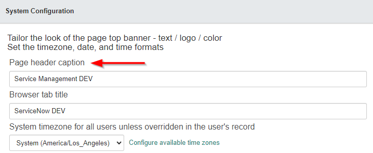
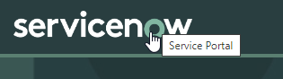

## Product description text

You can change this text to give it some flair.

To change the "Product Description".
1. Navigate to "**System Properties &gt; Basic Configuration**".
1. Look for and update the "**Page header caption**" [glide.product.description] field.
1. Click on "**Save**".

These changes are considered theming and will survive a clone over the instance.

> As of the Utah release in the Next Experience UI, ServiceNow recommends not changing the "Product description" [glide.product.description] and instead using Banner Announcements with "Non-dismissible" enabled so it's always there.

> This change will not affect the Service Portal which uses its own configuration for the logo and product name.
> 