## Product logo
You can give instances their own unique logo to tell them apart. This method is super easy to do.

This logo is used:
* In the top-right of the banner (incl. UI16).
* On the login page for the Next Experience.

> **Note:** Custom product banner logos will not affect the Service Portal.

For more information on changing the banner logo and the different ways to do it, check out SN Docs.
* [Create a company profile](https://docs.servicenow.com/bundle/washingtondc-platform-user-interface/page/administer/navigation-and-ui/task/t_CreateACompanyProfile.html)
* [Customize the banner logo in Core UI](https://docs.servicenow.com/bundle/washingtondc-platform-user-interface/page/administer/navigation-and-ui/task/t_CustomizeTheLogoInSysProps.html)

### How it looks

Here's how it looks out of the box in Polaris / Next Experience UI.

[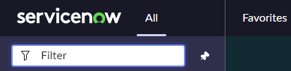](banner-logo-polaris.png)

If you hover the mouse over the logo, the "Product Description" appears.

Here's how it looks out-of-the-box in UI16.

[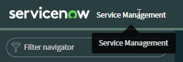](banner-logo-ui16.png)

**Customised**

Here's an example in the Next Experience with a slight change to denote which instance that you're in.

[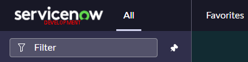](banner-logo-polaris-custom.png)

[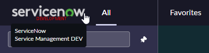](banner-logo-polaris-custom-hover.png)

The custom logo also appears on the Next Experience login page.

[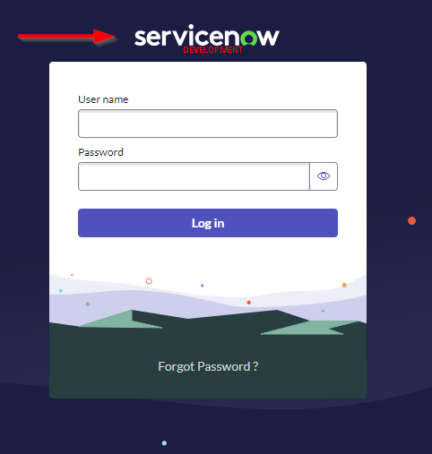](login-product-image.png)

And in UI16.

[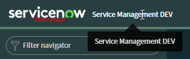](banner-logo-ui16-custom.png)

### How ServiceNow decides what logo image to use
The logo (a.k.a. product image) is set by the following, in order.
1. The **UI16 Banner Image** image field on the Company that your User [sys_user] is set to. Does not affect login page. **Not clone safe**.
1. The **UI16 Banner Image** image field on the **System Properties > My Company** record / the Company [core_company] where "Primary" is TRUE. **Not clone safe**.
1. System Property **glide.product.image.light**. Should be an image name, not an attachment sys_id.
1. System Property **glide.product.image**. Should be an image name, not an attachment sys_id.

The logo on the login page will use the same order.

Note that **glide.product.image.light** overrides any other logo image configuration for the Platform UI or the login page.

Changing the "UI16 Banner Image" field on the "My Company" record **will update the glide.product.image.light property**. These changes will be lost during a clone over the instance.

### How to change the product image
> Do not use the **System Configuration > Basic Configuration** page to upload a new logo. This will attach the image to the system property which will be lost during a clone.

Here's how to upload a new logo image and update ServiceNow to use that image as a logo.

First, add the image to ServiceNow.
1. **In production** navigate to "**System UI &gt; Images > Images**" or the table Images [db_image].
1. Click on "**New**".
1. Enter a "**Name**" for your image. Valid names must end in .gif, .png, .jpg, .ico, or .bmp. I'd recommend "favicon_(instance name)" e.g. "favicon_dev.png".
1. Click the "**Click to add**" link in the Image field, then select and upload the image.
1. Click "**Update**" to save the new image.
1. Repeat the above steps for as many unique favicon images you need (e.g. 1 for DEV, 1 for TEST).
1. Get the new Image [db_image] to the other instances either by doing a clone, or repeating the above steps in the other instances.

> **Why did we add the images in production?**
> While the system property that specifies which image to use will survive the clone, the image itself will not. The Image [db_image] table has no clone data preserves. This means images for all of the instances must be in production so that they come down in a clone.

Then update the system properties to use your new image.
1. Navigate to the list of system properties by entering **sys_properties.list** in the navigator search field, then press ENTER.
1. Search for the system property **glide.product.image** and open it. (If it's missing, create a new one with the same name).
1. Set "Value" to the name of the Image [db_image] you created earlier.
1. Save the changes.
1. Repeat the above steps for **glide.product.image.light**.

Here's some examples with placeholder images.

Here's how it looks with **glide.product.image.light** configured. Note that this property is confiugured by default.

[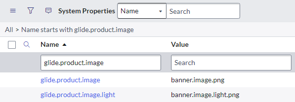](properties-product-image.png)

[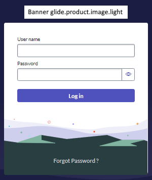](example-login-logo-with-light.png)

Here's how it looks without **glide.product.image.light** configured, but still a logo on the "My Company" record.

[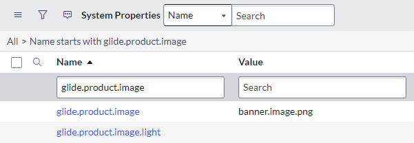](properties-product-image-without-light.png)

[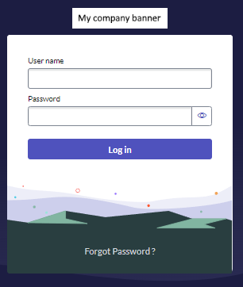](example-login-logo-without-light.png)

[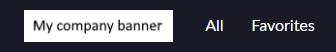](example-banner-logo-without-light.png)

### Warning: Image attachments on Company records
Unique banner images on Company [core_company] **will be lost and replaced during a clone**, even though the record itself is preserved.

I don't recommend setting the logo for non-production instances using the Company [core_company] method.

### Warning: Image attachments on system properties

**Do not attach images to system properties.** Images attached to Sytem Property [sys_properties] records **are not** preserved during a clone. This is a problem for "uploaded image" system properties because the system property and it's value will be preserved, but the value will be a sys_id of the image attachment which gets deleted by the clone. 

This will cause your logo image to be missing after a clone.

[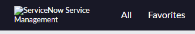](banner-missing-logo.png)

*Banner with a missing logo.*

[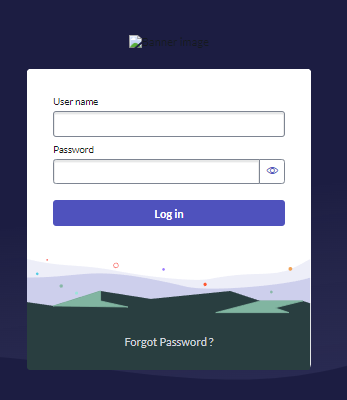](login-missing-logo.png)

*Next Experience login page missing logo.*