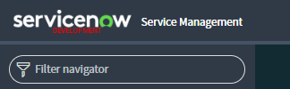
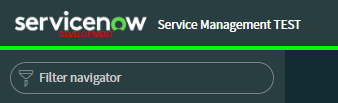
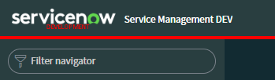

### UI16 Banner Theming
Theming the banner in UI16 is easy, and can be done using system properties.

When it comes to making the instances look unique, I recommend changing the colour of the banner border, the thin line that sits on the bottom of the banner. If this line is visually striking, the difference between instances can be obvious.

> **Note:** The banner colouring will **not** be visible if the user has selected their own theme.

1. Navigate to "**System Properties &gt; Basic Configuration UI16**".
1. Find "**Header divider stripe color**" [css.$navpage-header-divider-color] and set it to a new colour (e.g. #FF0000 for red).
1. Click on "**Save**".

This approach works the same for any of the other system properties that customise the UI16 theme, however a banner with an eye-catching colour is typically enough on its own.

Here are some variations of instance-unique banners.

