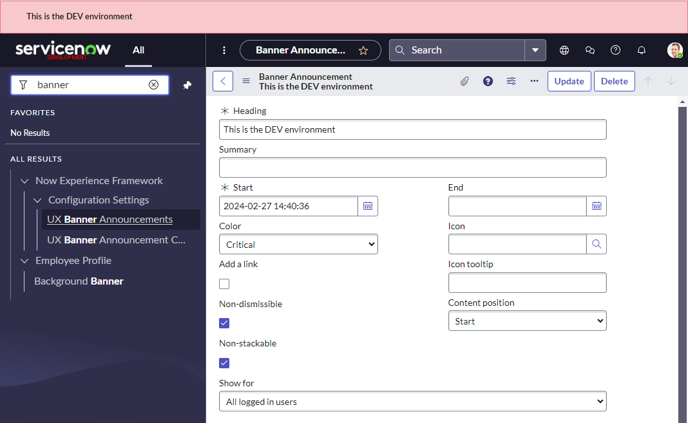

## Next Experience / Unified Navigation Banner Announcements
ServiceNow Docs recommends that you use **Banner Announcements** instead of customising the Produce Description. This is not available in UI16.

In a nutshell, all you have to do is create a new "**Banner Announcement**" [sys_ux_banner_announcement] record and enable "**Non-dismissible**" to the banner announcement is always visible.

> **Note:** Next Experience Banner Announcements are not visible on the Service Portal.

The benefit of using Banner Announcements is that it will not be affected if the user has selected a different **theme**. In contrast to colouring the banner, which can be undone by the user selecting a different theme.

You can read more about them here in ServiceNow docs.
[Next Experience banner announcements](https://docs.servicenow.com/bundle/washingtondc-platform-user-interface/page/administer/navigation-and-ui/concept/next-experience-banner-announcements.html#config-next-experience-banners)

> **Note** these banners will **not** survive a clone with the out-of-the-box clone profile. 
>
> I'd recommend adding a Clone Data Preserver to preserve "Banner Announcement" [sys_ux_banner_announcement] records where "Non-dismissible" is set to TRUE, and set the preserver's "Theme" field to TRUE so it honours the clone "Preserve theme" setting.

Here's an example of a banner announcement for a DEV environment and the Banner Announcement record that made it happen. Note that the banner announcement cannot be dismissed and will always be present.

