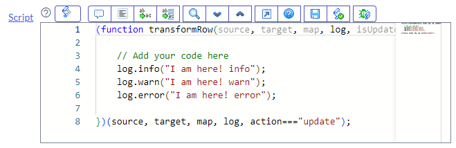
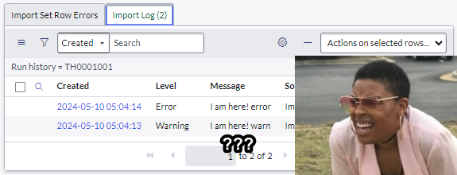
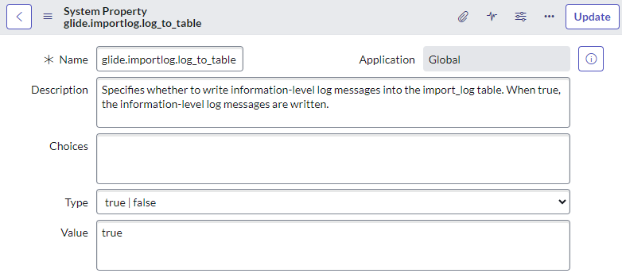
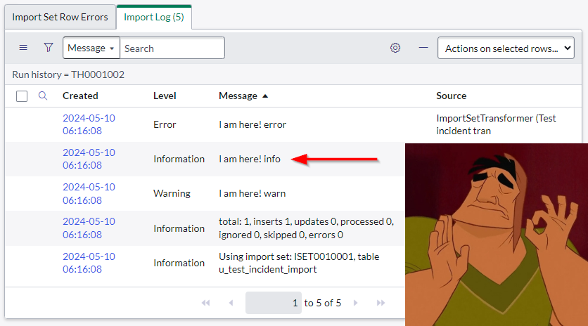
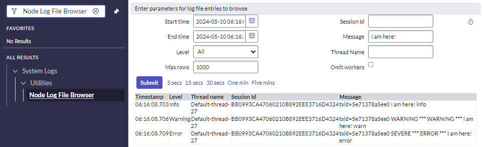

## The problem
So you're running a transform to import some data into ServiceNow, but something has gone wrong. For debugging, you find or add some `log.info()` to the transform script, but when you run the transform you find that nothing has been logged to the transform log.

## The answer
Starting around the San Diego release, using `log.info()` won't actually log messages to the transform log. It will log `log.warn()` and `log.error()`, but not `log.info()`.

To change this, set the system property **glide.importlog.log_to_table** to **true**, or create it if it's not there already.

## Fun fact
What's actually going on here is that `log.info()` **does** log, but the log messages aren't saved to the database under the transform log anymore.

However, they still get logged to the node's log file. You can see the `log.info()` messages if you browse or download the node's log file.

This isn't useful, but still cool to know.

## Links
* SN Docs - Import sets properties
 https://docs.servicenow.com/bundle/tokyo-platform-administration/page/administer/import-sets/reference/r_ImportSetsProperties.html
* SN Community - Import logs are not created when you import something using the transform maps from SanDiego Version
 https://www.servicenow.com/community/cmdb-forum/import-logs-are-not-created-when-you-import-something-using-the/m-p/2393960