## Background
After moving into my new home, I've been wanting to see if I could capture and track power data from my solar inverter into a dashboard with cool graphs.

The solar inverter that came with the house is a Delta Solivia 5.0 APG3 (EOE46010301). When I first looked at the bottom I saw the "RS485" ports and got excited at the idea of integrating it into my smart home.

[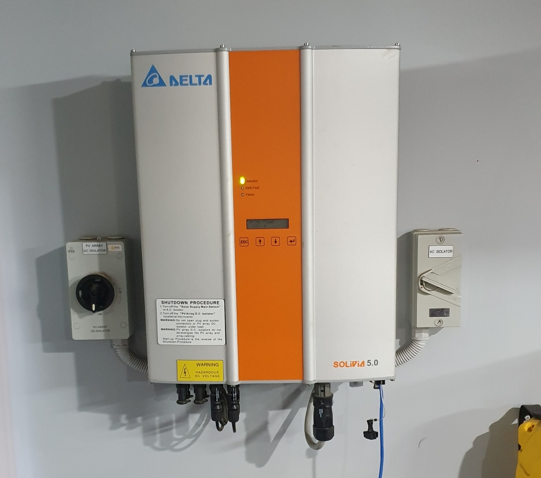](my-inverter-delta-solivia-front.jpg)

[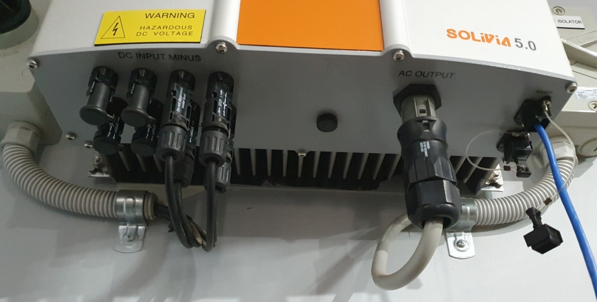](my-inverter-delta-solivia-under.jpg)

## The goal
My main goal is I want to see cool graphs about the solar panels, because I am a big nerd. Graphs like these ones.

[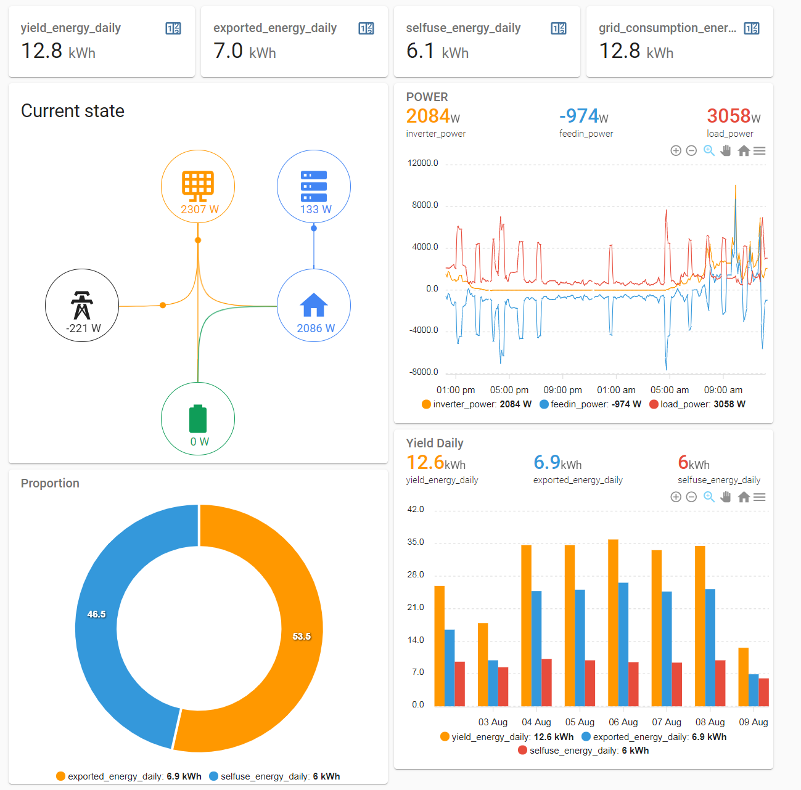](home-assistant-power-usage-graphs.png)

My 2nd goal is that I want to be able to track the performance of the solar panels.
* Notice solar panels dying or dropping in performance.
* Show how much the solar power improves after cleaning the panels.

## Off-the-shelf solutions
There are some solutions proided by Delta themselves.

### Delta Service Software (DSS)
Delta have some Windows PC software that will let your computer talk to an inverter with a focus on maintenance (diagnosis, firmware updating, etc).
https://solarsolutions.delta-emea.com/en/Software-439.htm

[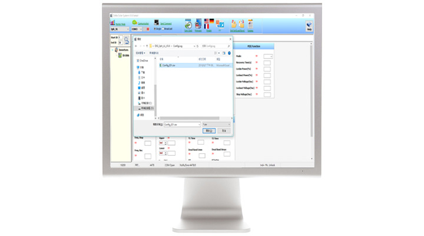](dss-screenshot.jpg)

I wasn't able to test this approach because it required a login for the Delta EMEA Partner Portal.

Also, I don't want to have a full-on Windows machine just to pull data from the inverter. I'm thinking smaller and less power-hungry.

### Delta Solivia Gateway
Delta do make a solution for connecting to Delta Solivia inverters over wifi.
https://support.delta-es.com.au/knowledgebase/solivia-gateway/

Guide on using the Delta Gateway to monitor inverters.
https://support.delta-es.com.au/wp-content/uploads/2020/03/Manual-SOLIVIA-Monitoring.pdf

[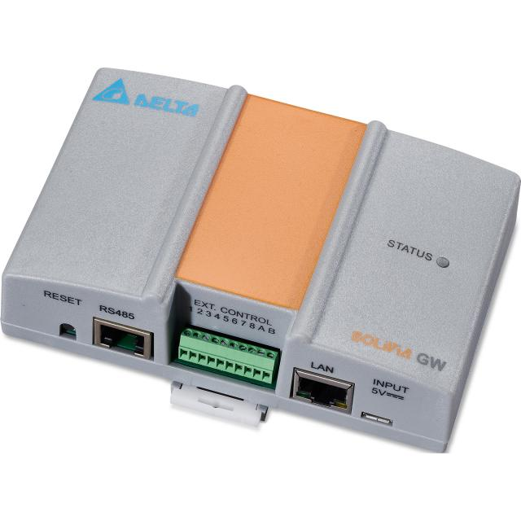](delta-gateway.jpg)

[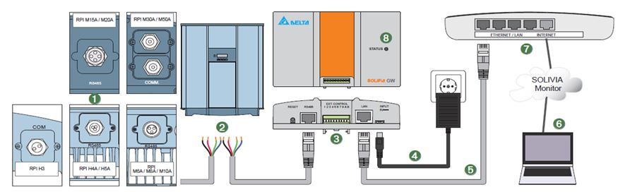](delta-gateway-diagram.jpg)

However, the Solivia Gateway comes with a couple of problems that I'm not happy with.
* Is not sold anymore.
* It relies on an external website and provider, I want everything to be local to my own network.
* Focus appears to be on business-to-customer usage, instead of the customer using it on their own devices.
* The external website is in German by default. http://monitoring.solar-inverter.com/

Here are some screenshots.
[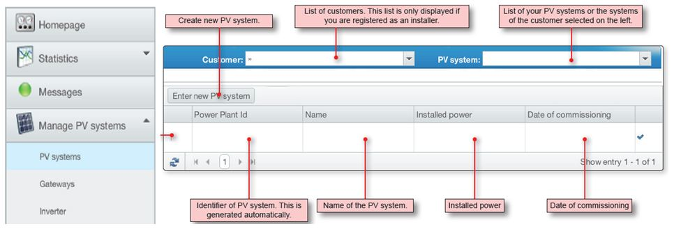](delta-gateway-screenshot-1.jpg)
[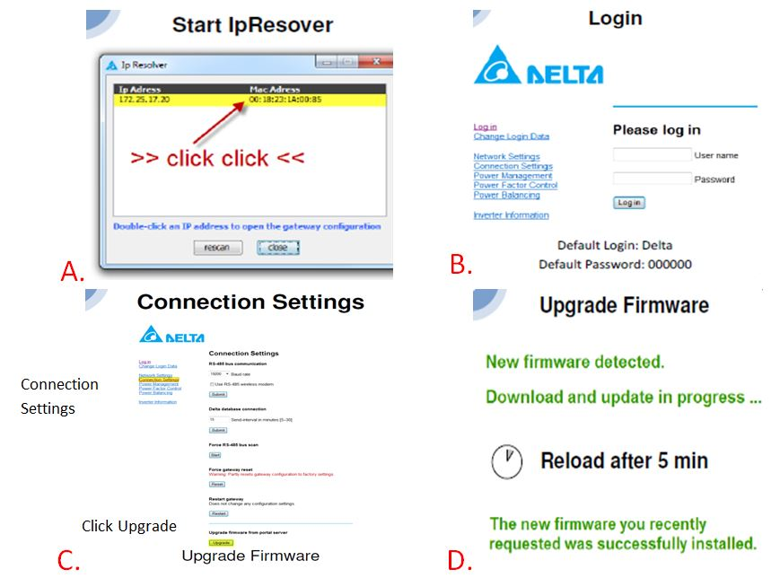](delta-gateway-screenshot-2.jpg)
[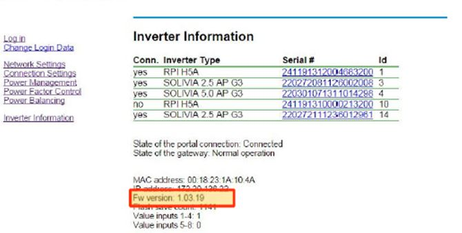](delta-gateway-screenshot-3.jpg)

## Building my own
I'm not happy with the existing solutions available, so I'm going to try building my own. 

Ideally, I'd like to use a wifi controller of some kind to talk to the inverter, and then push data back to Home Assistant over MQTT messages. From there, Home Assistant can do the dashboards and cool graphs.

[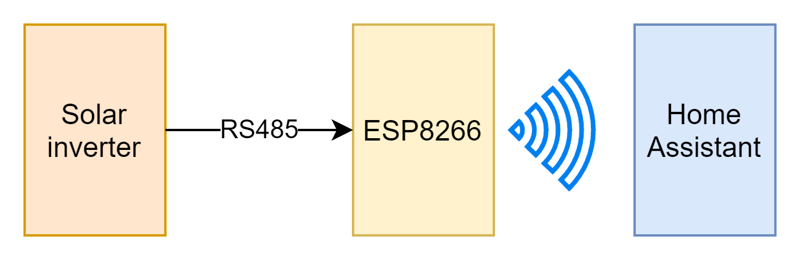](my-plan-diagram.png)

### Resources
I found a number of really good sources of information.

Fantastic discussion on the Whirlpool forums where people wanted to pull data from their inverters. This thread is amazing, I wouldn't have been able to get this far without it.
https://forums.whirlpool.net.au/thread/1901079

Public RS485 Protocol 1V2. Solivia RS485 protocol guide. Another fantastic resource that I could not have done without.
[Public RS485 Protocol 1V2 - download](Public_RS485_Protocol_1V2.pdf)
https://forums.ni.com/ni/attachments/ni/170/1007166/1/Public%20RS485%20Protocol%201V2.pdf

Discussion on the Home Assistant community, someone wanted to pull data from a Delta Solivia gateway (not the inverter itself). Still some good info there.
https://community.home-assistant.io/t/scraping-delta-solivia-pv-inverter-data/270304

https://community.home-assistant.io/t/create-custom-uart-sensor-delta-solivia-inverter-3-0-eu-g4-tr/447224

A blog post from a Dutch author about creating a Python program on a mini Linux stick that plugs into their inverter. Has a lot of good technical detail in it.
https://www.sydspost.nl/index.php/2021/03/23/opbrengst-zonnepanelen-uitlezen-2/

Manual for Delta Solivia 5.0 AP G3 Solar Inverter.
https://cdn.delta-emea.com/cs/download/file/4075200_17_Manual_Solivia_5.0_AP_G3_AU-IN_en_ebook.pdf

Delta Service Software to talk to your inverter from your PC.
https://solarsolutions.delta-emea.com/en/Software-439.htm

Blog article about using an ESP8266 to get data from a Delta inverter. ESP code is very old, but still some interesting information.
https://smallbits.marshall-tribe.net/blog/2017/01/17/delta-reader-project

### Existing projects
A quick shout out to projects that have already had a go at pulling data from a Delta Solivia inverter. I didn't end up using them because their either were Python-only (won't work on a microcontroller) or didn't work with my inverter.

delta-rpi. What I based most of my work on. Only works for RPI inverters.
https://github.com/bbinet/delta-rpi

DeltaPVOutput. The first project, seems to be what a lot of the other GitHub projects are based on.
https://github.com/stik79/DeltaPVOutput

soliviamonitor. Didn't work for me, version of python was too old and installing python 2.7 still didn't make it work.
https://github.com/lvzon/soliviamonitor

solivia_esphome. Custom UART sensor for ESPHome.
https://github.com/htvekov/solivia_esphome

### Understanding the Delta Solivia connection
The connection to the Delta Solivia inverter is an RS485 serial connection. It uses an Ethernet RJ45 connector, but only uses 3 pins: Ground, TX_A, and RX_B.

The default baud rate is 19200, but check your inverter's configuration in case the baud rate has been changed.

[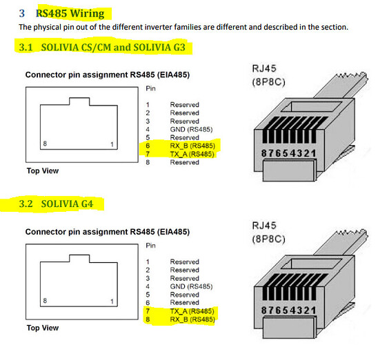](delta-rs485-wiring.jpg)

Some quick RS485 facts:
* Usually at a higher voltage e.g. 12v.
* Uses serial communication, typically in bytes (0-255).
* Doesn't have "transmit" and "receive" lines, the 2 lines go opposite each other. This greatly reduces noise on the connection and allows RS485 to cover great distances in electrically noisy environments.

[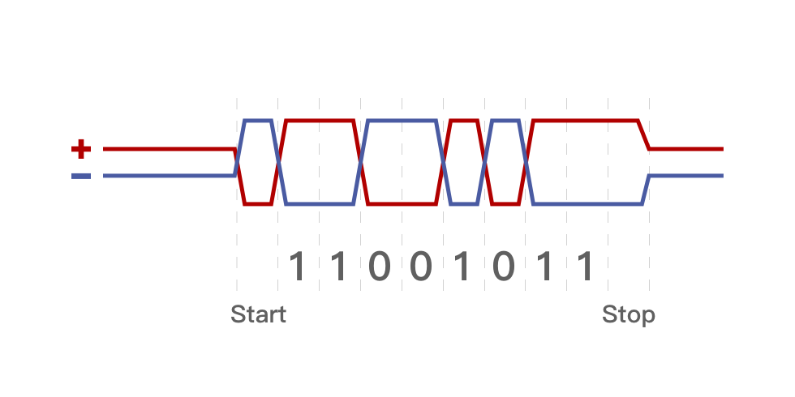](rs485-transmission-voltages.png)
*(RS485 voltages during transmission, from lorric.com)*

> RS485 has no flow control, which means that devices both send and receive over the same wire and a collision will occur if things are 2 things are sending at the same time over the connection. CRC integrity checks are important when using RS485 to ensure that something wasn't messed up due to a collision.

Here is the overall protocol layout Delta inverters.

* Addresses are between 1 and 254
* The checksum is a CRC16 checksum. [How to do CRC checks in Arduino, ESP8266, and other chips](/posts/2024-01-05-crc-arduino-esp8266-esp32/)
* The slave answer with NAK only if the command or subcommand is invalid.
* The slave answer to a valid writing command with the ACK frame and the data value is the internal slave data. If the slave receives a value out of the internal limits it will ignore the received data and set the internal value according to the allowed limits.

**Protocol characters**
| Character | ASCII (hex) Code | Description |
| --- | --- | --- |
| STX | 0x02 | Message start |
| ETX | 0x03 | Message end |
| ENQ | 0x05 | Link request (Master only) |
| ACK | 0x06 | Slave accepting link (Slave only) |
| NAK | 0x15 | Slave not accepting link / error / invalid request (Slave only) |

**Master to slave**
| Byte# | Data byte | Description |
| --- | --- | --- |
| 1 | 'STX' | Start of protocol |
| 2 | 'ENQ' | Master sending a request |
| 3 | address | Address of target device |
| 4 | # of bytes | Number of bytes incl. data, cmd, and subcmd |
| 5 | command | Command to send to slave |
| 6 | sub command | Sub command to send to slave |
| N | data | N bytes of data |
| N+1 | CRC low byte | Low byte of checksum |
| N+2 | CRC high byte | High bytes of checksum |
| N+3 | 'EXT' | End of protocol |

**Slave response with acknowledge to master**
| Byte# | Data byte | Description |
| --- | --- | --- |
| 1 | 'STX' | Start of protocol |
| 2 | 'ACK' | Slave acknowledging |
| 3 | address | Address of slave device |
| 4 | # of bytes | Number of bytes incl. data, cmd, and subcmd |
| 5 | command | Repeat of command |
| 6 | sub command | Repeat of sub command |
| N | data | N bytes of data |
| N+1 | CRC low byte | Low byte of checksum |
| N+2 | CRC high byte | High bytes of checksum |
| N+3 | 'EXT' | End of protocol |

**Slave response with no acknowledge to master**
Eg. There was an error.
| Byte# | Data byte | Description |
| --- | --- | --- |
| 1 | 'STX' | Start of protocol |
| 2 | 'NAK' | Slave acknowledging |
| 3 | address | Address of slave device |
| 4 | # of bytes | Number of bytes, should always be 2 for NAK (no data) |
| 5 | command | Repeat of command |
| 6 | sub command | Repeat of sub command |
| 7 | CRC low byte | Low byte of checksum |
| 8 | CRC high byte | High bytes of checksum |
| 9 | 'EXT' | End of protocol |


**Here's some useful commands:**
| CMD | S-CMD | Description |
| --- | --- | --- |
| 0x00 | 0x00 | Identify inverter incl. variant number |
| 0x00 | 0x40 | Get software version. Response is inverter-specific, depends on variant |
| 0x60 | 0x01 | Get measurement and statistic data |
| 0x60 | 0x20 | Get configuration and setup data |

### My prototype
I understood the theory, so I whacked together a prototype to see if I could do it. I used:
* a Raspberry Pi 3 B+
* a cheap USB RS485 adapter
* a short ethernet cable with one end cut off

I cut the head off a short Cat-5 ethernet cable and stripped a little insulation off the wires. My network cable was Type-A and I connected the ethernet wires to the RS485 adapter this way:
**GND** - stripe blue
**TX_A** - stripe brown
**RX_B** - orange

[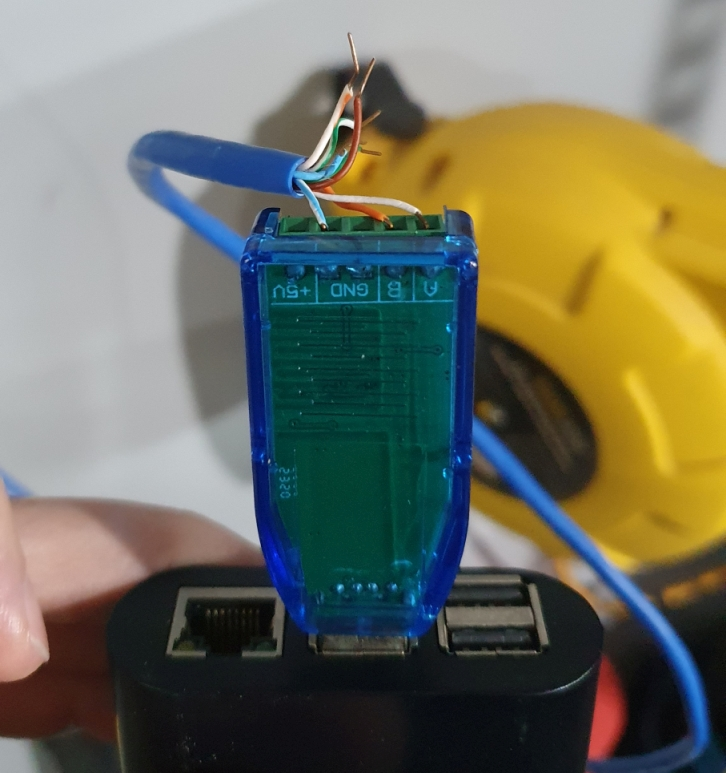](usb-rs485-wiring.jpg)

[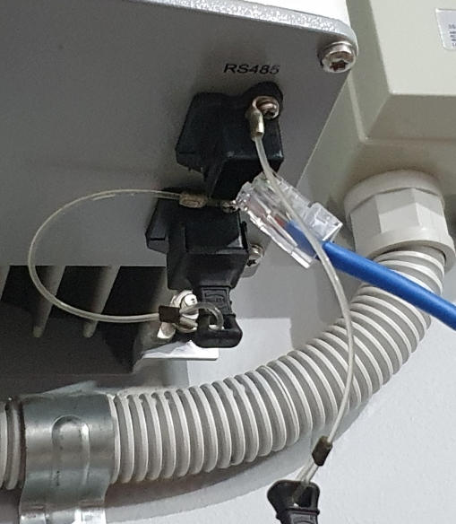](rs485-rj45-cable.jpg)

To prove that it worked, I was using the delta-rpi GitHub project to try and talk to my inverter.
https://github.com/bbinet/delta-rpi

```
usage: delta-rpi.py [-h] [-a ADDRESS] [-d DEVICE] [-b BAUDRATE]
                                      [-t TIMEOUT] [--debug]
                                      MODE
```

`$ python3 ./delta-rpi.py --debug -d /dev/ttyUSB0 -b 19200 -a 1 master`

I ran into an issue where I kept getting the error **struct.error: unpack requires a buffer of 158 bytes** but I fixed that (below).

It works! I can pull stats and data from the inverter! 

```
SAP part number                                b'EOE46010301'
SAP serial number                        b'220301081423017703'
SAP data code                                     b'31343233'
SAP revision                                          b'3038'
Software revision ac control                            01.00 MA,MI
Software revision dc control                            01.00 MA,MI
Software revision display                               01.00 MA,MI
Software revision ens control                           01.00 MA,MI
Solar current at input 1                                 56.0 A
Solar voltage at input 1                                  240 V
Solar isolation resistance at input 1                   10000 kOhm
Solar current at input 2                                 72.0 A
Solar voltage at input 2                                  241 V
Solar isolation resistance at input 2                   10000 kOhm
AC current                                              116.0 A
AC voltage                                                246 V
AC power                                                 2824 W
AC frequency                                           5009.0 kOhm
...
```

### Issue - struct.error: unpack requires a buffer of … bytes
While trying to use delta-rpi, I kept running into this error:

**struct.error: unpack requires a buffer of 158 bytes**

I could see that messages were being sent to and from the inverter, what was wrong?

The answer was that the Python function struct.unpack required the **exact** number of bytes specified, and more than 158 bytes of data was being sent by my inverter.

The cause was a revelation: **the "Measurement and statistics" payload structure is different between each model**. delta-rpi was written for an RPI series inverter, not my Solivia 5.0 APG3 inverter. The response payload was different.

The "measurement and statistics" payload was different depending on the "variant" of the inverter. The response for the "identify yourself" request cmd 0x00 subcmd 0x00 was:
```
Raw: 223f536f6c69766961352e3041502d4733002c
String: "?Solivia5.0AP-G3\x00,
(yes, with a comma at the end, I don't know what that means)
```

I don't fully understand the response structure, but I do know:
| Byte # | Data | Description |
| --- | --- | --- |
| 1 | 34 (0x22) | variant number (not exact) |
| 2 | 63 (0x3F) | variant number (more accurate) |
| 3+ | Solivia5.0AP-G3 | Model name as a string, null-terminated |
| -1 | , (0x2C) | ??? |

I got it working after I found the data structure for the "Measurement and Statistics" payload in the "Public RS485 Protocol 1V2.pdf" doc and rewrote that part of the python script to match. 

[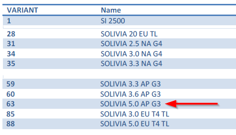](variant-lookup.png)

Now it works like a charm. Yea boi!

## What's next?
Up next is to make something on an wifi microcontroller (ESP8266) and integrate it with my smart home controller Home Assistant. Bonus points if I can get the wifi microcontroller to host a basic web page where I can see information about the inverter, maybe even control it a little.